.. index:: BNC software settings

..
   for latex

.. |G:CWPX_?| replace:: G:CWPX\_\?
.. |CWPX_?| replace:: CWPX\_\?
.. |R:PCX_?| replace:: R:PCX\_\?
.. |E:CPX_?| replace:: E:CPX\_\?

..
   for html

   .. |G:CWPX_?| replace:: `G:CWPX_?`
   .. |CWPX_?| replace:: `CWPX_?`
   .. |R:PCX_?| replace:: `R:PCX_?`
   .. |E:CPX_?| replace:: `E:CPX_?`

BNC software settings
*********************
The general documentation approach is to create a separate chapter for each processing option in a sequence which follows the layout of BNC's Graphical User Interface (GUI). The advantage is that searching for help by means of the document's Table of Contents (TOC) is quite convenient.

The following chapters describe how to set BNC program options. They explain the 'Top Menu Bar', the 'Settings Canvas' with the processing options, the content of the 'Streams Canvas' and 'Logging Canvas', and the 'Bottom Menu Bar'.

.. index:: Top Menu Bar

Top Menu Bar
============

The top menu bar allows selecting a font for the BNC windows, save configured options, or quit the program execution. It also provides access to the program's documentation.

File
----
The 'File' button lets you

* Select an appropriate font. Use smaller font size if the BNC main window exceeds the size of your screen.
* Reread and save selected options in configuration file. When using 'Reread \& Save Configuration' while BNC is already processing data, some configuration options become immediately effective on-the-fly without interrupting uninvolved threads while all of them are saved on disk. See section 'Reread Configuration' for a list of on-the-fly changeable configuration options.
* Quit the BNC program.

Help
----
The 'Help' button provides access to

* Help contents. You may keep the 'Help Contents' window open while configuring BNC.
* A 'Flow Chart' showing BNC linked to a real-time GNSS network engine such as RTNET.
* General information about BNC. Close the 'About BNC' window to continue working with BNC.

.. index:: Network

Network
=======

You may need to specify a proxy when running BNC in a protected network. You may also like to use the Transport Layer Security (TLS) and its predecessor, Secure Sockets Layer (SSL) cryptographic protocols for secure Ntrip communication over the Internet.

.. index:: Proxy

Proxy - Usage in a protected LAN
--------------------------------

If you are running BNC within a protected Local Area Network (LAN), you might need to use a proxy server to access the Internet. Enter your proxy server IP and port number in case one is operated in front of BNC. If you do not know the IP and port of your proxy server, check the proxy server settings in your Internet browser or ask your network administrator.

Note that IP streaming is often not allowed in a LAN. In this case you need to ask your network administrator for an appropriate modification of the local security policy or for the installation of a TCP relay to the Ntrip Broadcaster you need to access. If this is not possible, you might need to run BNC outside your LAN on a host that has unobstructed connection to the Internet.

.. index:: SSL

SSL - Transport Layer Security
------------------------------
Communication with an Ntrip Broadcaster over Secure Sockets Layer (SSL) as well as the download of RINEX skeleton files when available from HTTPS websites requires the exchange of client and/or server certificates. Specify the path to a directory where you save certificates on your system. You may like to check out http://software.rtcm-ntrip.org/wiki/Certificates for a list of known Ntrip Server certificates. You may also just try communication via SSL to check out whether this is supported by the involved Ntrip Broadcaster.

SSL communication may involve queries coming from the Ntrip Broadcaster or from a HTTPS website hosting RINEX skeletons. Such a query could show up under BNC's 'Log' tab especially when self-signed SSL certificates are used. Example::

   SSL Error
   Server Certificate Issued by:
   GNSS Data Center
   BKG (Bundesamt für Geodäsie und Kartographie)
   Cannot be verified

   The issuer certificate of a locally looked up certificate could not be found
   The root CA certificate is not trusted for this purpose
   No certificates could be verified

   Queries should not be received by a client when a server uses official SSL certificates.

Tick 'Ignore SSL authorization errors' if you generally trust the server and do not want to be bothered with this. Note that SSL communication is usually done over port 443 :numref:`(Fig. %s) <fig_7>`.

.. _fig_7:
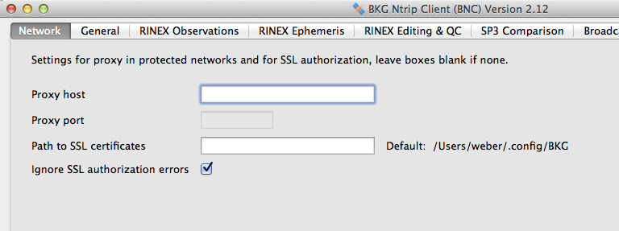

   BNC's 'Network' panel configured to ignore eventually occurring SSL error messages.

.. index:: General settings

General
=======

The following defines general settings for BNC's logfile, file handling, reconfiguration on-the-fly, and auto-start :numref:`(Fig. %s) <fig_7b>`.

.. _fig_7b:
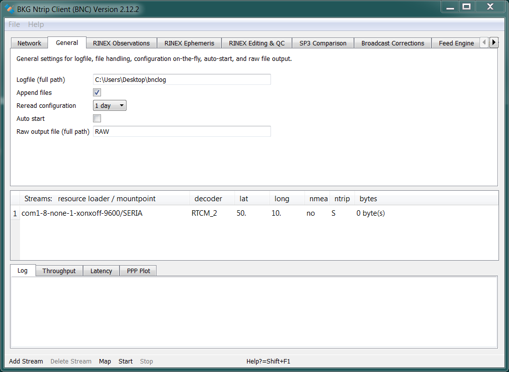

   General BNC options

.. index:: Logfile

Logfile - optional
------------------

Records of BNC's activities are shown in the 'Log' tab on the bottom of the main window. These logs can be saved into a file when a valid path is specified in the 'Logfile (full path)' field. The logfile name will automatically be extended by a string '\_YYMMDD' for the current date. This leads to series of daily logfiles when running BNC continuously. Message logs cover the communication status between BNC and the Ntrip Broadcaster as well as problems that may occur in the communication link, stream availability, stream delay, stream conversion etc. All times are given in UTC. The default value for 'Logfile (full path)' is an empty option field, meaning that BNC logs will not be saved into a file.

The following is an example for the content of a logfile written by BNC when operated in Single Point Positioning (SPP) mode:

.. code-block:: console

   15-06-30 11:40:17 ========== Start BNC v2.12 (MAC) ==========
   15-06-30 11:40:17 Panel 'PPP' active
   15-06-30 11:40:17 CUT07: Get data in RTCM 3.x format
   15-06-30 11:40:17 RTCM3EPH: Get data in RTCM 3.x format
   15-06-30 11:40:17 Configuration read: PPP.conf, 2 stream(s)

   15-06-30 11:40:21 2015-06-30_11:40:19.000 CUT07 X = -2364337.6814 Y = 4870283.8110 Z = -3360808.3085 NEU:  -0.0000  -0.0000  -0.0000 TRP:  +2.4026  -0.0001
   15-06-30 11:40:22 2015-06-30_11:40:20.000 CUT07 X = -2364337.6853 Y = 4870283.8130 Z = -3360808.3082 NEU:  +1.1639  +0.6988  -2.1178 TRP:  +2.4018  +0.0003
   15-06-30 11:40:23 2015-06-30_11:40:21.000 CUT07 X = -2364337.6862 Y = 4870283.8155 Z = -3360808.3107 NEU:  +0.1317  -0.4655  -4.4614 TRP:  +2.4009  +0.0009
   15-06-30 11:40:24 2015-06-30_11:40:22.000 CUT07 X = -2364337.6864 Y = 4870283.8106 Z = -3360808.3099 NEU:  +0.1543  +0.2121  -1.0190 TRP:  +2.4022  +0.0009
   15-06-30 11:40:25 2015-06-30_11:40:23.000 CUT07 X = -2364337.6861 Y = 4870283.8111 Z = -3360808.3105 NEU:  -0.9782  +0.0916  -2.3544 TRP:  +2.4017  +0.0013
   15-06-30 11:40:26 2015-06-30_11:40:24.000 CUT07 X = -2364337.6884 Y = 4870283.8123 Z = -3360808.3103 NEU:  -0.5606  -0.0938  -1.9498 TRP:  +2.4018  +0.0016
   15-06-30 11:40:27 2015-06-30_11:40:25.000 CUT07 X = -2364337.6913 Y = 4870283.8133 Z = -3360808.3122 NEU:  -0.1799  -0.1525  -4.8142 TRP:  +2.4007  +0.0025
   15-06-30 11:40:28 2015-06-30_11:40:26.000 CUT07 X = -2364337.6919 Y = 4870283.8171 Z = -3360808.3184 NEU:  +0.7497  +0.7994  -2.0363 TRP:  +2.4018  +0.0032
   15-06-30 11:40:29 2015-06-30_11:40:27.000 CUT07 X = -2364337.6923 Y = 4870283.8196 Z = -3360808.3230 NEU:  +0.8099  +0.5592  -2.8552 TRP:  +2.4015  +0.0039
   15-06-30 11:40:30 2015-06-30_11:40:28.000 CUT07 X = -2364337.6960 Y = 4870283.8219 Z = -3360808.3222 NEU:  -0.2952  +1.9737  -4.5565 TRP:  +2.4008  +0.0047
   15-06-30 11:40:31 2015-06-30_11:40:29.000 CUT07 X = -2364337.6982 Y = 4870283.8209 Z = -3360808.3209 NEU:  +0.3563  +2.1067  -5.5327 TRP:  +2.4005  +0.0057
   ...

Append Files - optional
-----------------------
When BNC is started, new files are created by default and existing files with the same name will be overwritten. However, users might want to append existing files following a restart of BNC, a system crash or a BNC crash. Tick 'Append files' to continue with existing files and keep what has been recorded so far. Note that option 'Append files' affects all types of files created by BNC.

Reread Configuration - optional
-------------------------------
When operating BNC online in 'no window' mode (command line option ``-nw``), some configuration options can nevertheless be changed on-the-fly without interrupting the running process. For that, you force the program to reread parts of its configuration in pre-defined intervals from disk. Select '1 min', '1 hour', or '1 day' to let BNC reread on-the-fly changeable configuration options every full minute, hour, or day. This lets in-between edited options become effective without interrupting uninvolved threads.

Note that following configuration options saved on disk can be changed/edited on-the-fly while BNC is already processing data:

* 'mountPoints' to change the selection of streams to be processed, see section 'Streams Canvas';
* 'outWait' to change the 'Wait for full obs epoch' option, see section 'Feed Engine';
* 'outSampl' to change the 'Sampling' option, see section 'Feed Engine';
* 'outFile' to change the 'File' name where synchronized observations are saved in plain ASCII format, see section 'Feed Engine'.

.. index:: Auto Start

Auto Start - optional
---------------------

You may like to auto-start BNC at startup time in window mode with pre-assigned configuration options. This may be required e.g. immediately after booting your system. Tick 'Auto start' to supersede the usage of the 'Start' button. Make sure that you maintain a link to BNC for that in your Autostart directory (Windows systems) or call BNC in a script below directory ``/etc/init.d`` (Unix/Linux/Mac OS X systems).

See BNC's command line option ``-nw`` for an auto-start of BNC in 'no window' mode.

.. index:: Raw output file

Raw Output File - optional
--------------------------

BNC can save all data coming in through various streams in one daily file. The information is recorded in the specified 'Raw output file' in the received order and format. This feature allows a BNC user to run the PPP option offline with observations, Broadcast Corrections, and Broadcast Ephemeris being read from a previously saved file. It supports the offline repetition of a real-time situation for debugging purposes (Record & Replay functionality) and is not meant for post processing.

Data will be saved in blocks in the received format separated by ASCII time stamps like (example):

.. code-block:: console

   2010-08-03T18:05:28 RTCM3EPH RTCM_3 67

This example block header tells you that 67 bytes were saved in the data block following this time stamp. The information in this block is encoded in RTCM Version 3 format, comes from mountpoint RTCM3EPH and was received at 18:05:28 UTC on 2010-08-03. BNC adds its own time stamps in order to allow the reconstruction of a recorded real-time situation.

The default value for 'Raw output file' is an empty option field, meaning that BNC will not save all raw data into one single daily file.

.. index:: RINEX observations

RINEX Observations
==================

Observations will be converted to RINEX if they come in either RTCM Version 2 or RTCM Version 3 format. Depending on the RINEX version and incoming RTCM message types, files generated by BNC may contain data from GPS, GLONASS, Galileo, SBAS, QZSS, and/or BDS (BeiDou). In case an observation type is listed in the RINEX header but the corresponding observation is unavailable, its value is set to zero '0.000' or left blank. Note that the 'RINEX TYPE' field in the RINEX Version 3 Observation file header is always set to 'M(MIXED)' or 'Mixed' even if the file only contains data from one system.

It is important to understand that converting RTCM streams to RINEX files requires a priori information on observation types for specifying a complete RINEX header. Regarding the RINEX Version 2 file header, BNC simply introduces all observation types defined in the Version 2 standard and later reports '0.000' for observations which are not received. However, following this approach is not possible for RINEX Version 3 files from RTCM Version 3 MSM streams because of the huge number of observation types, which might in principle show up. The solution implemented in BNC is to start with RINEX Version 3 observation type records from skeleton files (see section 'Skeleton Extension' and 'Skeleton Mandatory') and switch to a default selection of observation types when such file is not available or does not contain the required information. The following is the default selection of observation types specified for a RINEX Version 3 file:

.. code-block:: console

   C    9 C2I L2I S2I C6I L6I S6I C7I L7I S7I                  SYS / # / OBS TYPES
   E   12 C1X L1X SX1 C5X L5X SX5 C7X L7X SX7 C8X L8X SX8      SYS / # / OBS TYPES
   G   15 C1C L1C S1C C1W L1W S1W C2X L2X S2X C2W L2W S2W C5X  SYS / # / OBS TYPES
          L5X S5X                                              SYS / # / OBS TYPES
   J   24 C1C L1C S1C C1S L1S S1S C1L L1L S1L C1X L1X S1X C2S  SYS / # / OBS TYPES
          L2S S2S C2L L2L S2L C2X L2X S2X C5X L5X S5X          SYS / # / OBS TYPES
   R   12 C1C L1C S1C C1P L1P S1P C2C L2C S2C C2P L2P S2P      SYS / # / OBS TYPES
   S    9 C1C L1C S1C C5I L5I S5I C5Q L5Q S5Q                  SYS / # / OBS TYPES

Please note that RTCM Version 3 messages 1084 for GLONASS observations do not contain the GLONASS channel numbers. These observation messages can only be converted to RINEX when you add messages which include the channel numbers. This could be done by means of an additional stream carrying 1087 GLONASS observation messages or an additional stream carrying 1020 GLONASS ephemeris messages. You could also consider setting up a stream which contains both, the 1084 and the 1020 messages.

The screenshot below shows an example setup of BNC when converting streams to RINEX. Streams are coming from various Ntrip Broadcasters as well as from a serial communication link. Specifying a decoder string 'ZERO' would mean to not convert the affected stream but save its content as received. The 'SSL Error' recorded in the 'Log' tab is caused by the fact that observation stream downloads from IGS and MGEX Broadcasters initiate the download of RINEX skeleton files from a HTTPS (TLS/SSL) website and BNC has been configured in this example to ignore SSL errors as shown in the preceding 'Network' panel screenshot :numref:`(Fig. %s) <fig_8>`.

.. _fig_8:
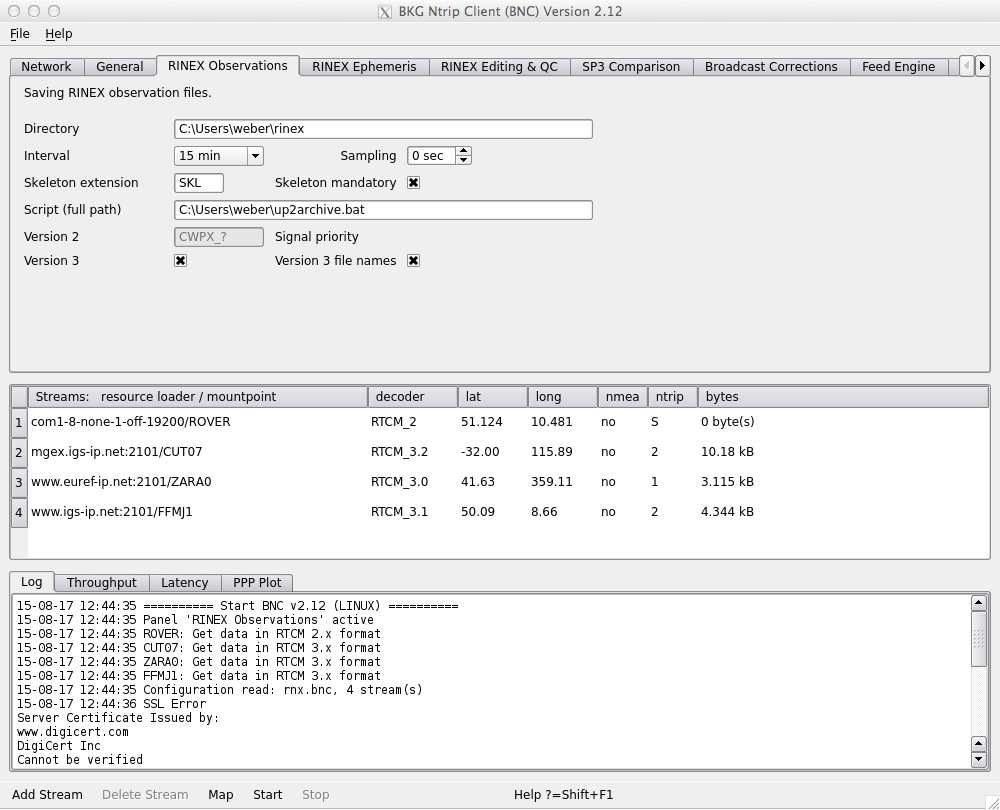

   BNC translating incoming observation streams to 15 min RINEX Version 3 Observation files.

.. index:: RINEX filenames

RINEX Filenames
---------------

The default for RINEX filenames in BNC follows the convention of RINEX Version 2. However, the software provides options to alternatively follow the filename convention of RINEX Version 3. RINEX Version 2 filenames are derived by BNC from the first 4 characters of the corresponding stream's mountpoint (4-character Station ID). For example, data from mountpoints FRANKFURT and WETTZELL will have hourly RINEX Observation files named::

   FRAN{ddd}{h}.{yy}O
   WETT{ddd}{h}.{yy}O

where 'ddd' is the day of year, 'h' is a letter which corresponds to an hour long UTC time block and 'yy' is the year.

If there is more than one stream with identical 4-character Station ID (same first 4 characters for their mountpoints), the mountpoint strings are split into two sub-strings and both become part of the RINEX filename. For example, when simultaneously retrieving data from mountpoints FRANKFURT and FRANCE, their hourly RINEX Version 2 Observation files are named as::

   FRAN{ddd}{h}_KFURT.{yy}O
   FRAN{ddd}{h}_CE.{yy}O

If several streams show up with exactly the same mountpoint name (example: BRUS0 from www.euref-ip.net and BRUS0 from www.igs-ip.net), BNC adds an integer number to the filename, leading e.g. to hourly RINEX Version 2 Observation files like::

   BRUS{ddd}{h}_0.{yy}O
   BRUS{ddd}{h}_1.{yy}O

Note that RINEX Version 2 filenames for all intervals less than 1 hour follow the filename convention for 15 minutes RINEX Version 2 Observation files e.g.::

   FRAN{ddd}{h}{mm}.{yy}O

where 'mm' is the starting minute within the hour.

In case of RINEX Version 3 filenames, the conventions are summarized in :numref:`Table %s <tab_RINEX_FN_CONV>`.

.. tabularcolumns:: |p{0.35\textwidth}|p{0.22\textwidth}|p{0.35\textwidth}|

.. _tab_RINEX_FN_CONV:
.. table:: Conventions of RINEX 3 file names.

  ====================== ================ ===============================
  **Filename Parameter** **# Characters** **Meaning**
  ====================== ================ ===============================
  Name                          9         Site, station and country code
  S                             1         Data source
  Start Time                   11         YYYYDDDHHMM
  Period                        3         File period
  Obs. Freq.                    3         Observation frequency
  Content                       2         Content type
  Format                        3         File format
  Compression                 2-3         Compression method (optional)
  ====================== ================ ===============================

Example for Mixed RINEX Version 3 GNSS observation filename, file containing 1 hour of data, one observation every second, 'MO' standing for 'Mixed Observations'::

   ALGO00CAN_R_20121601000_01H_01S_MO.rnx

Note that filename details are produced from the stream's mountpoint as well as corresponding BNC settings and meta data from the Ntrip Broadcaster source-table.

.. index:: RINEX observation directory

Directory - optional
--------------------

Here you can specify the path to where the RINEX Observation files will be stored. If the specified directory does not exist, BNC will not create RINEX Observation files. Default value for 'Directory' is an empty option field, meaning that no RINEX Observation files will be written.

.. index:: RINEX observation file interval

File Interval - mandatory if 'Directory' is set
-----------------------------------------------

Select the length of the RINEX Observation file to be generated. The default value is 15 minutes.

.. index:: RINEX observation file sampling

Sampling - mandatory if 'Directory' is set
------------------------------------------

Select the RINEX Observation sampling interval in seconds. A value of zero '0' tells BNC to store all received epochs into RINEX. This is the default value.

.. index:: RINEX header skeleton files

Skeleton Extension - optional
-----------------------------

Whenever BNC starts to generate RINEX Observation files (and then once every day at midnight), it first tries to retrieve information needed for RINEX headers from so-called fully machine-readable public RINEX header skeleton files which are derived from sitelogs. An HTTP or HTTPS link to a directory containing these skeleton files may be available through data field number 7 of the affected NET record in the source-table. See http://www.epncb.oma.be:80/stations/log/skl/brus.skl for an example of a public RINEX header skeleton file for EPN station Brussels. Note that the download of RINEX skeleton files from HTTPS websites requires the exchange of client and/or server certificates. Clarify 'SSL' options offered through panel 'Network' for details.

Sometimes public RINEX header skeleton files are not available, their content is not up to date, or you need to put additional/optional records in the RINEX header. For that, BNC allows using personal skeleton files that contain the header records you would like to include. You can derive a personal RINEX header skeleton file from the information given in an up to date sitelog. A file in the RINEX Observations 'Directory' with a 'Skeleton extension' suffix is interpreted by BNC as a personal RINEX header skeleton file for the corresponding stream.

When producing RINEX Observation files from mountpoints (examples) 'BRUS0', 'FRANKFURT', and 'WETTZELL', the following skeleton filenames would be accepted:

.. code-block:: console

   brus.skl
   fran.skl
   wett.skl

if 'Skeleton extension' is set to 'skl'.

Note the following regulations regarding personal RINEX header skeleton files:

* If such a file exists in the 'RINEX directory', the corresponding public RINEX header skeleton file is ignored. The RINEX header is generated solely from the content of the personal skeleton.
* Personal skeletons should contain a complete first header record of type:

.. code-block:: console

   RINEX VERSION / TYPE

They should then contain an empty header record of type:

.. code-block:: console

   PGM / RUN BY / DATE

BNC will complete this line and include it in the RINEX file header.

* They should further contain complete header records of type:

.. code-block:: console

   MARKER NAME
   OBSERVER / AGENCY
   REC # / TYPE / VERS
   ANT # / TYPE
   APPROX POSITION XYZ
   ANTENNA: DELTA H/E/N
   WAVELENGTH FACT L1/2 (RINEX Version 2)
   SYS / # / OBS TYPES (for RINEX Version 3 files, will be ignored in Version 2 files)

* They may contain any other optional complete header record as defined in the RINEX documentation.
* They should also contain an empty header record of type:

  .. code-block:: none

     #/ TYPES OF OBSERV (only RINEX Version 2, will be ignored when in Version 3 files)

* BNC will include these lines in the final RINEX file header together with an additional

  .. code-block:: console

     COMMENT

  line describing the source of the stream.

* They should finally contain an empty last header record of type:

  .. code-block:: console

     END OF HEADER

* They must not contain a header record of type:

  .. code-block:: console

     TIME OF FIRST OBS

If neither a public nor a personal RINEX header skeleton file is available for BNC, a default header will be used. The following is a skeleton example for a RINEX file:

.. code-block:: console

                       OBSERVATION DATA    M (MIXED)           RINEX VERSION / TYPE
                                                               PGM / RUN BY / DATE
   CUT0                                                        MARKER NAME
   59945M001                                                   MARKER NUMBER
   5023K67889          TRIMBLE NETR9       5.01                REC # / TYPE / VERS
   4928353386          TRM59800.00     SCIS                    ANT # / TYPE
    -2364337.2699  4870285.5624 -3360809.8398                  APPROX POSITION XYZ
           0.0000        0.0000        0.0000                  ANTENNA: DELTA H/E/N
   gnss@curtin.edu.au  CUT                                     OBSERVER / AGENCY
   C   10 C1I L1I D1I S1I C6I L6I S6I C7I L7I S7I              SYS / # / OBS TYPES
   E   13 C1X L1X D1X S1X C5X L5X S5X C7X L7X S7X C8X L8X S8X  SYS / # / OBS TYPES
   G   13 C1C L1C D1C S1C C2W L2W S2W C2X L2X S2X C5X L5X S5X  SYS / # / OBS TYPES
   J   19 C1C L1C D1C S1C C1X L1X S1X C1Z L1Z S1Z C2X L2X S2X  SYS / # / OBS TYPES
          C5X L5X S5X C6L L6L S6L                              SYS / # / OBS TYPES
   R   13 C1C L1C D1C S1C C1P L1P S1P C2C L2C S2C C2P L2P S2P  SYS / # / OBS TYPES
   S    7 C1C L1C D1C S1C C5I L5I S5I                          SYS / # / OBS TYPES
   PORTIONS OF THIS HEADER GENERATED BY THE IGS CB FROM        COMMENT
   SITELOG cut0_20150507.log                                   COMMENT
                                                               END OF HEADER

.. index:: RINEX header skeleton files

Skeleton Mandatory - optional
-----------------------------

Tick check box 'Skeleton mandatory' in case you want that RINEX files are only produced when skeleton files are available for BNC. If no skeleton file is available for a particular source, then no RINEX observation file will be produced from the affected stream.

Note that a skeleton file contains RINEX header information such as receiver and antenna types. In case of stream conversion to RINEX Version 3, a skeleton file should also contain information on potentially available observation types. A missing skeleton file will force BNC to only save a default set of RINEX 3 observation types.

Script - optional
-----------------

Whenever a RINEX Observation file is saved, you might want to compress, copy or upload it immediately via FTP. BNC allows you to execute a script/batch file to carry out these operations. To do that, specify the full path to such script/batch file. BNC will pass the RINEX Observation file path to the script as a command line parameter (\%1 on Windows systems, \$1 on Unix/Linux/Mac OS X systems).

The triggering event for calling the script or batch file is the end of a RINEX Observation file 'Interval'. If that is overridden by a stream outage, the triggering event is the stream reconnection.

As an alternative to initiating file uploads through BNC, you may like to call an upload script or batch file through your crontable or Task Scheduler (independent from BNC) once every one or two minutes after the end of each RINEX file 'Interval'.

Version 2 - optional
--------------------

GNSS observation data are generally hold available within BNC according to attributes as defined in RINEX Version 3. These attributes describe the tracking mode or channel when generating the observation signals. Capital letters specifying signal generation attributes are A, B, C, D, I, L, M, N, P, Q, S, W, X, Y, and Z, see RINEX Version 3 documentation. Although RINEX Version 3 with its signal generation attributes is the internal default processing format for BNC, there are two applications where the program is explicitly required to produce data files in RINEX Version 2 format:

#. When saving the content of incoming observation streams in RINEX Version 2 files as described in this section.
#. When editing or concatenating RINEX 3 files to save them in Version 2 format, see section on 'RINEX Editing & QC'.

As the Version 2 format ignores signal generation attributes, BNC is forced to somehow map RINEX Version 3 to RINEX Version 2 although this cannot be done in one-to-one correspondence. Hence we introduce a 'Signal priority' list of attributes (characters, forming a string) for mapping Version 3 to Version 2.

Signal priorities can be specified as equal for all systems, as system specific or as system and frequency specific. For example:

* 'CWPX_?' (General signal priorities valid for all GNSS)
* 'C:IQX I:ABCX' (System specific signal priorities for BDS and IRNSS)
* 'G:12&PWCSLXYN G:5&IQX R:12&PC R:3&IQX' (System and frequency specific signal priorities)

The default 'Signal priority' list is defined as follows: 'G:12&PWCSLXYN G:5&IQX R:12&PC R:3&IQX E:16&BCX E:578&IQX J:1&SLXCZ J:26&SLX J:5&IQX C:IQX I:ABCX S:1&C S:5&IQX'

As an example the 'Signal priority' of 'CWPX_?' is explained in more detail:

* Signals with attribute 'C' enjoy the highest priority. If such a Version 3 observation becomes available, it is presented as RINEX Version 2 observation if that is the format you wish to see. Observations with other attributes are being ignored.
* If no signal with 'C' attribute is available but we have an observation with 'W' attribute, BNC presents that one as RINEX Version 2 observation and ignores all observations with other attributes. The same applies mutatis mutandis to observations with P and X attributes.
* If no signal with 'C', 'W', 'P', or 'X' attribute is available but a signal with undefined generation attribute (underscore character, '_') exists, BNC presents that one as RINEX Version 2 observation. Note that observation attributes should actually always be available in RINEX Version 3. Hence the underscore character makes only sense in a few very special cases.
* If no signal with 'C', 'W', 'P', 'X', or '_' generation attribute exists then the question mark '?' tells BNC to present the first of any other appearing signal as RINEX Version 2 observation.

You may like to specify your own 'Signal priority' string(s) for producing RINEX Version 2 files. If you neither convert observation streams to RINEX Version 2 nor concatenate RINEX Version 3 to Version 2 files, then the 'Version 2' option is meaningless.

Version 3 - optional
--------------------

The default format for RINEX Observation files is RINEX Version 2.11. Select RINEX 'Version 3' if you would like to save RTCM Version 3 observation streams in RINEX Version 3.03 format. Note that it is possible to force an RTCM Version 2 stream to be saved in RINEX Version 3 file format. However, this is not recommended because such stream cannot be precisely mapped to RINEX Version 3 as the required information on tracking modes (observation attributes) is not part of RTCM Version 2.

Version 3 Filenames - optional
------------------------------

Tick check box 'Version 3 filenames' to let BNC create so-called extended filenames following the RINEX Version 3 standard. Default is an empty check box, meaning to still use filenames following the RINEX Version 2 standard although the file content is saved in RINEX Version 3 format.

.. index:: RINEX ephemeris

RINEX Ephemeris
===============

Broadcast Ephemeris can be saved in RINEX Navigation files when received e.g. via RTCM Version 3 message types 1019 (GPS) or 1020 (GLONASS) or 1044 (QZSS) or 1043 (SBAS) or 1045 and 1046 (Galileo) or 63 (BDS/BeiDou, tentative message number). The filename convention follows the details given in section 'RINEX Filenames' except that the first four characters are 'BRDC'. For RINEX Version 2 Navigation files the last character is 'N' or 'G' for GPS or GLONASS ephemeris in two separate files. Regarding RINEX Version 3 you will find all ephemeris data for GPS, GLONASS, Galileo, SBAS, QZSS, and BDS gathered in one Navigation file.

The following is an example for a RINEX Version 3 Navigation filename. The file contains one day's data. 'MN' stands for 'Multi Constellation Navigation' data.

.. code-block:: console

   BRDC00DEU_S_20121600000_01D_MN.rnx

Note that streams dedicated to carry Broadcast Ephemeris messages in RTCM Version 3 format in high repetition rates are listed on http://igs.bkg.bund.de/ntrip/ephemeris. Note further that BNC will ignore incorrect or outdated Broadcast Ephemeris data when necessary, leaving a note 'WRONG EPHEMERIS' or 'OUTDATED EPHEMERIS' in the logfile.

Directory - optional
--------------------

Specify a path for saving Broadcast Ephemeris data in RINEX Navigation files. If the specified directory does not exist, BNC will not create RINEX Navigation files. Default value for Ephemeris 'Directory' is an empty option field, meaning that no RINEX Navigation files will be created.

Interval - mandatory if 'Directory' is set
------------------------------------------

Select the length of RINEX Navigation files. The default value is '1 day'.

Port - optional
---------------

BNC can output Broadcast Ephemeris in RINEX Version 3 format on your local host (IP 127.0.0.1) through an IP 'Port'. Specify an IP port number to activate this function. The default is an empty option field, meaning that no ASCII ephemeris output via IP port is generated.

The source code for BNC comes with an example Perl script ``test_tcpip_client.pl`` that allows you to read BNC's ephemeris ASCII output from the IP port.

Version - optional
------------------

Default format for RINEX Navigation files containing Broadcast Ephemeris is RINEX Version 2.11. Select 'Version 3' if you want to save the ephemeris data in RINEX Version 3.03 format. Note that this does not concern the Broadcast Ephemeris output through IP port, which is always in RINEX Version 3.03 format.

Version 3 Filenames - optional
------------------------------

Tick check box 'Version 3 filenames' to let BNC create so-called extended filenames following the RINEX Version 3 standard. Default is an empty check box, meaning to still use filenames following the RINEX Version 2 standard although the file content is saved in RINEX Version 3 format :numref:`(Fig. %s) <fig_9>`.

.. _fig_9:
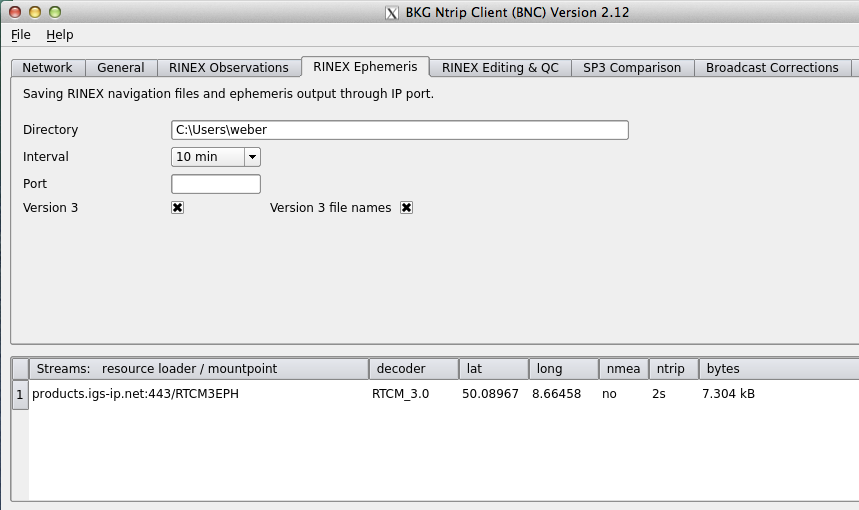

   BNC converting Broadcast Ephemeris stream to RINEX Version 3 Navigation files

.. index:: RINEX editing and quality check

RINEX Editing & QC
==================

Besides stream conversion from RTCM to RINEX, BNC allows editing RINEX files or concatenate their content. RINEX Observation and Navigation files can be handled. BNC can also carry out a RINEX file Quality Check. In summary and besides Stream **T**\ ranslation, this functionality in BNC covers

* File **E**\ diting and concatenation
* File **Q**\ uality **C**\ heck

  * Multipath analysis sky plots
  * Signal-to-noise ratio sky plots
  * Satellite availability plots
  * Satellite elevation plots
  * PDOP plots

and hence follows UNAVCO's famous teqc program (see :cite:`estey1999a`). The remarkable thing about BNC in this context is that it supports RINEX Version 3 under GNU General Public License with full GUI support and graphics output.

Action - optional
-----------------

Select an action. Options are 'Edit/Concatenate' and 'Analyze'.

* Select 'Edit/Concatenate' if you want to edit RINEX file content according to options specified under 'Set Edit Options' or if you want to concatenate several RINEX files.
* Select 'Analyze' if you are interested in a quality check of your RINEX file content.

Input Files - mandatory
-----------------------

Specify full path to input RINEX Observation file(s), and specify full path to input RINEX Navigation file(s). When specifying several input files, BNC will concatenate their contents. In case of RINEX Observation input files with different observation type header records, BNC will output only one set of adjusted observation type records in the RINEX header which fits to the whole file content. Note that you may specify several RINEX Version 2 Navigation files for GPS and GLONASS.

Output Files - optional if 'Action' is set to 'Edit/Concatenate'
----------------------------------------------------------------

If 'Edit/Concatenate' is selected, specifying the full path to output RINEX Observation file(s) and specifying the full path to output RINEX Navigation file(s) is optional. Default are empty option fields, meaning that no RINEX files will be saved on disk.

Logfile - optional
------------------

Specify the name of a logfile to save information on RINEX file Editing/Concatenation or Analysis. Default is an empty option field, meaning that no logfile will be saved. Note that logfiles from analyzing RINEX files may become quite large. Hence, BNC provides an option 'Summary only' to limit logfile content to some essential information in case 'Action' is set to 'Analyze'. The following is an example for a RINEX quality check analysis logfile:

.. code-block:: console

  QC Format Version  : 1.1

  Navigation File(s) : BRDC2520.15P
  Ephemeris          : 2985 OK   0 BAD

  Observation File   : CUT02520.15O
  RINEX Version      : 3.03
  Marker Name        : CUT0
  Marker Number      : 59945M001
  Receiver           : TRIMBLE NETR9
  Antenna            : TRM59800.00     SCIS
  Position XYZ       :  -2364337.2699   4870285.5624  -3360809.8398
  Antenna dH/dE/dN   :   0.0000   0.0000   0.0000
  Start Time         : 2015-09-09 13.04.50.0
  End Time           : 2015-09-09 23.59.58.0
  Interval           : 1
  Navigation Systems : 6    C E G J R S
  Observation Types C: C2I L2I D2I S2I C6I L6I S6I C7I L7I S7I
  Observation Types E: C1X L1X D1X S1X C5X L5X S5X C7X L7X S7X C8X L8X S8X
  Observation Types G: C1C L1C D1C S1C C2W L2W S2W C2X L2X S2X C5X L5X S5X
  Observation Types J: C1C L1C D1C S1C C1X L1X S1X C1Z L1Z S1Z C2X L2X S2X C5X L5X S5X C6L L6L S6L
  Observation Types R: C1C L1C D1C S1C C1P L1P S1P C2C L2C S2C C2P L2P S2P
  Observation Types S: C1C L1C D1C S1C C5I L5I S5I

    C: Satellites: 13
    C: Signals   : 3    2I 6I 7I

        C:   2I: Observations      : 396567 (  511017)    77.60 %
        C:   2I: Slips (file+found):        0 +       0
        C:   2I: Gaps              :     8676
        C:   2I: Mean SNR          :     41.7
        C:   2I: Mean Multipath    :     0.42

        C:   6I: Observations      : 396233 (  511017)    77.54 %
        C:   6I: Slips (file+found):        0 +       0
        C:   6I: Gaps              :     8761
        C:   6I: Mean SNR          :     44.4
        C:   6I: Mean Multipath    :     0.00

        C:   7I: Observations      : 396233 (  511017)    77.54 %
        C:   7I: Slips (file+found):        0 +       0
        C:   7I: Gaps              :     8761
        C:   7I: Mean SNR          :     43.6
        C:   7I: Mean Multipath    :     0.30

    E: Satellites: 5
    E: Signals   : 4    1X 5X 7X 8X

        E:   1X: Observations      :  74468 (  196545)    37.89 %
        E:   1X: Slips (file+found):        0 +       2
        E:   1X: Gaps              :     2758
        E:   1X: Mean SNR          :     45.1
        E:   1X: Mean Multipath    :     0.37

        E:   5X: Observations      :  74422 (  196545)    37.87 %
        E:   5X: Slips (file+found):        0 +       2
        E:   5X: Gaps              :     2785
        E:   5X: Mean SNR          :     45.2
        E:   5X: Mean Multipath    :     0.32

        E:   7X: Observations      :  74422 (  196545)    37.87 %
        E:   7X: Slips (file+found):        0 +       0
        E:   7X: Gaps              :     2785
        E:   7X: Mean SNR          :     44.2
        E:   7X: Mean Multipath    :     0.00

        E:   8X: Observations      :  74429 (  196545)    37.87 %
        E:   8X: Slips (file+found):        0 +       0
        E:   8X: Gaps              :     2784
        E:   8X: Mean SNR          :     49.9
        E:   8X: Mean Multipath    :     0.00

    G: Satellites: 28
    G: Signals   : 4    1C 2W 2X 5X

        G:   1C: Observations      : 439952 ( 1100652)    39.97 %
        G:   1C: Slips (file+found):        0 +      21
        G:   1C: Gaps              :    10901
        G:   1C: Mean SNR          :     44.0
        G:   1C: Mean Multipath    :     0.63

        G:   2W: Observations      : 422560 ( 1100652)    38.39 %
        G:   2W: Slips (file+found):        0 +      19
        G:   2W: Gaps              :    11133
        G:   2W: Mean SNR          :     31.1
        G:   2W: Mean Multipath    :     0.42

        G:   2X: Observations      : 205305 ( 1100652)    18.65 %
        G:   2X: Slips (file+found):        0 +      10
        G:   2X: Gaps              :     7269
        G:   2X: Mean SNR          :     43.3
        G:   2X: Mean Multipath    :     0.47

        G:   5X: Observations      : 120638 ( 1100652)    10.96 %
        G:   5X: Slips (file+found):        0 +       0
        G:   5X: Gaps              :     3330
        G:   5X: Mean SNR          :     49.9
        G:   5X: Mean Multipath    :     0.00

    J: Satellites: 1
    J: Signals   : 6    1C 1X 1Z 2X 5X 6L

        J:   1C: Observations      :  38040 (   39309)    96.77 %
        J:   1C: Slips (file+found):        0 +       0
        J:   1C: Gaps              :     1003
        J:   1C: Mean SNR          :     49.0
        J:   1C: Mean Multipath    :     0.33

        J:   1X: Observations      :  38040 (   39309)    96.77 %
        J:   1X: Slips (file+found):        0 +       0
        J:   1X: Gaps              :     1003
        J:   1X: Mean SNR          :     51.5
        J:   1X: Mean Multipath    :     0.32

        J:   1Z: Observations      :  38040 (   39309)    96.77 %
        J:   1Z: Slips (file+found):        0 +       0
        J:   1Z: Gaps              :     1003
        J:   1Z: Mean SNR          :     48.4
        J:   1Z: Mean Multipath    :     0.40

        J:   2X: Observations      :  38040 (   39309)    96.77 %
        J:   2X: Slips (file+found):        0 +       0
        J:   2X: Gaps              :     1003
        J:   2X: Mean SNR          :     48.7
        J:   2X: Mean Multipath    :     0.31

        J:   5X: Observations      :  38040 (   39309)    96.77 %
        J:   5X: Slips (file+found):        0 +       0
        J:   5X: Gaps              :     1003
        J:   5X: Mean SNR          :     53.0
        J:   5X: Mean Multipath    :     0.00

        J:   6L: Observations      :  38040 (   39309)    96.77 %
        J:   6L: Slips (file+found):        0 +       0
        J:   6L: Gaps              :     1003
        J:   6L: Mean SNR          :     50.6
        J:   6L: Mean Multipath    :     0.00

    R: Satellites: 23
    R: Signals   : 4    1C 1P 2C 2P

        R:   1C: Observations      : 323918 (  904107)    35.83 %
        R:   1C: Slips (file+found):        0 +      44
        R:   1C: Gaps              :     7295
        R:   1C: Mean SNR          :     44.9
        R:   1C: Mean Multipath    :     0.77

        R:   1P: Observations      : 323761 (  904107)    35.81 %
        R:   1P: Slips (file+found):        0 +      44
        R:   1P: Gaps              :     7305
        R:   1P: Mean SNR          :     43.4
        R:   1P: Mean Multipath    :     0.58

        R:   2C: Observations      : 323521 (  904107)    35.78 %
        R:   2C: Slips (file+found):        0 +      44
        R:   2C: Gaps              :     7305
        R:   2C: Mean SNR          :     40.8
        R:   2C: Mean Multipath    :     0.56

        R:   2P: Observations      : 321751 (  904107)    35.59 %
        R:   2P: Slips (file+found):        0 +      37
        R:   2P: Gaps              :     7317
        R:   2P: Mean SNR          :     40.3
        R:   2P: Mean Multipath    :     0.49

    S: Satellites: 4
    S: Signals   : 2    1C 5I

        S:   1C: Observations      : 152158 (  157236)    96.77 %
        S:   1C: Slips (file+found):        0 +       1
        S:   1C: Gaps              :     4013
        S:   1C: Mean SNR          :     40.4
        S:   1C: Mean Multipath    :     0.75

        S:   5I: Observations      :  76078 (  157236)    48.38 %
        S:   5I: Slips (file+found):        0 +       1
        S:   5I: Gaps              :     2007
        S:   5I: Mean SNR          :     44.1
        S:   5I: Mean Multipath    :     0.47

  > 2015 09 09 13 04 50.0000000 23  1.2
  R09   1.46   36.90   8  L1C s. 34.3  C1C  . 0.00  L1P s. 33.2  C1P  . 0.00  L2C s. 26.4  C2C  . 0.00  L2P s. 22.1  C2P  . 0.00
  R10  49.67   46.84   8  L1C .. 52.3  C1C  . 0.62  L1P .. 51.2  C1P  . 0.52  L2C .. 42.9  C2C  . 0.51  L2P .. 42.4  C2P  . 0.40
  R11  68.25 -168.71   8  L1C .. 52.1  C1C  . 0.32  L1P .. 50.2  C1P  . 0.38  L2C .. 44.6  C2C  . 0.40  L2P .. 43.4  C2P  . 0.36
  R12  15.62 -148.75   8  L1C .. 40.6  C1C  . 0.94  L1P .. 38.9  C1P  . 0.51  L2C .. 41.1  C2C  . 0.61  L2P .. 40.7  C2P  . 0.45
  R20  26.26  150.44   8  L1C .. 40.2  C1C  . 0.90  L1P .. 38.8  C1P  . 0.63  L2C .. 44.8  C2C  . 0.57  L2P .. 44.4  C2P  . 0.46
  R21  71.53 -163.80   8  L1C .. 53.3  C1C  . 0.32  L1P .. 51.6  C1P  . 0.40  L2C .. 50.3  C2C  . 0.43  L2P .. 49.3  C2P  . 0.39
  R22  40.38  -54.63   8  L1C .. 50.0  C1C  . 0.44  L1P .. 48.7  C1P  . 0.46  L2C .. 47.1  C2C  . 0.49  L2P .. 46.7  C2P  . 0.44
  E11  68.80  -54.74   8  L1X .. 49.9  C1X  . 0.22  L5X .. 49.8  C5X  . 0.19  L7X .. 49.1  C7X  . 0.00  L8X .. 55.3  C8X  . 0.00
  E12  58.84  141.76   8  L1X .. 50.0  C1X  . 0.14  L5X .. 49.4  C5X  . 0.21  L7X .. 48.2  C7X  . 0.00  L8X .. 55.1  C8X  . 0.00
  E18   0.00    0.00   8  L1X .. 53.5  C1X  . 0.11  L5X .. 51.0  C5X  . 0.15  L7X .. 50.1  C7X  . 0.00  L8X .. 56.5  C8X  . 0.00
  J01  21.34   23.40  12  L1C .. 41.2  C1C  . 0.59  L1X .. 43.2  C1X  . 0.38  L1Z .. 41.3  C1Z  . 0.58  L2X .. 40.0  C2X  . 0.47  L5X .. 44.7  C5X  . 0.00  L6L .. 41.6  C6L  . 0.00
  S27  16.04  -73.53   4  L1C .. 37.8  C1C  . 0.81  L5I .. 39.9  C5I  . 0.41
  S28  38.63  -50.63   4  L1C .. 45.5  C1C  . 0.49  L5I .. 47.4  C5I  . 0.48
  S29  41.28   46.44   2  L1C .. 43.2  C1C  . 0.00
  S37  41.28   46.44   2  L1C .. 42.1  C1C  . 0.00
  C01  45.38   41.07   6  L2I .. 42.1  C2I  . 0.20  L6I .. 45.1  C6I  . 0.00  L7I .. 46.0  C7I  . 0.22
  C02  36.53  -53.83   6  L2I .. 37.1  C2I  . 0.31  L6I .. 42.6  C6I  . 0.00  L7I .. 41.3  C7I  . 0.24
  C03  53.80  -10.40   6  L2I .. 42.8  C2I  . 0.19  L6I .. 47.3  C6I  . 0.00  L7I .. 46.0  C7I  . 0.21
  C04  30.52   62.20   6  L2I .. 37.3  C2I  . 0.33  L6I .. 42.4  C6I  . 0.00  L7I .. 41.3  C7I  . 0.25
  C05  19.48  -71.66   6  L2I .. 36.6  C2I  . 0.40  L6I .. 40.0  C6I  . 0.00  L7I .. 38.5  C7I  . 0.37
  C07  63.30   26.64   6  L2I .. 48.5  C2I  . 0.41  L6I .. 49.3  C6I  . 0.00  L7I .. 48.1  C7I  . 0.25
  C08  76.83 -113.07   6  L2I .. 48.9  C2I  . 0.22  L6I .. 50.5  C6I  . 0.00  L7I .. 48.7  C7I  . 0.24
  C10  83.00  -66.65   6  L2I .. 48.8  C2I  . 0.20  L6I .. 50.0  C6I  . 0.00  L7I .. 48.1  C7I  . 0.23
  > 2015 09 09 13 04 52.0000000 33  0.9
  ...

Note that in addition to cycle slips recorded in the RINEX 'file', cycle slips identified by BNC are reported as 'found'.

Plots for Signals - mandatory if 'Action' is set to 'Analyze'
-------------------------------------------------------------

Multipath and signal-to-noise sky plots as well as plots for satellite availability, elevation and PDOP are produced :numref:`(Fig. %s <fig_13>`, :numref:`%s <fig_14>`, :numref:`%s) <fig_15>` per GNSS system and frequency with the multipath analysis based on CnC observation types (n = band / frequency). The 'Plots for signals' option lets you exactly specify the observation signals to be used for that and also enables the plot production. You can specify the navigation system (C = BDS, E = Galileo, G = GPS, J = QZSS, R = GLONASS, S = SBAS), the frequency, and the tracking mode or channel as defined in RINEX Version 3. Specifications for frequency and tracking mode or channel must be separated by ampersand character '\&'. Specifications for each navigation systems must be separated by blank character ' '. The following string is an example for option field 'Plots of signals':

.. code-block:: console

  C:2&7 E:1&5 G:1&2 J:1&2 R:1&2 S:1&5

This default configuration will present:

* BDS plots for L2 and L7,
* Galileo plots for L1 and L5,
* GPS plots for L1 and L2,
* QZSS plots for L1 and L2,
* GLONASS plots for L1 and L2,
* SBAS plots for L1 and L5.

Directory for Plots - optional if 'Action' is set to 'Analyze'
--------------------------------------------------------------

If 'Analyze' :numref:`(see Fig. %s) <fig_12>` is selected, specifying the path to a directory where plot files will be saved is optional. Filenames will be composed from the RINEX input filename(s) plus suffix 'PNG' to indicate the plot file format in use. Default is an empty option field, meaning that plots will not be saved on disk.

Set Edit Options - mandatory if 'Action' is set to 'Edit/Concatenate'
---------------------------------------------------------------------

Once the 'Edit/Concatenate' action is selected, you have to 'Set Edit Options' :numref:`(see Fig. %s) <fig_10>`. BNC lets you specify the RINEX version, a signal priority list when mapping RINEX Version 3 to Version 2, the sampling interval, begin and end of file, operator, observation types, comment lines, and marker, antenna, receiver details. Note that some of the specifications for editing and concatenation :numref:`(see Fig. %s) <fig_11>` are only meaningful for RINEX Observation files but not for RINEX Navigation files.

A note on converting RINEX Version 3 to RINEX Version 2 and vice versa:

* The RINEX Version 2 format ignores signal generation attributes. Therefore, when converting RINEX Version 3 to Version 2 Observation files, BNC is forced to somehow map signals with attributes to signals without attributes although this cannot be done in one-to-one correspondence. Hence we introduce a 'Version 2 Signal Priority' list of attributes (characters, forming a string) for mapping Version 3 to Version 2, see details in section 'RINEX Observations/Version 2'. Signal priorities can be specified as equal for all systems, as system specific or as system and frequency specific. For example:

  * 'CWPX_?' (General signal priorities valid for all GNSS)
  * 'C:IQX I:ABCX' (System specific signal priorities for BDS and IRNSS)
  * 'G:12&PWCSLXYN G:5&IQX R:12&PC R:3&IQX' (System and frequency specific signal priorities)

  The default 'Signal priority' list is defined as follows: 'G:12&PWCSLXYN G:5&IQX R:12&PC R:3&IQX E:16&BCX E:578&IQX J:1&SLXCZ J:26&SLX J:5&IQX C:IQX I:ABCX S:1&C S:5&IQX'

* When converting RINEX Version 2 to Version 3 Observation files, the tracking mode or channel information in the (last character out of the 3-character) observation code is left blank if unknown. This is a compromise, knowing that it is not in accordance with the RINEX Version 3 documentation.

Optionally you may specify a 'RUN BY' string to be included in the emerging new RINEX file header. Default is an empty option field, meaning the operator's ID is automatically used as 'RUN BY' string.

You can specify a list of observation codes in field 'Use Obs. Types' to limit the output file content to specific observation codes. GNSS system characters in that list are followed by a colon and a 2- or 3-character observation code. A 2-character observation code would mean that all available tracking modes of the affected observation type and frequency will be accepted as part of the RINEX output file. Observation codes are separated by a blank character. Default is an empty option field, meaning that any input observation code will become part of the RINEX output file.

Specifying comment line text to be added to the emerging new RINEX file header is another option. Any introduction of a newline through '\\n' in this enforces the beginning of a further comment line. Comment lines will be added to the header immediately after the 'PGM / RUN BY / DATE' record. Default is an empty option field, meaning that no additional comment line will be added to the RINEX header.

If you specify a 'New' but no 'Old' marker/antenna/receiver name, the corresponding data field in the emerging new RINEX Observation file will be filled accordingly. If you in addition specify an 'Old' marker/antenna/receiver name, the corresponding data field in the emerging new RINEX Observation file will only be filled accordingly where 'Old' specifications match existing file content.

.. _fig_13:
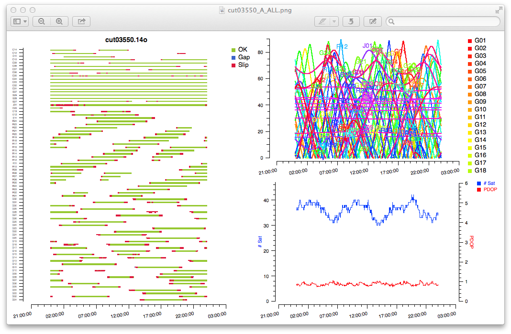

   Example for satellite availability, elevation and PDOP plots as a result of a RINEX Quality Check analysis with BNC

.. _fig_14:
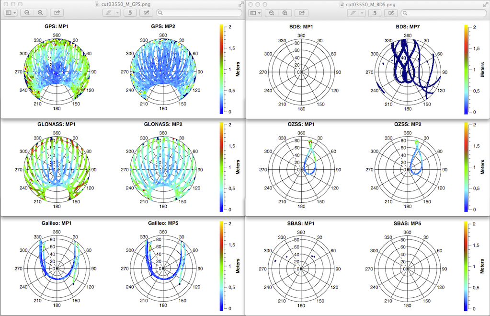

   Sky plot examples for multipath, part of RINEX quality check analysis with BNC

.. _fig_15:
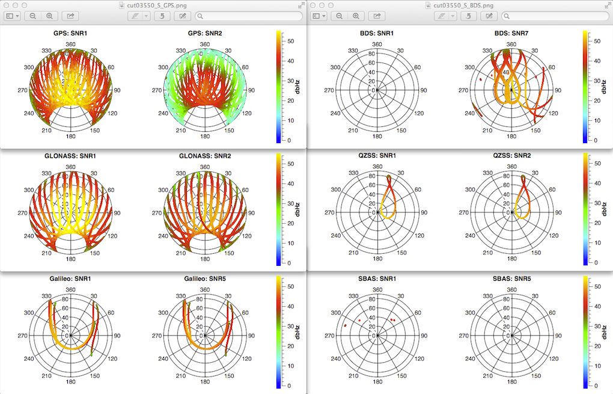

   Sky plot examples for signal-to-noise ratio, part of RINEX quality check analysis with BNC

.. _fig_10:
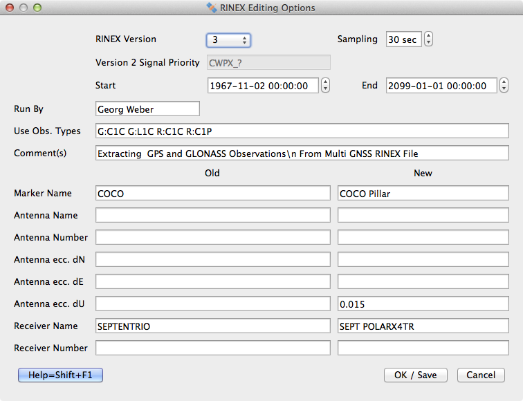

   Example for BNC's 'RINEX Editing Options' window

.. _fig_11:
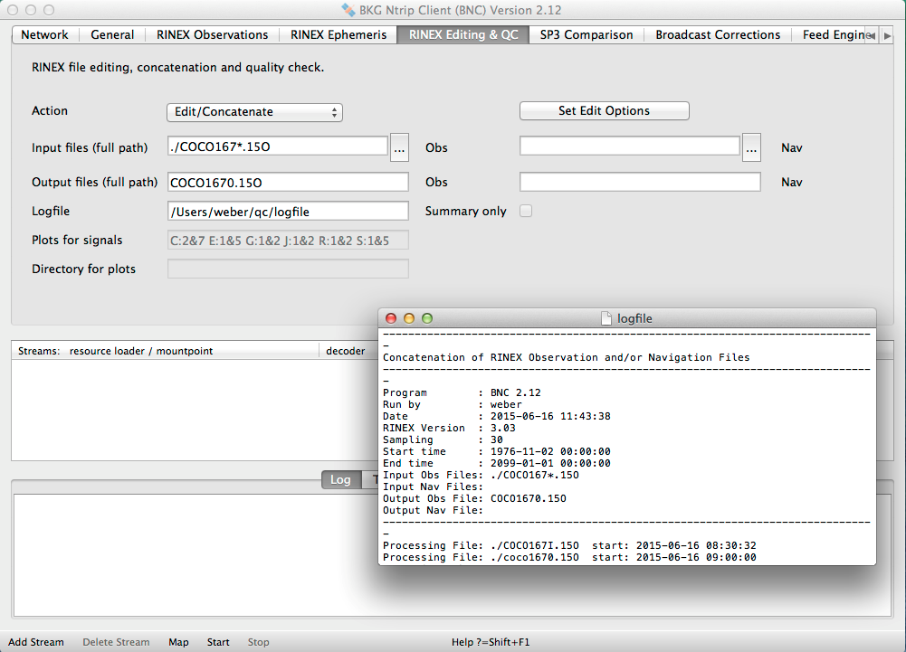

   Example for RINEX file concatenation with BNC

.. _fig_12:
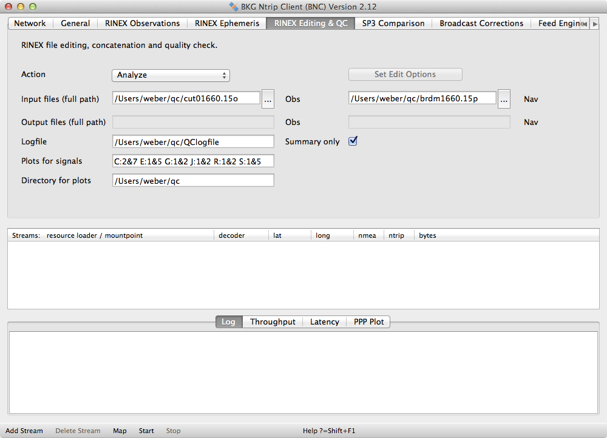

   Example for creating RINEX quality check analysis graphics output with BNC

.. only:: latex

   .. raw:: latex

     \clearpage

.. index:: SP3 comparison

Command Line, No Window - optional
----------------------------------

BNC applies options from the configuration file but allows updating every one of them on the command line while the content of the configuration file remains unchanged, see section on 'Command Line Options'. Note the following syntax for Command Line Interface (CLI) options:

.. code-block:: console

   --key <keyName> <keyValue>

Parameter <keyName> stands for the name of an option contained in the configuration file and <keyValue> stands for the value you want to assign to it. This functionality may be helpful in the 'RINEX Editing \& QC' context when running BNC on a routine basis for maintaining a RINEX file archive. The following example for a Linux platform calls BNC in 'no window' mode with a local configuration file 'rnx.conf' for concatenating four 15min RINEX files from station TLSE residing in the working directory to produce an hourly RINEX Version 3 file with 30 seconds sampling interval:

.. code-block:: console

   ./bnc --nw --conf rnx.conf --key reqcAction Edit/Concatenate --key reqcObsFile "tlse119b00.12o,tlse119b15.12o,tlse119b30.12o,tlse119b45.12o" --key reqcOutObsFile tlse119b.12o --key reqcRnxVersion 3 --key reqcSampling 30

You may use asterisk '*' and/or question mark '?' wildcard characters as shown with the following globbing command line option to specify a selection of files in the working directory:

.. code-block:: console

     --key reqcObsFile "tlse*"

or

.. code-block:: console

     --key reqcObsFile tlse\*

The following Linux command line produces RINEX QC plots (see Estey and Meertens 1999) offline in 'no window' mode and saves them in directory ``/home/user``. Introducing a dummy configuration file ``/dev/null`` makes sure that no configuration options previously saved on disc are used:

.. code-block:: console

     /home/user/bnc --conf /dev/null --key reqcAction Analyze --key reqcObsFile CUT02070.12O --key reqcNavFile BRDC2070.12P --key reqcOutLogFile CUT0.txt --key reqcPlotDir /home/user --nw

The following Linux command line produces the same RINEX QC plots in interactive autoStart mode:

.. code-block:: console

   /home/user/bnc --conf /dev/null --key reqcAction Analyze --key reqcObsFile CUT02070.12O --key reqcNavFile BRDC2070.12P --key reqcOutLogFile CUT0.txt --key startTab 4 --key autoStart 2

:numref:`Table %s <tab_RINEX_ED_QC_OPT>` gives a list of available key names for 'RINEX Editing & QC' (short: REQC, pronounced 'rek') options and their meaning, cf. section 'Configuration Examples'.

.. tabularcolumns:: |p{0.3\textwidth}|p{0.62\textwidth}|

.. _tab_RINEX_ED_QC_OPT:
.. table:: Key names for 'RINEX Editing & QC' options and their meaning.

  ===================== ============================================
  **Keyname**           **Meaning**
  ===================== ============================================
  reqcAction            RINEX Editing & QC action
  reqcObsFile           RINEX Observation input file(s)
  reqcNavFile           RINEX Navigation input files(s)
  reqcOutObsFile        RINEX Observation output file
  reqcOutNavFile        RINEX Navigation output file
  reqcOutLogFile        Logfile
  reqcLogSummaryOnly    Summary of Logfile
  reqcSkyPlotSignals    Plots for signals
  reqcPlotDir           RINEX QC plot directory
  reqcRnxVersion        RINEX version of emerging new file
  reqcSampling          Sampling interval of emerging new RINEX file
  reqcV2Priority        Version 2 Signal Priority
  reqcStartDateTime     Begin of emerging new RINEX file
  reqcEndDateTime       End of emerging new RINEX file
  reqcRunBy             Operator name
  reqcUseObsTypes       GNSS systems and observation types
  reqcComment           Additional comment lines
  reqcOldMarkerName     Old marker name
  reqcNewMarkerName     New marker name
  reqcOldAntennaName    Old antenna name
  reqcNewAntennaName    New antenna name
  reqcOldAntennaNumber  Old antenna number
  reqcNewAntennaNumber  New antenna number
  reqcOldAntennadN      Old component of north eccentricity
  reqcOldAntennadE      Old component of east eccentricity
  reqcOldAntennadU      Old component of up eccentricity
  reqcNewAntennadN      New component of north eccentricity
  reqcNewAntennadE      New component of east eccentricity
  reqcNewAntennadU      New component of up eccentricity
  reqcOldReceiverName   Old receiver name
  reqcNewReceiverName   New receiver name
  reqcOldReceiverNumber Old receiver number
  reqcNewReceiverNumber New receiver number
  ===================== ============================================

SP3 Comparison
==============

BNC allows to compare the contents of two files with GNSS orbit and clock data in SP3 format :numref:`(Fig. %s) <fig_16>`. SP3 ASCII files basically contain a list of records over a certain period of time. Each record carries a time tag, the XYZ position of the satellite's Center of Mass at that time and the corresponding satellite clock value. Both SP3 files may contain some records for different epochs. If so, then BNC only compares records for identical epochs. BNC accepts that a specific GNSS system or a specific satellite is only available from one of the SP3 files. Note that BNC does not interpolate orbits when comparing SP3 files.

.. _fig_16:
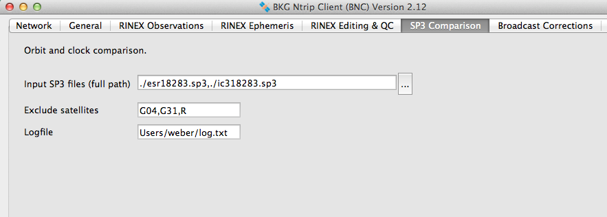

   Example for comparing two SP3 files with satellite orbit and clock data using BNC

To compare satellite clocks provided by the two files, BNC first converts coordinate differences dX,dY,dZ into along track, out-of-plane, and radial components. It then corrects the clock differences for the radial components of coordinate differences. RMS values of clock differences are finally calculated after introducing at first one offset 'per epoch for all satellites' and secondly one offset 'per satellite for all epochs'.

Input SP3 Files - optional
--------------------------

Specify the full paths of two SP3 files, separate them by comma.

Exclude Satellites - optional
-----------------------------

You may want to exclude one or more satellites in your SP3 files from the comparison. Or you may like to exclude all satellites of a specific GNSS system from the comparison. The following are example strings to be entered for excluding satellites from the comparison:

* G05,G31 (excluding GPS satellites with PRN 5 and 31)
* G (excluding all GPS satellites)
* R (excluding all GLONASS satellites)
* R12,R24 (excluding GLONASS satellites with slot number 12 and 24)
* G04,G31,R (excluding GPS satellites with PRN 4 and 31 as well as all GLONASS satellites)

Default is an empty option field, meaning that no satellite will be excluded from the comparison.

Logfile - mandatory if 'Input SP3 Files' is set
-----------------------------------------------

Specify a logfile name to save results of the SP3 file comparison.

The following is an example for a SP3 Comparison logfile:

.. code-block:: console

  ! SP3 File 1: esr18283.sp3
  ! SP3 File 2: rt218283.sp3
  !
  !  MJD       PRN  radial   along   out        clk    clkRed   iPRN
  ! ----------------------------------------------------------------
  57043.000000 G01 -0.0001 -0.0318 -0.0354     0.0266  0.0267     1
  57043.000000 G02 -0.0062 -0.0198  0.0111     0.0082  0.0143     2
  57043.000000 G03  0.0052  0.0060  0.0032     0.0386  0.0334     3
  57043.000000 G04 -0.0049 -0.0193 -0.0071    -0.1696 -0.1648     4
  57043.000000 G05  0.0027  0.0154  0.0275     0.0345  0.0318     5
  57043.000000 G06  0.0247 -0.0398 -0.0111     0.0483  0.0236     6
  57043.000000 G07 -0.0052  0.2854 -0.0975    -0.0940 -0.0888     7
  57043.000000 G08 -0.0247  0.0937 -0.0184    -0.1563 -0.1316     8
  57043.000000 G09  0.0152  0.0583  0.0086    -0.0144 -0.0296     9
  ...
  ...
  ...
  !
  ! RMS[m]
  !
  !   PRN  radial   along   out     nOrb    clk   clkRed   nClk    Offset
  ! ---------------------------------------------------------------------
  !   G01  0.0151  0.0377  0.0196     96  0.0157  0.0154     96    0.0152
  !   G02  0.0083  0.0278  0.0228     96  0.0097  0.0124     96   -0.0626
  !   G03  0.0105  0.0311  0.0307     96  0.0352  0.0309     96    0.0898
  !   G04  0.0113  0.0334  0.0154     94  0.0725  0.0707     94   -0.5087
  !   G05  0.0103  0.0319  0.0299     96  0.0417  0.0403     96    0.1185
  !   G06  0.0182  0.0509  0.0302     96  0.0218  0.0166     96    0.0040
  !   G07  0.0337  0.1632  0.0463     96  0.0483  0.0435     96    0.3031
  !   G08  0.0228  0.0741  0.0321     88  0.0616  0.0561     88   -0.2232
  ...
  ...
  ...
  !   R20  0.0637  0.2115  0.1131     96  0.1580  0.1345     96    0.7371
  !   R21  0.0475  0.1657  0.0880     96  0.1123  0.0840     96   -0.4133
  !   R22  0.0125  0.1249  0.0646     96  0.0414  0.0444     96   -0.7375
  !   R23  0.0435  0.1503  0.0573     96  0.0987  0.1099     96    0.6620
  !   R24  0.0278  0.2026  0.1186     96  0.1446  0.1303     96   -1.1470
  !
  ! Total  0.0262  0.0938  0.0492   5268  0.0620  0.0561   5268

The first part of this output uses the abbreviations in :numref:`Table %s <tab_LOG_ABB_1>`.

.. tabularcolumns:: |p{0.3\textwidth}|p{0.62\textwidth}|

.. _tab_LOG_ABB_1:
.. table:: Abbreviations in first part of BNC log files when comparing SP3 files

  ================ ===============================================================================
  **Abbreviation** **Meaning**
  ================ ===============================================================================
  MJD              Modified Julian Date
  PRN              Satellite specification
  radial           Radial component of orbit coordinate difference [m]
  along            Along track component of orbit coordinate difference [m]
  out              Out-of-plane component of orbit coordinate difference [m]
  clk              Clock difference [m]
  clkRed           Clock difference reduced by radial component of orbit coordinate difference [m]
  iPRN             BNC internal sequence number
  ================ ===============================================================================

The second part following string 'RMS' provides a summary of the comparison using the abbreviations in :numref:`Table %s <tab_LOG_ABB_2>`.

.. tabularcolumns:: |p{0.3\textwidth}|p{0.62\textwidth}|

.. _tab_LOG_ABB_2:
.. table:: Abbreviations in second part of BNC log files when comparing SP3 files

  ================ ===============================================================================
  **Abbreviation** **Meaning**
  ================ ===============================================================================
  PRN              Satellite specification
  radial           RMS of radial component of orbit coordinate differences [m]
  along            RMS of along track component of orbit coordinate differences [m]
  out              RMS of out-of-plane component of orbit coordinate differences [m]
  nOrb             Number of epochs used in in orbit comparison
  clk              RMS of clock differences [m]
  clkRed           RMS of clock differences after reduction of radial orbit differences [m]
  nClk             Number of epochs use in clock comparisons
  Offset           Clock offset [m]
  ================ ===============================================================================

.. index:: Broadcast corrections

Broadcast Corrections
=====================

Differential GNSS and RTK operation using RTCM streams is currently based on corrections and/or raw measurements from single or multiple reference stations. This approach to differential positioning uses 'observation space' information. The representation with the RTCM standard can be called 'Observation Space Representation' (OSR).

An alternative to the observation space approach is the so-called 'state space' approach. The principle here is to provide information on individual error sources. It can be called 'State Space Representation' (SSR). For a rover position, state space information concerning precise satellite clocks, orbits, ionosphere, troposphere et cetera can be converted into observation space and used to correct the rover observables for more accurate positioning. Alternatively, the state information can be used directly in the rover's processing or adjustment model.

RTCM is currently developing Version 3 messages to transport SSR corrections in real-time. They refer to satellite Antenna Phase Center (APC). SSR messages adopted or recently proposed concern:

SSR, Step I:

* Orbit corrections to Broadcast Ephemeris
* Clock corrections to Broadcast Ephemeris
* High-rate clock corrections to Broadcast Ephemeris
* Combined orbit and clock corrections to Broadcast Ephemeris
* User Range Accuracy (URA)
* High Rate User Range Accuracy (HR URA)
* Code biases

SSR, Step II:

* Phase biases
* Vertical Total Electron Content (VTEC)

RTCM Version 3 streams carrying these messages may be used e.g. to support real-time Precise Point Positioning (PPP) applications.

When using clocks from Broadcast Ephemeris (with or without applied corrections) or clocks from SP3 files, it may be important to understand that they are not corrected for the conventional periodic relativistic effect. Chapter 10 of the IERS Conventions 2003 mentions that the conventional periodic relativistic correction to the satellite clock (to be added to the broadcast clock) is computed as

.. math::

     dt =  -2 (R * V) / c^2

where :math:`R*V` is the scalar product of the satellite position and velocity and :math:`c` is the speed of light. This can also be found in the GPS Interface Specification, IS-GPS-200, Revision D, 7 March 2006.

Orbit corrections are provided in along-track, out-of-plane and radial components. These components are defined in the Earth-Centered, Earth-Fixed reference frame of the Broadcast Ephemeris. For an observer in this frame, the along-track component is aligned in both direction and sign with the velocity vector, the out-of-plane component is perpendicular to the plane defined by the satellite position and velocity vectors, and the radial direction is perpendicular to the along track and out-of-plane ones. The three components form a right-handed orthogonal system.

After applying corrections, the satellite position and clock is referred to the 'ionospheric free' phase center of the antenna which is compatible with the broadcast orbit reference.

The orbit and clock corrections do not include local effects like Ocean Loading, Solid Earth Tides or tropospheric delays. However, accurate single frequency applications can be corrected for global ionospheric effects using so-call VTEC messages for global ionospheric state parameters.

While we have a plain ASCII standard for saving Broadcast Ephemeris in RINEX Navigation files, we do not have an equivalent standard for corrections to Broadcast Ephemeris. Hence, BNC saves Broadcast Correction files following its own format definition. The filename convention for Broadcast Correction files follows the convention for RINEX Version 2 files except for the last character of the filename suffix which is set to 'C'.

Broadcast Correction file format
--------------------------------

BNC's Broadcast Correction files contain blocks of records in plain ASCII format. Each block covers information about one specific topic and starts with an 'Epoch Record'. The leading 'Epoch Record' of each block in a Broadcast Correction file contains 11 parameters. Example:

.. code-block:: console

  > ORBIT 2015 06 17 11 43 35.0 2 53 CLK93

Their meaning is as follows:

1. Special character '>' is the first character in each 'Epoch Record' (as we have it in RINEX Version 3)
2. SSR message or topic descriptor, valid descriptors are: ORBIT, CLOCK, CODE_BIAS, PHASE_BIAS, and VTEC
3. Year, GPS time
4. Month, GPS time
5. Day, GPS time
6. Hour, GPS time
7. Minute, GPS time
8. Second, GPS time
9. SSR message update interval indicator:

  * 0 = 1 sec
  * 1 = 2 sec
  * 2 = 5 sec
  * 3 = 10 sec
  * 4 = 15 sec
  * 5 = 30 sec
  * 6 = 60 sec
  * 7 = 120 sec
  * 8 = 240 sec
  * 9 = 300 sec
  * 10 = 600 sec
  * 11 = 900 sec
  * 12 = 1800 sec
  * 13 = 3600 sec
  * 14 = 7200 sec
  * 15 = 10800 sec

10. Number of following records in this block
11. Mountpoint, source/stream indicator

Each of the following 'satellite records' in such a block carries information for one specific satellite. Undefined parameters in the 'satellite records' could be set to zero '0.000'.

Example for block 'ORBIT' carrying orbit corrections
^^^^^^^^^^^^^^^^^^^^^^^^^^^^^^^^^^^^^^^^^^^^^^^^^^^^

.. code-block:: console

  > ORBIT 2015 06 17 11 43 35.0 2 53 CLK93
  G01   9     0.5134     0.3692     0.6784        0.0000    -0.0000    -0.0000
  G02  25    57.6817   139.0492   -91.3456        0.5436    -0.6931     1.0173
  G03  79   -32.1768   191.8368  -121.6540        0.2695     0.2296     0.4879
  ...
  G32  82     1.8174     1.1704     0.2200       -0.0002    -0.0000    -0.0001
  R01  59     0.7819    -0.6968     0.7388       -0.0001     0.0004     0.0004
  R02  59     0.5816    -0.5800    -0.2004        0.0001    -0.0006     0.0001
  R03  59     0.4635    -0.9104    -0.3832        0.0001     0.0001     0.0005
  ...
  R24  59     0.5935     2.0732    -0.6884       -0.0000     0.0004     0.0003

Records in this block provide the following satellite specific information:

* GNSS Indicator and Satellite Vehicle Pseudo Random Number
* IOD referring to Broadcast Ephemeris set
* Radial Component of Orbit Correction to Broadcast Ephemeris [m]
* Along-track Component of Orbit Correction to Broadcast Ephemeris [m]
* Out-of-plane Component of Orbit Correction to Broadcast Ephemeris [m]
* Velocity of Radial Component of Orbit Correction to Broadcast Ephemeris [m/s]
* Velocity of Along-track Component of Orbit Correction to Broadcast Ephemeris [m/s]
* Velocity of Out-of-plane Component of Orbit Correction to Broadcast Ephemeris [m/s]

Example for block 'CLOCK' carrying clock corrections
^^^^^^^^^^^^^^^^^^^^^^^^^^^^^^^^^^^^^^^^^^^^^^^^^^^^

.. code-block:: console

  > CLOCK 2015 06 17 11 43 35.0 2 53 CLK93
  G01   9     0.5412     0.0000     0.0000
  G02  25    11.1811     0.0000     0.0000
  G03  79    45.0228     0.0000     0.0000
  ...
  G32  82    -1.5324     0.0000     0.0000
  R01  59     4.2194     0.0000     0.0000
  R02  59     2.0535     0.0000     0.0000
  R03  59     1.8130     0.0000     0.0000
  ...
  R24  59     2.7409     0.0000     0.0000

Records in this block provide the following satellite specific information:

* GNSS Indicator and Satellite Vehicle Pseudo Random Number
* IOD referring to Broadcast Ephemeris set
* C0 polynomial coefficient for Clock Correction to Broadcast Ephemeris [m]
* C1 polynomial coefficient for Clock Correction to Broadcast Ephemeris [m/s]
* C2 polynomial coefficient for Clock Correction to Broadcast Ephemeris [m/s**2]

Example for block 'CODE_BIAS' carrying code biases
^^^^^^^^^^^^^^^^^^^^^^^^^^^^^^^^^^^^^^^^^^^^^^^^^^

.. code-block:: console

  > CODE_BIAS 2015 06 17 11 43 35.0 2 53 CLK93
  G01    5   1C    -3.3100   1W    -3.7500   2W    -6.1900   2X    -5.7800   5I    -5.4200
  G02    5   1C     3.6000   1W     3.9300   2W     6.4800   2X     0.0000   5I     0.0000
  G03    5   1C    -2.1600   1W    -2.6500   2W    -4.3600   2X    -4.4800   5I    -5.3400
  ...
  G32    5   1C    -1.5800   1W    -1.1000   2W    -1.8200   2X     0.0000   5I     0.0000
  R01    4   1C    -2.4900   1P    -2.4900   2C    -3.1500   2P    -4.1200
  R02    4   1C     0.3900   1P     0.2100   2C     0.4000   2P     0.3400
  R03    4   1C     2.4800   1P     2.2800   2C     3.7800   2P     3.7700
  ...
  R24    4   1C     2.7000   1P     2.7800   2C     3.9800   2P     4.6000

Records in this block provide the following satellite specific information:

* GNSS Indicator and Satellite Vehicle Pseudo Random Number
* Number of Code Biases, succeeded by code specific information:

  * Indicator to specify the signal and tracking mode
  * Code Bias [m]
  * Indicator to specify the signal and tracking mode
  * Code Bias [m]
  * etc.

Example for block 'PHASE_BIAS' carrying phase biases
^^^^^^^^^^^^^^^^^^^^^^^^^^^^^^^^^^^^^^^^^^^^^^^^^^^^

.. code-block:: console

  > PHASE_BIAS 2015 06 17 11 43 35.0 2 31 CLK93
   0   1
  G01 245.39062500   0.00000000    3   1C     3.9518   1   2   6   2W     6.3177   1   2   6   5I     6.8059   1   2   6
  G02 250.31250000   0.00000000    3   1C    -4.0900   1   2   5   2W    -6.7044   1   2   5   5I     0.0000   1   2   5
  G03 281.95312500   0.00000000    3   1C     2.9327   1   2   4   2W     4.6382   1   2   4   5I     5.4120   1   2   4
  ...
  G32 290.39062500   0.00000000    3   1C     1.2520   1   2   5   2W     2.0554   1   2   5   5I     0.0000   1   2   5

The second record in this block provides the following consistency information:

* Dispersive bias consistency indicatory

 0 − phase biases valid for non-dispersive signal only

 1 − phase biases maintain consistency between non-dispersive and all original dispersive phase signals

* MW consistency indicator

 0 − code and phase biases are independently derived

 1 − consistency between code and phase biases is maintained for the MW combinations

Following records provide satellite specific information:

* GNSS Indicator and Satellite Vehicle Pseudo Random Number
* Yaw angle [:math:`^{\circ}`], restricted to [:math:`0^{\circ}...360^{\circ}`]
* Yaw rate [:math:`^{\circ}/s`]
* Number of phase biases in this record, succeeded by phase specific information:

  * Signal and tracking mode indicator
  * Phase bias [m]
  * Signal integer indicator
  * Signal wide-lane integer indicator
  * Signal discontinuity counter

Example for block 'VTEC' carrying ionospheric corrections
^^^^^^^^^^^^^^^^^^^^^^^^^^^^^^^^^^^^^^^^^^^^^^^^^^^^^^^^^

.. code-block:: console

  > VTEC 2015 06 17 11 43 35.0 6 1 CLK93
   1  6  6   450000.0
     17.6800     0.0000     0.0000     0.0000     0.0000     0.0000     0.0000
      4.5200     8.8700     0.0000     0.0000     0.0000     0.0000     0.0000
     -4.6850    -0.3050     1.1700     0.0000     0.0000     0.0000     0.0000
     -2.2250    -1.3900    -1.0250    -0.1300     0.0000     0.0000     0.0000
      0.8750    -0.3800     0.2700    -0.1300     0.0400     0.0000     0.0000
      1.2150     0.9050    -1.0100     0.3700    -0.1450    -0.2450     0.0000
     -0.8200     0.4850     0.2300    -0.1750     0.3400    -0.0900    -0.0400
      0.0000     0.0000     0.0000     0.0000     0.0000     0.0000     0.0000
      0.0000    -0.0700     0.0000     0.0000     0.0000     0.0000     0.0000
      0.0000     0.5800    -1.4150     0.0000     0.0000     0.0000     0.0000
      0.0000    -0.6200    -0.1500     0.2600     0.0000     0.0000     0.0000
      0.0000     0.0700    -0.0900    -0.0550     0.1700     0.0000     0.0000
      0.0000     0.5000     0.3050    -0.5700    -0.5250    -0.2750     0.0000
      0.0000     0.0850    -0.4700     0.0600     0.0700     0.1600     0.0400

The second record in this block provides four parameters:

* Layer number
* Maximum degree of spherical harmonics
* Maximum order of spherical harmonics
* Height of ionospheric layer [m]

Subsequent records in this block provide the following information:

* Spherical harmonic coefficients C and S, sorted by degree and order (0 to maximum)

Directory, ASCII - optional
---------------------------

Specify a directory for saving Broadcast Corrections in files. If the specified directory does not exist, BNC will not create Broadcast Correction files. Default value for Broadcast Correction 'Directory' is an empty option field, meaning that no Broadcast Correction files will be created.

Interval - mandatory if 'Directory, ASCII' is set
-------------------------------------------------

Select the length of the Broadcast Correction files. The default value is '1 day'.

Port - optional
---------------

BNC can output epoch by epoch synchronized Broadcast Corrections in ASCII format on your local host (IP 127.0.0.1) through an IP 'Port'. Specify an IP port number to activate this function. The default is an empty option field, meaning that no Broadcast Correction output via IP port is generated.

The output format is similar to the format used for saving Broadcast Corrections in a file.

The following is an example output for the stream from mountpoint CLK93:

.. code-block:: console

  > ORBIT 2015 06 19 16 41 00.0 2 53 CLK93
  G01  85     0.5891    -0.5124    -0.0216       -0.0001    -0.0002     0.0000
  G02  25  -150.1820    11.4676    84.5216        0.4130    -0.6932     1.0159
  G03  79    15.1999   141.9932  -156.4244        0.6782    -0.8607    -0.8211
  ...
  G32  39     1.8454     0.4888    -0.3876       -0.0001    -0.0001     0.0001
  R01  79    -0.0506     1.9024    -0.0120        0.0004     0.0002    -0.0000
  R02  79     0.1623     0.9012     0.3984        0.0001     0.0001     0.0002
  R03  79     0.3247    -2.6704    -0.0240        0.0005    -0.0002     0.0002
  ...
  R24  79     0.7046    -0.5088    -0.0160       -0.0000     0.0000    -0.0002
  > CLOCK 2015 06 19 16 41 00.0 2 53 CLK93
  G01  85  -116.9441     0.0000     0.0000
  G02  25  -110.4472     0.0000     0.0000
  G03  79   -96.8299     0.0000     0.0000
  ...
  G32  39  -119.2757     0.0000     0.0000
  R01  79     1.5703     0.0000     0.0000
  R02  79    -1.4181     0.0000     0.0000
  R03  79     0.2072     0.0000     0.0000
  ...
  R24  79     1.1292     0.0000     0.0000
  > CODE_BIAS 2015 06 19 16 41 00.0 0 56 CLK93
  E11    3   1B     1.3800   5Q     2.4800   7Q     2.5000
  E12    3   1B     0.3900   5Q     0.6900   7Q     0.5300
  E19    3   1B    -1.7800   5Q    -3.1900   7Q    -3.0700
  G01    5   1C    -3.3100   1W    -3.7500   2W    -6.1900   2X    -5.7800   5I    -5.4200
  G02    5   1C     3.6000   1W     3.9300   2W     6.4800   2X     0.0000   5I     0.0000
  G03    5   1C    -2.1600   1W    -2.6500   2W    -4.3600   2X    -4.4800   5I    -5.3400
  ...
  G32    5   1C    -1.5800   1W    -1.1000   2W    -1.8200   2X     0.0000   5I     0.0000
  R01    4   1C    -2.4900   1P    -2.4900   2C    -3.1500   2P    -4.1200
  R02    4   1C     0.3900   1P     0.2100   2C     0.4000   2P     0.3400
  R03    4   1C     2.4800   1P     2.2800   2C     3.7800   2P     3.7700
  ...
  R24    4   1C     2.7000   1P     2.7800   2C     3.9800   2P     4.6000
  > PHASE_BIAS 2015 06 19 16 41 00.0 2 31 CLK93
   0   1
  G01 309.37500000   0.00000000    3   1C     3.9922   1   2   6   2W     6.3568   1   2   6   5I     6.8726   1   2   6
  G02 263.67187500   0.00000000    3   1C    -4.0317   1   2   7   2W    -6.6295   1   2   7   5I     0.0000   1   2   7
  G03 267.89062500   0.00000000    3   1C     3.1267   1   2   4   2W     4.9126   1   2   4   5I     5.6478   1   2   4
  ...
  G32 255.93750000   0.00000000    3   1C     1.3194   1   2   5   2W     2.1448   1   2   5   5I     0.0000   1   2   5
  > VTEC 2015 06 19 16 41 00.0 6 1 CLK93
   1  6  6   450000.0
     16.7450     0.0000     0.0000     0.0000     0.0000     0.0000     0.0000
      4.9300     8.1600     0.0000     0.0000     0.0000     0.0000     0.0000
     -4.4900     0.2550     1.0950     0.0000     0.0000     0.0000     0.0000
     -2.2450    -1.9500    -0.7950    -0.4700     0.0000     0.0000     0.0000
      1.0250    -0.9000    -0.0900     0.1050     0.1450     0.0000     0.0000
      1.5500     0.9750    -0.8150     0.3600     0.0350    -0.0900     0.0000
     -0.4050     0.8300     0.0800    -0.0650     0.2200     0.0150    -0.1600
      0.0000     0.0000     0.0000     0.0000     0.0000     0.0000     0.0000
      0.0000    -0.1250     0.0000     0.0000     0.0000     0.0000     0.0000
      0.0000     1.0050    -0.7750     0.0000     0.0000     0.0000     0.0000
      0.0000    -0.2300     0.7150     0.7550     0.0000     0.0000     0.0000
      0.0000    -0.4100    -0.1250     0.2400     0.2700     0.0000     0.0000
      0.0000     0.0850    -0.3400    -0.0500    -0.2200    -0.0750     0.0000
      0.0000     0.2000    -0.2850    -0.0150    -0.0250     0.0900     0.0650

The source code for BNC comes with an example Perl script 'test_tcpip_client.pl' that allows to read BNC's Broadcast Corrections from the IP port for verification.

.. _fig_17:
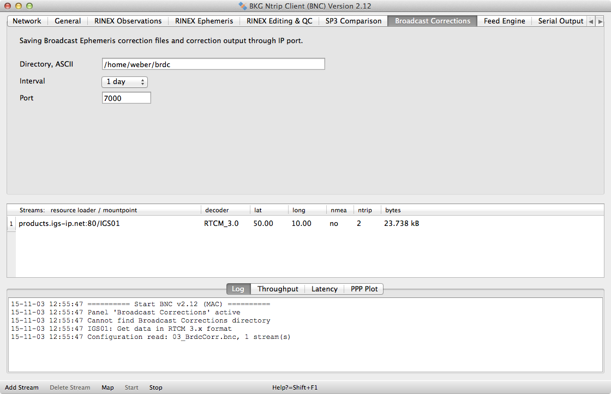

   Example for pulling, saving and output of Broadcast Corrections using BNC

.. index:: Feed engine

Feed Engine
===========

BNC can produce synchronized or unsynchronized observations epoch by epoch from all stations and satellites to feed a real-time GNSS network engine. Observations can be streamed out through an IP port and/or saved in a file. The output is always in the same plain ASCII format and sorted per incoming stream.

Each epoch in the synchronized output begins with a line containing the GPS Week Number and the seconds within the GPS Week. Following lines begin with the mountpoint string of the stream which provides the observations followed by a satellite number. Specifications for satellite number, code, phase, Doppler and signal strength data follow definitions presented in the RINEX Version 3 documentation. In case of phase observations, a 'Lock Time Indicator' is added. The end of an epoch is indicated by an empty line.

A valid 'Lock Time Indicator' is only presented for observations from RTCM Version 3 streams. The parameter provides a measure of the amount of time that has elapsed during which the receiver has maintained continuous lock on that satellite signal. If a cycle slip occurs during the previous measurement cycle, the lock indicator will be reset to Zero. In case of observations from RTCM Version 2 streams, the 'Lock Time Indicator' is always set to '-1'.

:numref:`Table %s <tab_FEED_ENGINE>` describes the format of BNC's synchronized output of GNSS observations which consists of 'Epoch Records' and 'Observation Records'. Each Epoch Record is followed by one or more Observation Records. The Observation Record is repeated for each satellite having been observed in the current epoch. The length of an Observation Record is given by the number of observation types for this satellite.

.. tabularcolumns:: |p{0.32\textwidth}|p{0.3\textwidth}|p{0.3\textwidth}|

.. _tab_FEED_ENGINE:
.. table:: Contents and format of synchronized output of observations feeding a GNSS engine

  ========================= =============== ===================
  **Identifier**            **Example**     **Format**
  ========================= =============== ===================
  *Epoch Record*
  Record Identifier         >               A1
  GPS Week Number           1850            1X,I4
  GPS Seconds of Week       120556.0000000  1X,F14.7

  *Observation Record*
  Mountpoint                WTZR0           A
  Satellite Number          G01             1X,A3

  *Pseudo-Range Data*
  Observation Code          C1C             1X,A3
  Pseudo-Range Observation  25394034.112    1X,F14.3

  *Carrier Phase Data*
  Observation Code          L1C             1X,A3
  Carrier Phase Observation 133446552.870   1X,F14.3
  Lock Time Indicator       11              1X,I4

  *Doppler Data*
  Observation Code          D1C             1X,A3
  Doppler Observation       -87.977         1X,F14.3

  *Signal Strength*
  Observation Code          S2W             1X,A3
  Observed Signal Strength  34.750          1X,F8.3
  ========================= =============== ===================

The following is an example for synchronized file and IP port output, which presents observations from GPS, GLONASS, Galileo, BDS (BeiDou), QZSS, and SBAS satellites as collected through streams FFMJ1, WTZR0 and CUT07:

.. code-block:: console

  > 1884 206010.0000000
  FFMJ1 G02 C1C   23286796.846 L1C  122372909.535  127 S1C   49.000 C2W   23286793.846 L2W   95355531.583  127 S2W   36.000
  ...
  FFMJ1 G26 C1C   24796690.856 L1C  130307533.550  127 S1C   42.000 C2W   24796697.776 L2W  101538315.510  127 S2W   25.000
  FFMJ1 S20 C1C   38682850.302 L1C  203279786.777  127 S1C   42.000
  FFMJ1 S36 C1C   38288096.846 L1C  201205293.221  127 S1C   47.000
  FFMJ1 R03 C1C   23182737.548 L1C  124098947.838  127 S1C   48.000 C2P   23182746.288 L2P   96521352.130  127 S2P   42.000
  ...
  FFMJ1 R21 C1C   22201343.772 L1C  118803851.388  127 S1C   52.000 C2P   22201348.892 L2P   92402993.884  127 S2P   44.000
  CUT07 G01 C1C   25318977.766 L1C  133052476.488  521 D1C       2533.500 S1C   33.688 C2W   25318993.668 L2W  103677584.878  521 S2W   15.625 C2X   25318991.820 L2X  103676566.850  521 S2X   35.375 C5X   25318993.461 L5X   99357161.238  521 S5X   39.812
  ...
  CUT07 G27 C1C   20251005.351 L1C  106420601.969  627 D1C        250.937 S1C   50.312 C2W   20251014.512 L2W   82924447.644  627 S2W   45.125 C2X   20251014.246 L2X   82924648.644  627 S2X   53.188 C5X   20251015.480 L5X   79469461.619  627 S5X   56.375
  CUT07 R01 C1C   20312587.149 L1C  108583395.373  625 D1C      -2456.703 S1C   52.875 C1P   20312586.192 L1P  108582844.382  625 S1P   51.000 C2C   20312593.422 L2C   84452892.610  625 S2C   43.625 C2P   20312593.836 L2P   84453114.622  625 S2P   42.312
  ...
  CUT07 R24 C1C   19732223.242 L1C  105517564.659  630 D1C         -7.477 S1C   47.375 C1P   19732222.609 L1P  105517564.669  630 S1P   46.375 C2C   19732227.660 L2C   82069550.193  630 S2C   38.125 C2P   19732227.316 L2P   82068477.204  630 S2P   37.375
  CUT07 E11 C1X   28843071.547 L1X  151571208.816  405 D1X      -2221.055 S1X   29.000 C7X   28843082.531 L7X  116138795.418  405 S7X   27.188 C8X   28843085.699 L8X  114662585.261  405 S8X   33.688 C5X   28843086.281 L5X  113186518.907  405 S5X   30.375
  ...
  CUT07 E30 C1X   28096037.289 L1X  147645296.835  630 D1X      -2020.613 S1X   34.688 C7X   28096054.070 L7X  113131111.635  630 S7X   36.875 C8X   28096055.684 L8X  111692702.565  630 S8X   40.375 C5X   28096058.008 L5X  110254591.278  630 S5X   36.188
  CUT07 S27 C1C   40038220.843 L1C  210402303.982  616 D1C        104.688 S1C   36.125 C5I   40038226.375 L5I  157118241.003  616 S5I   40.875
  ...
  CUT07 S37 C1C   37791754.594 L1C  198596881.251  704 D1C        106.605 S1C   37.875
  CUT07 J01 C1C   33076065.781 L1C  173816471.106  674 D1C        169.765 S1C   48.375 C1Z   33076063.086 L1Z  173815528.437  674 S1Z   48.625 C6L   33076065.652 L6L  141084039.422  674 S6L   52.688 C2X   33076070.523 L2X  135440679.474  674 S2X   50.500 C5X   33076076.496 L5X  129797319.733  674 S5X   54.188 C1X   33076065.492 L1X  173815529.101  674 S1X   52.375
  CUT07 C01 C2I   37725820.914 L2I  196447455.374  704 D2I         90.898 S2I   41.312 C6I   37725810.168 L6I  159630204.932  704 S6I   44.875 C7I   37725815.196 L7I  151906389.245  704 S7I   45.812
  ...
  CUT07 C14 C2I   23351041.328 L2I  121594621.501  592 D2I       2422.203 S2I   45.688 C6I   23351032.926 L6I   98805869.415  592 S6I   48.500 C7I   23351041.996 L7I   94024977.673  592 S7I   45.688
  WTZR0 G02 C1C   23641481.864 L1C  124236803.604  127 S1C   47.500 C2W   23641476.604 L2W   96807881.233  127 S2W   39.250
  ...
  WTZR0 G26 C1C   24681555.676 L1C  129702453.534  127 S1C   43.750 C2W   24681561.256 L2W  101066873.870  127 S2W   37.750
  WTZR0 R03 C1C   22982596.508 L1C  123027564.682  127 S1C   47.000 C2P   22982598.368 L2P   95688085.627  127 S2P   43.250
  ...
  WTZR0 R21 C1C   22510252.692 L1C  120456902.811  127 S1C   47.500 C2P   22510253.132 L2P   93688698.401  127 S2P   44.000

  > 1884 206011.0000000
  ...

The source code for BNC comes with a Perl script named 'test\_tcpip\_client.pl' that allows to read BNC's (synchronized or unsynchronized) ASCII observation output from the IP port and print it on standard output for verification.

Note that any socket connection of an application to BNC's synchronized or unsynchronized observation ports is recorded in the 'Log' tab on the bottom of the main window together with a connection counter, resulting in log records like 'New client connection on sync/usync port: # 1'.

The following figure shows the screenshot of a BNC configuration where a number of streams is pulled from different Ntrip Broadcasters to feed a GNSS engine via IP port output.

.. _fig_18:
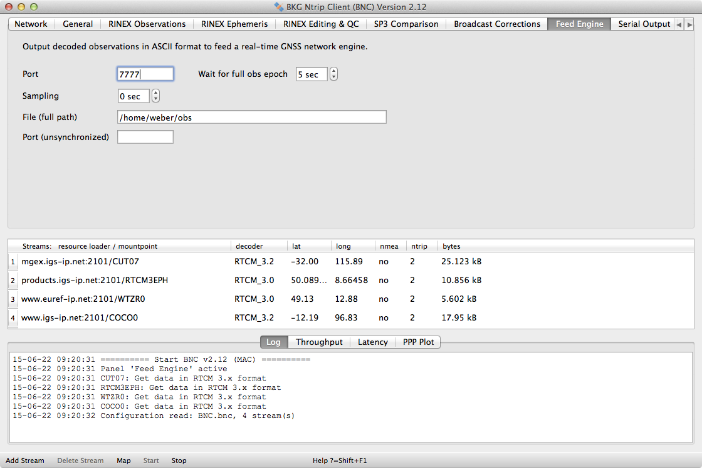

   Synchronized BNC output via IP port to feed a GNSS real-time engine

Port - optional
---------------

BNC can produce synchronized observations in ASCII format on your local host (IP 127.0.0.1) through an IP 'Port'. Synchronized means that BNC collects all observation data for a specific epoch, which become available within a certain number of seconds (see 'Wait for Full Obs Epoch' option). It then - epoch by epoch - outputs whatever has been received. The output comes block-wise per stream following the format specified in :numref:`Table %s <tab_FEED_ENGINE>`. Enter an IP port number here to activate this function. The default is an empty option field, meaning that no synchronized output is generated.

Wait for Full Obs Epoch - mandatory if 'Port' is set
----------------------------------------------------

When feeding a real-time GNSS network engine waiting for synchronized observations epoch by epoch, BNC drops whatever is received later than 'Wait for full obs epoch' seconds. A value of 3 to 5 seconds could be an appropriate choice for that, depending on the latency of the incoming streams and the delay acceptable for your real-time GNSS product. Default value for 'Wait for full obs epoch' is 5 seconds.

Note that 'Wait for full obs epoch' does not affect the RINEX Observation file content. Observations received later than 'Wait for full obs epoch' seconds will still be included in the RINEX Observation files.

Sampling - mandatory if 'File' or 'Port' is set
-----------------------------------------------

Select a synchronized observation output sampling interval in seconds. A value of zero '0' tells BNC to send/store all received epochs. This is the default value.

File - optional
---------------

Specify the full path to a 'File' where synchronized observations are saved in plain ASCII format. The default value is an empty option field, meaning that no ASCII output file is created.

Beware that the size of this file can rapidly increase depending on the number of incoming streams. To prevent it from becoming too large, the name of the file can be changed on-the-fly. This option is primarily meant for test and evaluation.

Port (unsynchronized) - optional
--------------------------------

BNC can produce unsynchronized observations from all configured streams in ASCII format on your local host (IP 127.0.0.1) through an IP 'Port'. Unsynchronized means that BNC immediately forwards any received observation to the port. Nevertheless, the output is produced block-wise per stream. Specify an IP port number here to activate this function. The default is an empty option field, meaning that no unsynchronized output is generated.

The following is an example for unsynchronized IP port output which presents observations from GPS and GLONASS as collected through stream WTZR0. The format for synchronized and unsynchronized output of observations is very much the same. However, unsynchronized output does not have 'Epoch Records' and 'Observation Records'. Instead each record contains the 'GPS Week Number' and 'GPS Second of Week' time tag between the mountpoint string and the satellite number, see :numref:`Table %s <tab_FEED_ENGINE>` for format details.

.. code-block:: console

  WTZR0 1884 209623.0000000 G02 C1C   22259978.112 L1C  116976955.890  127 S1C   49.250 C2W   22259974.472 L2W   91150855.991  127 S2W   44.500
  WTZR0 1884 209623.0000000 G03 C1C   24426736.058 L1C  128363272.624  127 S1C   43.500 C2W   24426741.838 L2W  100023289.335  127 S2W   39.000
  ...
  WTZR0 1884 209623.0000000 G29 C1C   25275897.592 L1C  132825869.191   90 S1C   35.250 C2W   25275893.692 L2W  103500567.110    8 S2W   28.500
  WTZR0 1884 209623.0000000 G30 C1C   23670676.284 L1C  124390283.441  127 S1C   46.750 C2W   23670679.784 L2W   96927531.685  127 S2W   39.500
  WTZR0 1884 209623.0000000 R04 C1C   20758122.104 L1C  111158778.398  127 S1C   50.000 C2P   20758121.664 L2P   86456803.800  127 S2P   47.000
  WTZR0 1884 209623.0000000 R05 C1C   19430829.552 L1C  103868912.028  127 S1C   45.750 C2P   19430829.672 L2P   80786936.849  127 S2P   46.750
  ...

.. index:: Serial output

Serial output
=============

You may use BNC to feed a serially connected device like a GNSS receiver. For that, an incoming stream can be forwarded to a serial port. Depending on the stream content, the receiver may use it for Differential GNSS, Precise Point Positioning or any other purpose supported by its firmware. Note that receiving a VRS stream requires the receiver sending NMEA sentences (option 'NMEA' set to 'Manual' or 'Auto') to the Ntrip Broadcaster. :numref:`Fig. %s <fig_19>` shows the data flow when pulling a VRS stream or a physical (non-VRS) stream.

.. _fig_19:
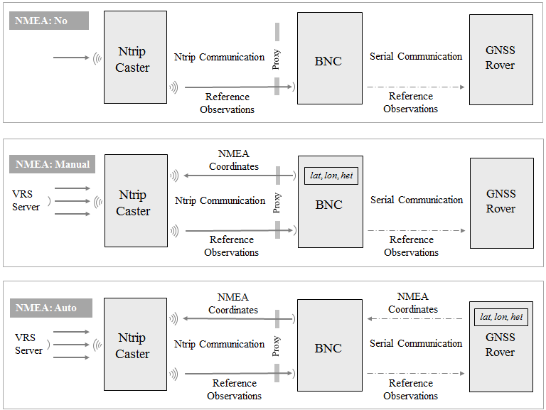

   Flowcharts, BNC forwarding a stream to a serially connected receiver; sending NMEA sentences is mandatory for VRS streams

:numref:`Fig. %s <fig_20>` shows the screenshot of an example situation where BNC pulls a VRS stream from an Ntrip Broadcaster to feed a serially connected RTK rover.

.. _fig_20:
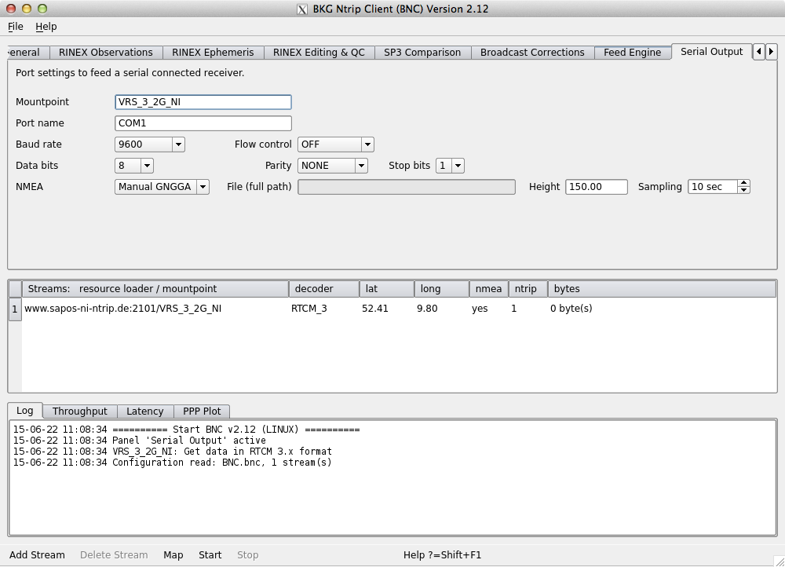

   BNC pulling a VRS stream to feed a serially connected RTK rover

Mountpoint - optional
---------------------

Enter a 'Mountpoint' to forward its corresponding stream to a serially connected GNSS receiver. When selecting one of the serial communication options listed below, make sure that you pick those configured to the serially connected receiver.

Port Name - mandatory if 'Mountpoint' is set
--------------------------------------------

Enter the serial 'Port name' selected on your host for communication with the serially connected receiver. Valid port names are summarized in :numref:`Table %s <tab_PORT_NAMES>`.

.. tabularcolumns:: |p{0.3\textwidth}|p{0.62\textwidth}|

.. _tab_PORT_NAMES:
.. table:: Valid port names for serially connected receivers.

  ================= ======================
  **OS**            **Port Names**
  ================= ======================
  Windows           COM1, COM2
  Linux             /dev/ttyS0, /dev/ttyS1
  FreeBSD           /dev/ttyd0, /dev/ttyd1
  Digital Unix      /dev/tty01, /dev/tty02
  HP-UX             /dev/tty1p0, /dev/tty2p0
  SGI/IRIX          /dev/ttyf1, /dev/ttyf2
  SunOS/Solaris     /dev/ttya, /dev/ttyb
  ================= ======================

Note that you must plug a serial cable in the port defined here before you start BNC.

Baud Rate - mandatory if 'Mountpoint' is set
--------------------------------------------

Select a 'Baud rate' for the serial output link. Note that using a high baud rate is recommended.

Flow Control - mandatory if 'Mountpoint' is set
-----------------------------------------------

Select a 'Flow control' for the serial output link. Note that your selection must equal the flow control configured to the serially connected device. Select 'OFF' if you do not know better.

Parity - mandatory if 'Mountpoint' is set
-----------------------------------------

Select the 'Parity' for the serial output link. Note that parity is often set to 'NONE'.

Data Bits - mandatory if 'Mountpoint' is set
--------------------------------------------

Select the number of 'Data bits' for the serial output link. Note that often '8' data bits are used.

Stop Bits - mandatory if 'Mountpoint' is set
--------------------------------------------

Select the number of 'Stop bits' for the serial output link. Note that often '1' stop bit is used.

NMEA - mandatory if 'Mountpoint' is set
---------------------------------------

The 'NMEA' option supports the so-called 'Virtual Reference Station' (VRS) concept which requires the receiver to send approximate position information to the Ntrip Broadcaster. Select 'no' if you do not want BNC to forward or upload any NMEA sentence to the Ntrip broadcaster in support of VRS.

Select 'Auto' to automatically forward NMEA sentences of type GGA from your serially connected receiver to the Ntrip broadcaster and/or save them in a file.

Select 'Manual GPGGA' or 'Manual GNGGA' if you want BNC to produce and upload GPGGA or GNGGA NMEA sentences to the Ntrip broadcaster because your serially connected receiver does not generate them. A Talker ID 'GP' proceeding the GGA string stands for GPS solutions while a Talker ID 'GN' stands for multi-constellation solutions.

Note that selecting 'Auto' or 'Manual' works only for VRS streams which show up under the 'Streams' canvas on BNC's main window with 'nmea' stream attribute set to 'yes'. This attribute is either extracted from the Ntrip broadcaster's source-table or introduced by the user through editing the BNC configuration file.

File - optional if 'NMEA' is set to 'Auto'
------------------------------------------

Specify the full path to a file where NMEA sentences coming from your serially connected receiver are saved. Default is an empty option field, meaning that no NMEA sentences will be saved on disk.

Height - mandatory if 'NMEA' is set to 'Manual'
-----------------------------------------------

Specify an approximate 'Height' above mean sea level in meters for the reference station introduced through 'Mountpoint'. Together with the latitude and longitude from the Ntrip broadcaster source-table, the height information is used to build GGA sentences to be sent to the Ntrip broadcaster.

For adjusting latitude and longitude values of a VRS stream given in the 'Streams' canvas, you can double click the latitude/longitude data fields, specify appropriate values and then hit Enter.

This option is only relevant when option 'NMEA' is set to 'Manual GPGGA' or 'Manual GNGGA' respectively.

Sampling - mandatory if 'NMEA' is set to 'Manual'
-------------------------------------------------

Select a sampling interval in seconds for manual generation and upload of NMEA GGA sentences.

A sampling rate of '0' means that a GGA sentence will be sent only once to initialize the requested VRS stream. Note that some VRS systems need GGA sentences at regular intervals.

.. index:: Stream outages, Stream corruption

Outages
=======

At any time an incoming stream might become unavailable or corrupted. In such cases, it is important that the BNC operator and/or the stream providers become aware of the situation so that measures can be taken to restore the stream. Furthermore, continuous attempts to decode a corrupted stream can generate unnecessary workload for BNC. Outages and corruptions are handled by BNC as follows:

Stream outages: BNC considers a connection to be broken when there are no incoming data detected for more than 20 seconds. When this occurs, BNC will try to reconnect at a decreasing rate. It will first try to reconnect with 1 second delay and again in 2 seconds if the previous attempt failed. If the attempt is still unsuccessful, it will try to reconnect within 4 seconds after the previous attempt and so on. The waiting time doubles each time with a maximum of 256 seconds.

Stream corruption: Not all chunks of bits transferred to BNC's internal decoder may return valid observations. Sometimes several chunks might be needed before the next observation can be properly decoded. BNC buffers all outputs (both valid and invalid) from the decoder for a short time span (size derived from the expected 'Observation rate') to then determine whether a stream is valid or corrupted.

Outage and corruption events are reported in the 'Log' tab. They can also be passed on as parameters to a shell script or batch file to generate an advisory note to BNC's operator or affected stream providers. This functionality lets users utilize BNC as a real-time performance monitor and alarm system for a network of GNSS reference stations, see :numref:`Fig. %s <fig_20b>` for an example setup.

.. _fig_20b:
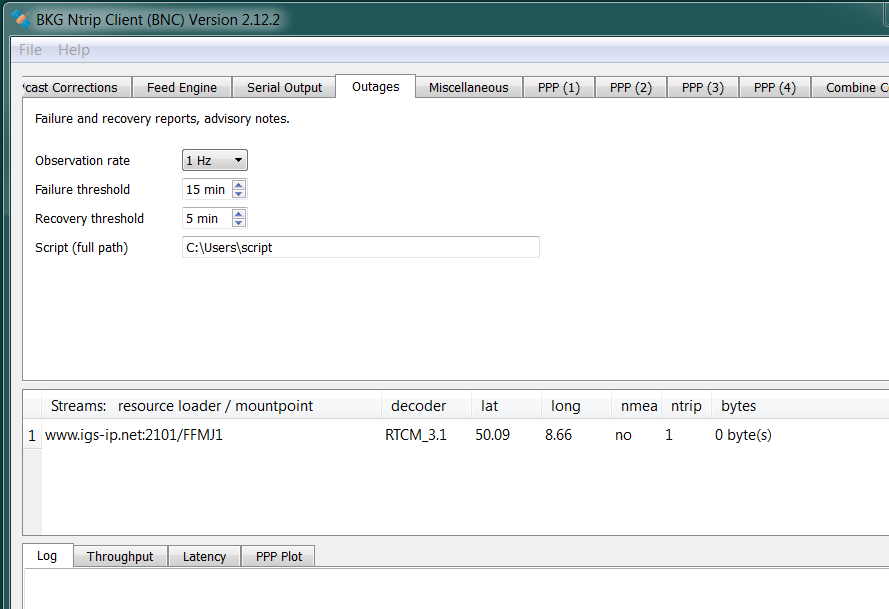

   Specifying thresholds for stream outage and recovery

Observation Rate - optional
---------------------------

BNC can collect all returns (success or failure) coming from a decoder within a certain short time span to then decide whether a stream has an outage or its content is corrupted. This procedure needs a rough a priori estimate of the expected observation rate of the incoming streams.

An empty option field (default) means that you do not want explicit information from BNC about stream outages and incoming streams that cannot be decoded.

Failure Threshold - mandatory if 'Observation rate' is set
----------------------------------------------------------

Event 'Begin_Failure' will be reported if no data is received continuously for longer than the 'Failure threshold' time. Similarly, event 'Begin_Corrupted' will be reported when corrupted data is detected by the decoder continuously for longer than this 'Failure threshold' time. The default value is set to 15 minutes and is recommended as to not inundate users with too many event reports.

Note that specifying a value of zero '0' for the 'Failure threshold' will force BNC to report any stream failure immediately. Note also that for using this function you need to specify the 'Observation rate'.

Recovery Threshold - mandatory if 'Observation rate' is set
-----------------------------------------------------------

Once a 'Begin_Failure' or 'Begin_Corrupted' event has been reported, BNC will check when the stream again becomes available or uncorrupted. Event 'End_Failure' or 'End_Corrupted' will be reported as soon as valid observations are detected continuously throughout the 'Recovery threshold' time span. The default value is set to 5 minutes and is recommended as to not inundate users with too many event reports.

Note that specifying a value of zero '0' for the 'Recovery threshold' will force BNC to report any stream recovery immediately. Note also that for using this function you need to specify the 'Observation rate'.

Script - optional if 'Observation rate' is set
----------------------------------------------

As mentioned before, BNC can trigger a shell script or a batch file to be executed when one of the described events is reported. This script can be used to email an advisory note to network operator or stream providers. To enable this feature, specify the full path to the script or batch file in the 'Script' field. The affected stream's mountpoint and type of event reported ('Begin_Outage', 'End_Outage', 'Begin_Corrupted' or 'End_Corrupted') will then be passed on to the script as command line parameters (%1 and %2 on Windows systems or $1 and $2 on Unix/Linux/Mac OS X systems) together with date and time information.

Leave the 'Script' field empty if you do not wish to use this option. An invalid path will also disable this option.

Examples for command line parameter strings passed on to the advisory 'Script' are:

.. code-block:: console

  FFMJ0 Begin_Outage 08-02-21 09:25:59
  FFMJ0 End_Outage 08-02-21 11:36:02 Begin was 08-02-21 09:25:59

Sample script for Unix/Linux/Mac OS X systems:

.. code-block:: none

  #!/bin/bash
  sleep $((60*RANDOM/32767))
  cat > mail.txt <<EOF
  Advisory Note to BNC User,
  Please note the following advisory received from BNC.
  Stream: $*
  Regards, BNC
  EOF
  mail -s "NABU: $1" email@address < mail.txt

Note the sleep command in this script, which causes the system to wait for a random period of up to 60 seconds before sending the email. This should avoid overloading your mail server in case of a simultaneous failure of many streams.

Miscellaneous
=============

This section describes several miscellaneous options which can be applied to a single stream (mountpoint) or to all configured streams. :numref:`Fig. %s <fig_21>` shows RTCM message numbers and observation types contained in stream 'CUT07' and the message latencies recorded every 2 seconds.

.. _fig_21:
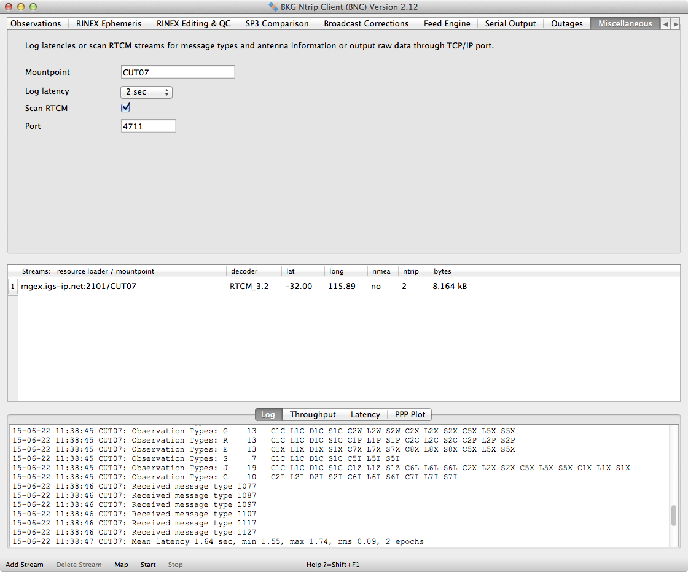

   RTCM message numbers, latencies and observation types logged by BNC

Mountpoint - optional
---------------------

Specify a mountpoint to apply one or several of the 'Miscellaneous' options to the corresponding stream. Enter 'ALL' if you want to apply these options to all configured streams. An empty option field (default) means that you do not want BNC to apply any of these options.

Log Latency - optional
----------------------

BNC can average latencies per stream over a certain period of GPS time, the 'Log latency' interval. Mean latencies are calculated from the individual latencies of one (first incoming) observation or Broadcast Correction per second. The mean latencies are then saved in BNC's logfile. Note that computing correct latencies requires the clock of the host computer to be properly synchronized. Note further that visualized latencies from the 'Latency' tab on the bottom of the main window represent individual latencies and not the mean latencies for the logfile.

.. index:: Latency monitoring

Latency
^^^^^^^

Latency is defined in BNC by

.. math::

     l = t_{UTC} - t_{GPS} + t_{leap}

.. tabularcolumns:: |p{0.3\textwidth}|p{0.62\textwidth}|

with latency :math:`l`, UTC time provided by BNC's host :math:`t_{UTC}`, GPS time of currently processed epoch :math:`t_{GPS}` and Leap seconds between UTC and GPS time :math:`t_{leap}`.

.. index:: Statistics monitoring

Statistics
^^^^^^^^^^

BNC counts the number of GPS seconds covered by at least one observation. It also estimates an observation rate (independent from the a priori specified 'Observation rate') from all observations received throughout the first full 'Log latency' interval. Based on this rate, BNC estimates the number of data gaps when appearing in subsequent intervals.

Latencies of observations or corrections to Broadcast Ephemeris and statistical information can be recorded in the 'Log' tab at the end of each 'Log latency' interval. A typical output from a 1 hour 'Log latency' interval would be:

.. code-block:: console

  08-03-17 15:59:47 BRUS0: Mean latency 1.47 sec, min 0.66, max 3.02, rms 0.35, 3585 epochs, 15 gaps

Select a 'Log latency' interval to activate this function or select the empty option field if you do not want BNC to log latencies and statistical information.

Scan RTCM - optional
--------------------

When configuring a GNSS receiver for RTCM stream generation, the firmware's setup interface may not provide details about RTCM message types and observation types. As reliable information concerning stream content should be available e.g. for Ntrip Broadcaster operators to maintain the broadcaster's source-table, BNC allows to scan RTCM streams for incoming message types and printout some of the contained meta-data. Contained observation types are also printed because such information is required a priori for the conversion of RTCM Version 3 MSM streams to RINEX Version 3 files. The idea for this option arose from 'inspectRTCM', a comprehensive stream analyzing tool written by D. Stöcker.

Tick 'Scan RTCM' to scan RTCM Version 2 or 3 streams and log all contained

* Numbers of incoming message types
* Antenna Reference Point (ARP) coordinates
* Antenna Phase Center (APC) coordinates
* Antenna height above marker
* Antenna descriptor.

In case of RTCM Version 3 streams the output includes

* RINEX Version 3 Observation types

Note that in RTCM Version 2 message types 18 and 19 carry only the observables of one frequency. Hence it needs two type 18 and 19 messages per epoch to transport observations from dual frequency receivers.

Please note further that RTCM Version 3 message types 1084 for GLONASS do not contain GLONASS channel numbers. Observations from these messages can only be decoded when you include 1020 GLONASS ephemeris messages to your stream which contain the channels. You could also consider adding a second stream carrying 1087 GLONASS observation messages or 1020 GLONASS ephemeris messages as both contain the GLONASS channel numbers.

Logged time stamps refer to message reception time and allow understanding repetition rates. Enter 'ALL' if you want to log this information from all configured streams. Beware that the size of the logfile can rapidly increase depending on the number of incoming RTCM streams.

This option is primarily meant for test and evaluation. Use it to figure out what exactly is produced by a specific GNSS receiver's configuration. An empty option field (default) means that you do not want BNC to print message type numbers and antenna information carried in RTCM streams.

Port - optional
---------------

BNC can output streams related to the above specified 'Mountpoint' through a TCP/IP port of your local host. Enter a port number to activate this function. The stream content remains untouched. BNC does not decode or reformat the data for this output. Be careful when keyword 'ALL' is specified as 'Mountpoint' for involving all incoming streams together because the affiliation of data to certain streams gets lost in the output. An empty option field (default) means that you do not want BNC to apply the TCP/IP port output option.

.. index:: PPP client

PPP Client
==========

BNC can derive coordinates for rover positions following the Precise Point Positioning (PPP) approach. It uses code or code plus phase data from one or more GNSS systems in ionosphere-free linear combinations P3, L3, or P3&L3. Besides pulling streams of observations from a dual frequency GNSS receiver, this

* Requires pulling in addition a stream carrying satellite orbit and clock corrections to Broadcast Ephemeris in the form of RTCM Version 3 'State Space Representation' (SSR) messages. Note that for BNC these Broadcast Corrections need to be referred to the satellite's Antenna Phase Center (APC). Streams providing such messages are listed on (http://igs.bkg.bund.de/ntrip/orbits) :cite:`caissy2012a`. Stream 'CLK11' on Ntrip Broadcaster 'products.igs-ip.net:2101' is an example.
* May require pulling a stream carrying Broadcast Ephemeris available as RTCM Version 3 message types 1019, 1020, 1043, 1044, 1045, 1046 and 63 (tentative). This becomes a must only when the stream coming from the receiver does not contain Broadcast Ephemeris or provides them only at very low repetition rate. Streams providing such messages are listed on http://igs.bkg.bund.de/ntrip/ephemeris. Stream 'RTCM3EPH' on caster 'products.igs-ip.net:2101' is an example.

Note that Broadcast Ephemeris parameters pass a plausibility check in BNC which allows to ignore incorrect or outdated ephemeris data when necessary, leaving a note 'WRONG EPHEMERIS' or 'OUTDATED EPHEMERIS' in the logfile.

When using the PPP option, it is important to understand which effects are corrected by BNC:

* BNC does correct for Solid Earth Tides and Phase Windup.
* Satellite Antenna Phase Center offsets are corrected.
* Satellite Antenna Phase Center variations are neglected because this is a small effect usually less than 2 centimeters.
* Observations can be corrected for a Receiver Antenna Offset and Receiver Antenna Phase Center Variation. Depending on whether or not these corrections are applied, the estimated position is either that of the receiver's Antenna Phase Center or that of the receiver's Antenna Reference Point.
* Ocean and atmospheric loading is neglected. Atmospheric loading is pretty small. Ocean loading is usually also a small effect but may reach up to about 10 centimeters for coastal stations.
* Rotational deformation due to polar motion (Polar Tides) is not corrected because this is a small effect usually less than 2 centimeters.

The provider of an orbit/clock correction stream may switch with his service at any time from a duty to a backup server installation. This shall be noted in the SSR stream through a change of the Issue Of Data (IOD SSR) parameter. The PPP option in BNC will immediately reset all ambiguities in such a situation.

PPP options are specified in BNC through the following four panels:

* PPP (1): Input and output, specifying real-time or post processing mode and associated data sources
* PPP (2): Processed stations, specifying sigmas and noise of a priori coordinates and NMEA stream output
* PPP (3): Processing options, specifying general PPP processing options
* PPP (4): Plots, specifying visualization through time series and track maps

.. index:: PPP Input and Output

PPP (1): Input and Output
-------------------------

This panel provides options for specifying the input and output streams and files required by BNC for real-time or post processing PPP, see :numref:`Fig. %s <fig_22>` for an example screenshot.

.. _fig_22:
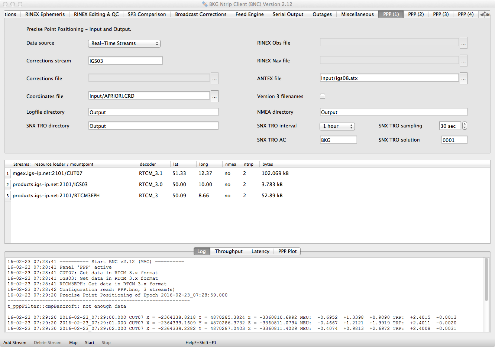

   Real-time Precise Point Positioning with BNC, PPP Panel 1

Data Source - optional
^^^^^^^^^^^^^^^^^^^^^^

Choose between input from 'Real-time Streams' or 'RINEX Files' for PPP with BNC in real-time or post processing mode.

Real-time Streams
"""""""""""""""""

When choosing 'Real-time Streams' BNC will do PPP solutions in real-time. This requires pulling GNSS observation streams, Broadcast Ephemeris messages and a stream containing corrections to Broadcast Ephemeris. Streams must come in RTCM Version 2 or RTCM Version 3 format. If you do not pull Broadcast Corrections, BNC will switch with its solution to 'Single Point Positioning' (SPP) mode. With RTCM Version 2 an ionosphere free linear combination of code-only observations cannot be processed.

RINEX Files
"""""""""""

This input mode allows to specify RINEX Observation, RINEX Navigation and Broadcast Correction files. BNC accepts RINEX Version 2 as well as RINEX Version 3 Observation or Navigation file formats. Files carrying Broadcast Corrections must have the format produced by BNC through the 'Broadcast Corrections' panel. Specifying only a RINEX Observation and a RINEX Navigation file and no Broadcast Correction file leads BNC to a 'Single Point Positioning' (SPP) solution.

Debugging
"""""""""

Note that for debugging purposes, BNC's real-time PPP functionality can also be used offline. Apply the 'File Mode' 'Command Line' option for that to read a file containing synchronized observations, orbit and clock correctors, and Broadcast Ephemeris. Example:

.. code-block:: bat

  bnc.exe --conf c:\temp\PPP.bnc --file c:\temp\RAW

Such a file (here: 'RAW') must be saved beforehand using BNC's 'Raw output file' option.

RINEX Observation File - mandatory if 'Data source' is set to 'RINEX Files'
^^^^^^^^^^^^^^^^^^^^^^^^^^^^^^^^^^^^^^^^^^^^^^^^^^^^^^^^^^^^^^^^^^^^^^^^^^^

Specify a RINEX Observation file. The file format can be RINEX Version 2 or RINEX Version 3.

RINEX Navigation File - mandatory if 'Data source' is set to 'RINEX Files'
^^^^^^^^^^^^^^^^^^^^^^^^^^^^^^^^^^^^^^^^^^^^^^^^^^^^^^^^^^^^^^^^^^^^^^^^^^

Specify a RINEX Navigation file. The file format can be RINEX Version 2 or RINEX Version 3.

Corrections Stream - optional if 'Data source' is set to 'Real-Time Streams'
^^^^^^^^^^^^^^^^^^^^^^^^^^^^^^^^^^^^^^^^^^^^^^^^^^^^^^^^^^^^^^^^^^^^^^^^^^^^

Specify a Broadcast 'Corrections stream' from the list of selected 'Streams' you are pulling if you want BNC to correct your satellite ephemeris accordingly. Note that the stream's orbit and clock corrections must refer to the satellite Antenna Phase Center (APC). Streams providing such corrections are made available e.g. through the International GNSS Service (IGS) and listed on http://igs.bkg.bund.de/ntrip/orbits. The stream format must be RTCM Version 3 containing so-called SSR messages. Streams 'IGS03' and 'CLK11' supporting GPS plus GLONASS are examples. If you do not specify a 'Corrections stream', BNC will fall back from a PPP solution to a Single Point Positioning (SPP) solution.

Corrections File - optional if 'Data source' is set to 'RINEX Files'
^^^^^^^^^^^^^^^^^^^^^^^^^^^^^^^^^^^^^^^^^^^^^^^^^^^^^^^^^^^^^^^^^^^^

Specify a Broadcast 'Corrections file' as saved beforehand using BNC. The file content is basically the ASCII representation of a RTCM Version 3 Broadcast Correction (SSR) stream. If you do not specify a 'Correction file', BNC will fall back from a PPP solution to a Single Point Positioning (SPP) solution.

ANTEX File - optional
^^^^^^^^^^^^^^^^^^^^^

IGS provides a file containing absolute phase center corrections for GNSS satellite and receiver antennas in ANTEX format. Entering the full path to such an ANTEX file is required for correcting observations in PPP for Antenna Phase Center offsets and variations. Note that for applying such corrections you need to specify the receiver's antenna name and radome in BNC's 'Coordinates file'.

Default value for 'ANTEX file' is an empty option field, meaning that you do not want to correct observations for Antenna Phase Center offsets and variations.

Coordinates File - optional
^^^^^^^^^^^^^^^^^^^^^^^^^^^

Enter the full path to an ASCII file which specifies all observation streams or files from stationary or mobile receivers you possibly may want to process. Specifying a 'Coordinates file' is optional. If it exists, it should contain one record per stream or file with the following parameters separated by blank characters:

* Input data source, to be specified either through

  * the 'Mountpoint' of an RTCM stream (when in real-time PPP mode), or
  * the first four characters of the RINEX observations file (when in post processing PPP mode).

  Having at least this first parameter in each record is mandatory.

* Only for static observations from a stationary receiver: Approximate a priori XYZ coordinate [m] of the station's marker; specify '0.0 0.0 0.0' if unknown or when observations come from a mobile receiver.
* Nort, East and Up component [m] of antenna eccentricity which is the difference between Antenna Reference Point (ARP) and a nearby marker position; when specifying the antenna eccentricity BNC will produce coordinates referring to the marker position and not referring to ARP; specify '0.0 0.0 0.0' if eccentricity is unknown or the ARP itself is understood as the marker.

Receiver's antenna name as defined in your ANTEX file (see below); Observations will be corrected for the Antenna Phase Center (APC) offsets and variations, which may result in a reduction of a few centimeters at max; the specified name must consist of 20 characters; add trailing blanks if the antenna name has less than 20 characters; examples:

.. code-block:: console

  'JPSREGANT_SD_E      ' (no radome)
  'LEIAT504        NONE' (no radome)
  'LEIAR25.R3      LEIT' (radome is LEIT)

Leave antenna name blank if you do not want to correct observations for APC offsets and variations or if you do not know the antenna name.
* Receiver type following the naming convention for IGS equipment as defined in https://igscb.jpl.nasa.gov/igscb/station/general/rcvr\_ant.tab. Specifying the receiver type is only required when saving SINEX Troposphere files. In those files it becomes part of the 'SITE/RECEIVER' specifications, see section 'SNX TRO Directory'.

Records in the 'Coordinates' file with exclamation mark '!' in the first column or blank records will be understood as comment lines and ignored.

The following is the content of an example 'Coordinates file'. Here each record describes the mountpoint of a stream available from the global IGS real-time reference station network. A priori coordinates are followed by North/East/Up eccentricity components of the ARP followed by the antenna name, radome and the receiver name in use.

.. code-block:: console

  !
  ! Station    X[m]          Y[m]          Z[m] North[m]  EAST[m]  UP[m]  Antenna        Radom Receiver
  ! -------------------------------------------------------------------------------- -------------------
  ADIS0  4913652.6612  3945922.7678   995383.4359  0.0000  0.0000  0.0010 TRM29659.00     NONE JPS LEGACY
  ALIC0 -4052052.5593  4212836.0078 -2545104.8289  0.0000  0.0000  0.0015 LEIAR25.R3      NONE LEICA GRX1200GGPRO
  BELF0  3685257.8823  -382908.8992  5174311.1067  0.0000  0.0000  0.0000 LEIAT504GG      LEIS LEICA GRX1200GGPRO
  BNDY0 -5125977.4106  2688801.2966 -2669890.4345  0.0000  0.0000  0.0000 ASH701945E_M    NONE TRIMBLE NETR5
  BRAZ0  4115014.0678 -4550641.6105 -1741443.8244  0.0000  0.0000  0.0080 LEIAR10         NONE LEICA GR25
  CTWN0  5023564.4285  1677795.7211 -3542025.8392  0.0000  0.0000  0.0000 ASH701941.B     NONE TRIMBLE NETR5
  CUT07 -2364337.4408  4870285.6055 -3360809.6280  0.0000  0.0000  0.0000 TRM59800.00     SCIS TRIMBLE NETR9
  GANP0  3929181.3480  1455236.9105  4793653.9880  0.0000  0.0000  0.3830 TRM55971.00     NONE TRIMBLE NETR9
  HLFX0  2018905.6037 -4069070.5095  4462415.4771  0.0000  0.0000  0.1000 TPSCR.G3        NONE TPS NET-G3A
  LHAZ0  -106941.9272  5549269.8041  3139215.1564  0.0000  0.0000  0.1330 ASH701941.B     NONE TPS E_GGD
  LMMF7  2993387.3587 -5399363.8649  1596748.0983  0.0000  0.0000  0.0000 TRM57971.00     NONE TRIMBLE NETR9
  MAO07 -5466067.0979 -2404333.0198  2242123.1929  0.0000  0.0000  0.0000 LEIAR25.R3      LEIT JAVAD TRE_G3TH DELTA
  NICO0  4359415.5252  2874117.1872  3650777.9614  0.0000  0.0000  0.0650 LEIAR25.R4      LEIT LEICA GR25
  NKLG7  6287385.7320  1071574.7606    39133.1088 -0.0015 -0.0025  3.0430 TRM59800.00     SCIS TRIMBLE NETR9
  NURK7  5516756.5103  3196624.9684  -215027.1315  0.0000  0.0000  0.1300 TPSCR3_GGD      NONE JAVAD TRE_G3TH DELTA
  ONSA0  3370658.3928   711877.2903  5349787.0603  0.0000  0.0000  0.9950 AOAD/M_B        OSOD JAVAD TRE_G3TH DELTA
  PDEL0  4551595.9072 -2186892.9495  3883410.9685  0.0000  0.0000  0.0000 LEIAT504GG      NONE LEICA GRX1200GGPRO
  RCMN0  5101056.6270  3829074.4206  -135016.1589  0.0000  0.0000  0.0000 LEIAT504GG      LEIS LEICA GRX1200GGPRO
  REUN0  3364098.9668  4907944.6121 -2293466.7379  0.0000  0.0000  0.0610 TRM55971.00     NONE TRIMBLE NETR9
  REYK7  2587384.0890 -1043033.5433  5716564.1301  0.0000  0.0000  0.0570 LEIAR25.R4      LEIT LEICA GR25
  RIO27  1429907.8578 -3495354.8953 -5122698.5595  0.0000  0.0000  0.0350 ASH700936C_M    SNOW JAVAD TRE_G3TH DELTA
  SMR50   927077.1096 -2195043.5597 -5896521.1344  0.0000  0.0000  0.0000 TRM41249.00     TZGD TRIMBLE NETR5
  SUWN0 -3062023.1604  4055447.8946  3841818.1684  0.0000  0.0000  1.5700 TRM29659.00     DOME TRIMBLE NETR9
  TASH7  1695944.9208  4487138.6220  4190140.7391  0.0000  0.0000  0.1206 JAV_RINGANT_G3T NONE JAVAD TRE_G3TH DELTA
  UFPR0  3763751.6731 -4365113.9039 -2724404.5331  0.0000  0.0000  0.1000 TRM55971.00     NONE TRIMBLE NETR5
  UNB30  1761287.9724 -4078238.5659  4561417.8448  0.0000  0.0000  0.3145 TRM57971.00     NONE TRIMBLE NETR9
  WIND7  5633708.8016  1732017.9297 -2433985.5795  0.0000  0.0000  0.0460 ASH700936C_M    SNOW JAVAD TRE_G3TH DELTA
  WTZR0  4075580.3797   931853.9767  4801568.2360  0.0000  0.0000  0.0710 LEIAR25.R3      LEIT LEICA GR25
  WUH27 -2267749.9761  5009154.5504  3221294.4429  0.0000  0.0000  0.1206 JAV_RINGANT_G3T NONE JAVAD TRE_G3TH DELTA
  YELL7 -1224452.8796 -2689216.1863  5633638.2832  0.0000  0.0000  0.1000 AOAD/M_T        NONE JAVAD TRE_G3TH DELTA

Note again that the only mandatory parameters in this file are the 'Station' parameters in the first column, each standing for an observation stream's mountpoint or the 4-character station ID of a RINEX filename. The following shows further valid examples for records of a 'Coordinates file'.

.. code-block:: console

  !
  ! Station     X[m]         Y[m]          Z[m]    N[m]   E[m]   U[m]  Antenna        Radom Receiver
  ! --------------------------------------------------------------------------------- ----------------
  WTZR0   4075580.3797  931853.9767  4801568.2360  0.000  0.000  0.071 LEIAR25.R3      LEIT LEICA GR25
  CUT07  -2364337.4408 4870285.6055 -3360809.6280  0.000  0.000  0.000 TRM59800.00     SCIS
  FFMJ1   4053455.7384  617729.8393  4869395.8214  0.000  0.000  0.045
  TITZ1   3993780.4501  450206.8969  4936136.9886
  WARN
  SASS1         0.0          0.0           0.0     0.000  0.000  0.031 TPSCR3_GGD      CONE TRIMBLE NETR5

In this file

* Record 'WTZR0' describes a stream from a stationary receiver with known a priori marker coordinate, antenna eccentricity, antenna and radome type and receiver type.
* Record 'CUT07' describes a stream from a stationary receiver with known a priori marker coordinate, antenna eccentricity and antenna and radome type. The receiver type is unknown.
* Record 'FFMJ1' describes a stream from a stationary receiver with known a priori marker coordinate and antenna eccentricity but unknown antenna, radome and receiver type.
* Record 'TITZ1' describes a stream coming from a stationary receiver where an a priori marker coordinate is known but antenna eccentricity, name and radome and receiver type are unknown.
* The 4-character station ID 'WARN' indicates that a RINEX observations file for post processing PPP is available for station 'WARN' but an a priori marker coordinate as well as antenna eccentricity, name and radome are unknown.
* Record 'SASS1' stands for a mountpoint where the stream comes from a mobile rover receiver. Hence an a priori coordinate is unknown although antenna eccentricity, name and radome and receiver type are known.

Version 3 Filenames - optional
^^^^^^^^^^^^^^^^^^^^^^^^^^^^^^

Tick 'Version 3 filenames' to let BNC create so-called extended filenames for PPP logfiles, NMEA files and SINEX Troposphere files to follow the RINEX Version 3 standard, see section 'RINEX Filenames' for details. Default is an empty check box, meaning to create filenames following the RINEX Version 2 standard. The file content is not affected by this option. It only concerns the filename notation. :numref:`Table %s <tab_RINEX2_FILENAMES>` and :numref:`Table %s <tab_RINEX3_FILENAMES>` give filename examples for RINEX version 2 and 3, respectively.

.. tabularcolumns:: |p{0.3\textwidth}|p{0.62\textwidth}|

.. _tab_RINEX2_FILENAMES:
.. table:: File name examples vor RINEX version 2.

  ================ ========================================
  **Filename**     **Description**
  ================ ========================================
  CUT018671.nmea   NMEA filename, suffix 'nmea'
  CUT018671.ppp    PPP logfile name, suffix 'ppp'
  CUT018671J30.tro SINEX Troposphere filename, suffix 'tro'
  ================ ========================================

.. tabularcolumns:: |p{0.46\textwidth}|p{0.46\textwidth}|

.. _tab_RINEX3_FILENAMES:
.. table:: File name examples vor RINEX version 3.

  ==================================== ========================================
  **Filename**                         **Description**
  ==================================== ========================================
  CUT000AUS_U_20152920000_01D_01S.nmea NMEA filename, suffix 'nmea'
  CUT000AUS_U_20152920000_01D_01S.ppp  PPP logfile name, suffix 'ppp'
  CUT000AUS_U_20152920945_15M_01S.tra  SINEX Troposphere filename, suffix 'tra'
  ==================================== ========================================

.. index:: PPP client logfile

Logfile Directory - optional
^^^^^^^^^^^^^^^^^^^^^^^^^^^^

Essential PPP results are shown in the 'Log' tab on the bottom of BNC's main window. Depending on the processing options, the following values are presented about once per second (example):

.. code-block:: console

  ...
  15-10-21 13:23:38 2015-10-21_13:23:38.000 CUT07 X = -2364337.4505 Y = 4870285.6269 Z = -3360809.6481 NEU:  -0.0046  -0.0006  +0.0306 TRP:  +2.4018  +0.1006
  15-10-21 13:23:39 2015-10-21_13:23:39.000 CUT07 X = -2364337.4468 Y = 4870285.6244 Z = -3360809.6453 NEU:  -0.0043  -0.0029  +0.0258 TRP:  +2.4018  +0.0993
  15-10-21 13:23:40 2015-10-21_13:23:40.000 CUT07 X = -2364337.4455 Y = 4870285.6215 Z = -3360809.6466 NEU:  -0.0070  -0.0027  +0.0238 TRP:  +2.4018  +0.0978
  15-10-21 13:23:41 2015-10-21_13:23:41.000 CUT07 X = -2364337.4447 Y = 4870285.6248 Z = -3360809.6445 NEU:  -0.0039  -0.0049  +0.0249 TRP:  +2.4018  +0.0962
  15-10-21 13:23:42 2015-10-21_13:23:42.000 CUT07 X = -2364337.4426 Y = 4870285.6238 Z = -3360809.6424 NEU:  -0.0031  -0.0063  +0.0223 TRP:  +2.4018  +0.0950
  15-10-21 13:23:43 2015-10-21_13:23:43.000 CUT07 X = -2364337.4453 Y = 4870285.6386 Z = -3360809.6518 NEU:  -0.0033  -0.0104  +0.0395 TRP:  +2.4018  +0.0927
  15-10-21 13:23:44 2015-10-21_13:23:44.000 CUT07 X = -2364337.4435 Y = 4870285.6354 Z = -3360809.6487 NEU:  -0.0027  -0.0106  +0.0348 TRP:  +2.4018  +0.0908
  15-10-21 13:23:45 2015-10-21_13:23:45.000 CUT07 X = -2364337.4445 Y = 4870285.6381 Z = -3360809.6532 NEU:  -0.0049  -0.0109  +0.0396 TRP:  +2.4018  +0.0884
  15-10-21 13:23:46 2015-10-21_13:23:46.000 CUT07 X = -2364337.4437 Y = 4870285.6365 Z = -3360809.6548 NEU:  -0.0073  -0.0109  +0.0389 TRP:  +2.4018  +0.0855
  15-10-21 13:23:47 2015-10-21_13:23:47.000 CUT07 X = -2364337.4498 Y = 4870285.6317 Z = -3360809.6395 NEU:  +0.0049  -0.0033  +0.0294 TRP:  +2.4018  +0.0833
  ...

Each row reports the PPP result of one epoch. It begins with a UTC time stamp (yy-mm-dd hh:mm:ss) which tells us when the result was produced. A second time stamp (yyyy-mm-dd\_hh:mm:ss) describes the PPP's epoch in 'GPS Time'. It is followed by the derived XYZ position in [m], its North, East and Up displacement compared to an introduced a priori coordinate, and the estimated tropospheric delay [m] (model plus correction). If you require more information, you can specify a 'Logfile directory' to save daily logfiles per station (filename suffix 'ppp') with additional processing details on disk:

.. code-block:: console

  Precise Point Positioning of Epoch 2015-10-21_13:23:47.000
  ---------------------------------------------------------------
  2015-10-21_13:23:47.000 SATNUM G  9
  2015-10-21_13:23:47.000 SATNUM R  6
  2015-10-21_13:23:47.000 SATNUM E  0
  2015-10-21_13:23:47.000 SATNUM C  9
  2015-10-21_13:23:47.000 RES C01   P3    0.3201
  2015-10-21_13:23:47.000 RES C02   P3    0.3597
  2015-10-21_13:23:47.000 RES C03   P3   -0.8003
  2015-10-21_13:23:47.000 RES C04   P3    2.7684
  2015-10-21_13:23:47.000 RES C05   P3    4.9738
  2015-10-21_13:23:47.000 RES C06   P3    0.1888
  2015-10-21_13:23:47.000 RES C07   P3   -2.8624
  2015-10-21_13:23:47.000 RES C08   P3   -2.9075
  2015-10-21_13:23:47.000 RES C10   P3   -1.5682
  2015-10-21_13:23:47.000 RES G05   P3    0.3828
  2015-10-21_13:23:47.000 RES G16   P3   -3.7602
  2015-10-21_13:23:47.000 RES G18   P3    0.8424
  2015-10-21_13:23:47.000 RES G20   P3    0.4062
  2015-10-21_13:23:47.000 RES G21   P3    0.8683
  2015-10-21_13:23:47.000 RES G25   P3   -1.3367
  2015-10-21_13:23:47.000 RES G26   P3    1.4107
  2015-10-21_13:23:47.000 RES G29   P3    1.1870
  2015-10-21_13:23:47.000 RES G31   P3   -0.5605
  2015-10-21_13:23:47.000 RES R01   P3   -0.1458
  2015-10-21_13:23:47.000 RES R02   P3   -2.1184
  2015-10-21_13:23:47.000 RES R14   P3    1.8634
  2015-10-21_13:23:47.000 RES R15   P3   -1.3964
  2015-10-21_13:23:47.000 RES R18   P3    0.5517
  2015-10-21_13:23:47.000 RES R24   P3    1.5750
  2015-10-21_13:23:47.000 RES C01   L3   -0.0040
  2015-10-21_13:23:47.000 RES C02   L3    0.0070
  2015-10-21_13:23:47.000 RES C03   L3    0.0093
  2015-10-21_13:23:47.000 RES C04   L3   -0.0017
  2015-10-21_13:23:47.000 RES C05   L3   -0.0008
  2015-10-21_13:23:47.000 RES C06   L3   -0.0031
  2015-10-21_13:23:47.000 RES C07   L3   -0.0016
  2015-10-21_13:23:47.000 RES C08   L3   -0.0089
  2015-10-21_13:23:47.000 RES C10   L3    0.0051
  2015-10-21_13:23:47.000 RES G05   L3   -0.0408
  2015-10-21_13:23:47.000 RES G16   L3    0.0043
  2015-10-21_13:23:47.000 RES G18   L3    0.0017
  2015-10-21_13:23:47.000 RES G20   L3   -0.0132
  2015-10-21_13:23:47.000 RES G21   L3    0.0188
  2015-10-21_13:23:47.000 RES G25   L3   -0.0059
  2015-10-21_13:23:47.000 RES G26   L3    0.0028
  2015-10-21_13:23:47.000 RES G29   L3    0.0062
  2015-10-21_13:23:47.000 RES G31   L3    0.0012
  2015-10-21_13:23:47.000 RES R01   L3    0.0260
  2015-10-21_13:23:47.000 RES R02   L3   -0.0121
  2015-10-21_13:23:47.000 RES R14   L3    0.0055
  2015-10-21_13:23:47.000 RES R15   L3   -0.0488
  2015-10-21_13:23:47.000 RES R18   L3    0.0475
  2015-10-21_13:23:47.000 RES R24   L3    0.0103

  2015-10-21_13:23:47.000 CLK      45386.971 +-  0.163
  2015-10-21_13:23:47.000 TRP       2.402 +0.083 +-  0.013
  2015-10-21_13:23:47.000 OFFGLO       1.766 +-  0.250
  2015-10-21_13:23:47.000 OFFGAL       0.000 +- 1000.001
  2015-10-21_13:23:47.000 OFFBDS      29.385 +-  0.218
  2015-10-21_13:23:47.000 AMB C01    239.913 +-  0.149   epo = 180
  2015-10-21_13:23:47.000 AMB C04    151.821 +-  0.149   epo = 180
  2015-10-21_13:23:47.000 AMB C05    137.814 +-  0.150   epo = 180
  2015-10-21_13:23:47.000 AMB C06   -368.848 +-  0.149   epo = 180
  2015-10-21_13:23:47.000 AMB C07   -102.508 +-  0.149   epo = 180
  2015-10-21_13:23:47.000 AMB C08   -145.358 +-  0.150   epo = 180
  2015-10-21_13:23:47.000 AMB C10    195.732 +-  0.149   epo = 180
  2015-10-21_13:23:47.000 AMB G25     58.320 +-  0.159   epo = 180
  2015-10-21_13:23:47.000 AMB G26    110.077 +-  0.159   epo = 180
  2015-10-21_13:23:47.000 AMB G29   -555.466 +-  0.159   epo = 180
  2015-10-21_13:23:47.000 AMB G31    -47.938 +-  0.159   epo = 180
  2015-10-21_13:23:47.000 AMB R01   -106.913 +-  0.193   epo = 180
  2015-10-21_13:23:47.000 AMB R02    168.316 +-  0.194   epo = 180
  2015-10-21_13:23:47.000 AMB R24    189.793 +-  0.193   epo = 180
  2015-10-21_13:23:47.000 AMB C02    -50.146 +-  0.149   epo = 175
  2015-10-21_13:23:47.000 AMB G05   -185.211 +-  0.173   epo = 175
  2015-10-21_13:23:47.000 AMB R14   -509.359 +-  0.194   epo = 175
  2015-10-21_13:23:47.000 AMB R15     65.355 +-  0.194   epo = 175
  2015-10-21_13:23:47.000 AMB R18   -105.206 +-  0.204   epo = 170
  2015-10-21_13:23:47.000 AMB G16    215.751 +-  0.160   epo = 165
  2015-10-21_13:23:47.000 AMB G18   -168.240 +-  0.159   epo = 165
  2015-10-21_13:23:47.000 AMB G20   -284.129 +-  0.159   epo = 165
  2015-10-21_13:23:47.000 AMB G21    -99.245 +-  0.159   epo = 165
  2015-10-21_13:23:47.000 AMB C03   -117.727 +-  0.149   epo = 30

  2015-10-21_13:23:47.000 CUT07 X = -2364337.4498 +- 0.0279 Y = 4870285.6317 +- 0.0388 Z = -3360809.6395 +- 0.0313 dN = 0.0049 +- 0.0248 dE = -0.0033 +- 0.0239 dU = 0.0294 +- 0.0456

Depending on selected processing options you find 'GPS Time' stamps (yyyy-mm-dd\_hh:mm:ss.sss) followed by

* SATNUM: Number of satellites per GNSS,
* RES: Code and phase residuals for contributing GNSS systems in [m]

  Given per satellite with cIF/lIF for ionosphere-free linear combination of code/phase observations,
* CLK: Receiver clock errors in [m],
* TRP: A priori and correction values of tropospheric zenith delay in [m],
* OFFGLO: Time offset between GPS time and GLONASS time in [m],
* OFFGAL: Time offset between GPS time and Galileo time in [m],
* OFFBDS: Time offset between GPS time and BDS time in [m],
* AMB: L3 biases, also known as 'floated ambiguities'

  Given per satellite with 'nEpo' = number of epochs since last ambiguity reset,
* MOUNTPOINT: Here 'CUT07' with XYZ position in [m] and dN/dE/dU in [m] for North, East, and Up displacements compared to a priori marker coordinates.

Estimated parameters are presented together with their formal errors as derived from the implemented filter. The PPP algorithm includes outlier and cycle slip detection.

Default value for 'Logfile directory' is an empty option field, meaning that you do not want to save daily PPP logfiles on disk. If a specified directory does not exist, BNC will not create PPP logfiles.

.. index:: PPP client NMEA output

NMEA Directory - optional
^^^^^^^^^^^^^^^^^^^^^^^^^

You can specify a 'NMEA directory' to save daily NMEA files with Point Positioning results recorded as NMEA sentences. Such sentences are usually generated about once per second with pairs of

* GPGGA sentences which mainly carry the estimated latitude, longitude, and height values, plus
* GPRMC sentences which mainly carry date and time information.

The following is an example for an NMEA output file from BNC:

.. code-block:: none

  $GPRMC,112348,A,3200.233,S,11553.688,E,,,300615,,*A
  $GPGGA,112348,3200.2332035,S,11553.6880127,E,1,13,1.4,23.971,M,0.0,M,,*5D
  $GPRMC,112349,A,3200.233,S,11553.688,E,,,300615,,*B
  $GPGGA,112349,3200.2332035,S,11553.6880127,E,1,13,1.4,23.971,M,0.0,M,,*5C
  $GPRMC,112350,A,3200.233,S,11553.688,E,,,300615,,*3
  $GPGGA,112350,3200.2332035,S,11553.6880127,E,1,13,1.4,23.971,M,0.0,M,,*54
  $GPRMC,112351,A,3200.233,S,11553.688,E,,,300615,,*2
  $GPGGA,112351,3200.2332035,S,11553.6880127,E,1,13,1.4,23.971,M,0.0,M,,*55
  $GPRMC,112352,A,3200.233,S,11553.688,E,,,300615,,*1
  $GPGGA,112352,3200.2332035,S,11553.6880127,E,1,13,1.4,23.971,M,0.0,M,,*56
  $GPRMC,112353,A,3200.233,S,11553.688,E,,,300615,,*0
  $GPGGA,112353,3200.2332035,S,11553.6880127,E,1,13,1.4,23.971,M,0.0,M,,*57
  $GPRMC,112354,A,3200.233,S,11553.688,E,,,300615,,*7
  $GPGGA,112354,3200.2332035,S,11553.6880127,E,1,13,1.4,23.971,M,0.0,M,,*50
  $GPRMC,112355,A,3200.233,S,11553.688,E,,,300615,,*6
  $GPGGA,112355,3200.2332035,S,11553.6880127,E,1,13,1.4,23.971,M,0.0,M,,*51
  $GPRMC,112356,A,3200.233,S,11553.688,E,,,300615,,*5
  $GPGGA,112356,3200.2332035,S,11553.6880127,E,1,13,1.4,23.971,M,0.0,M,,*52
  ...

The default value for 'NMEA directory' is an empty option field, meaning that BNC will not save NMEA sentences into files. If a specified directory does not exist, BNC will not create NMEA files. Note that Tomoji Takasu has written a program named RTKPLOT for visualizing NMEA sentences from IP ports or files. It is available from http://www.rtklib.com and compatible with the 'NMEA Directory' and port output of BNC's 'PPP' client option.

SNX TRO Directory - optional
^^^^^^^^^^^^^^^^^^^^^^^^^^^^

BNC estimates the tropospheric delay according to equation

.. math::

     T(z) = T_{apr}(z) + dT / cos(z)

where :math:`T_{apr}` is the a priori tropospheric delay derived from Saastamoinen model.

You can specify a 'SNX TRO Directory' for saving SINEX Troposphere files on disk, see https://igscb.jpl.nasa.gov/igscb/data/format/sinex_tropo.txt for a documentation of the file format. Note that receiver type information for these files must be provided through the coordinates file described in section 'Coordinates file'. The following is an example for a troposphere file content:

.. code-block:: none

  %=TRO 2.00 BKG 16:053:42824 BKG 16:053:42824 16:053:43199 P 00376 0  T
  +FILE/REFERENCE
   DESCRIPTION        BNC generated SINEX TRO file
   OUTPUT             Total Troposphere Zenith Path Delay Product
   SOFTWARE           BNC 2.12
   INPUT              Ntrip streams, additional Orbit and Clock information from IGS03
  -FILE/REFERENCE

 +SITE/ID
  *CODE PT DOMES____ T _STATION DESCRIPTION__ APPROX_LON_ APPROX_LAT_ _APP_H_
   CUT0  A           P AUS                    115 53 41.3 -32  0 14.0    24.0
  -SITE/ID

  +SITE/RECEIVER
  *SITE PT SOLN T DATA_START__ DATA_END____ DESCRIPTION_________ S/N__ FIRMWARE___
   CUT0  A 0001 P 16:053:42824 16:053:43199 TRM59800.00     SCIS ----- -----------
  -SITE/RECEIVER

  +SITE/ANTENNA
  *SITE PT SOLN T DATA_START__ DATA_END____ DESCRIPTION_________ S/N__
   CUT0  A 0001 P 16:053:42824 16:053:43199 TRM59800.00     SCIS -----
  -SITE/ANTENNA

  +SITE/ECCENTRICITY
  *                                             UP______ NORTH___ EAST____
  *SITE PT SOLN T DATA_START__ DATA_END____ AXE ARP->BENCHMARK(M)_________
   CUT0  A 0001 P 16:053:42824 16:053:43199 UNE   0.0000   0.0000   0.0000
  -SITE/ECCENTRICITY

  +TROP/COORDINATES
  *SITE PT SOLN T STA_X_______ STA_Y_______ STA_Z_______ SYSTEM REMARK
   CUT0  A 0001 P -2364337.441  4870285.605 -3360809.628 ITRF08 BKG
  -TROP/COORDINATES

  +TROP/DESCRIPTION
  *KEYWORD______________________ VALUE(S)______________
   SAMPLING INTERVAL                                  1
   SAMPLING TROP                                      1
   ELEVATION CUTOFF ANGLE                             7
   TROP MAPPING FUNCTION         Saastamoinen
   SOLUTION_FIELDS_1             TROTOT STDEV
  -TROP/DESCRIPTION

  +TROP/SOLUTION
  *SITE EPOCH_______ TROTOT STDEV
   CUT0 16:053:42824    0.0   0.0
   CUT0 16:053:42825 2401.7 100.0
   CUT0 16:053:42826 2401.8 100.0
   CUT0 16:053:42827 2401.8  99.9
   CUT0 16:053:42828 2402.1  99.9
  ...
  ...
  -TROP/SOLUTION
  %=ENDTROP

The default value for 'SNX TRO Directory' is an empty option field, meaning that BNC will not save SINEX Troposphere files. If a specified directory does not exist, BNC will not create SINEX Troposphere files.

SNX TRO Interval - mandatory if 'SINEX TRO Directory' is set
^^^^^^^^^^^^^^^^^^^^^^^^^^^^^^^^^^^^^^^^^^^^^^^^^^^^^^^^^^^^

Select the length of SINEX Troposphere files. Default 'Interval' for saving SINEX Troposphere files on disk is '1 day'.

SNX TRO Sampling - mandatory if 'SINEX TRO Directory' is set
^^^^^^^^^^^^^^^^^^^^^^^^^^^^^^^^^^^^^^^^^^^^^^^^^^^^^^^^^^^^

Select a 'Sampling' rate in seconds for saving troposphere parameters. Default 'Sampling' rate is '0', meaning that all troposphere estimates will be saved on disk.

SNX TRO Analysis Center - Mandatory if 'SINEX TRO Directory' is set
^^^^^^^^^^^^^^^^^^^^^^^^^^^^^^^^^^^^^^^^^^^^^^^^^^^^^^^^^^^^^^^^^^^

Specify a 3-character abbreviation describing you as the generating Analysis Center (AC) in your SINEX troposphere files. String 'BKG' is an example.

SNX TRO Solution ID - Mandatory if 'SINEX TRO Directory' is set
^^^^^^^^^^^^^^^^^^^^^^^^^^^^^^^^^^^^^^^^^^^^^^^^^^^^^^^^^^^^^^^

Specify a 4-character solution ID to allow a distingtion between different solutions per AC. String '0001' is an example.

.. index:: PPP client station selection

PPP (2): Processed Stations
---------------------------

This panel allows to enter parameters specific to each PPP process or thread. Individual sigmas for a priori coordinates and a noise for coordinate variations over time can be introduced. Furthermore, a sigma for model-based troposphere estimates and the corresponding noise for troposphere variations can be specified. Finally, local IP server ports can be defined for output of NMEA streams carrying PPP results.

BNC offers to create a table with one line per PPP process or thread to specify station-specific parameters. Hit the 'Add Station' button to create the table or add a new line to it. To remove a line from the table, highlight it by clicking it and hit the 'Delete Station' button. You can also remove multiple lines simultaneously by highlighting them using +Shift or +Ctrl. BNC will simultaneously produce PPP solutions for all stations listed in the 'Station' column of this table, see :numref:`Fig. %s <fig_23>` for an example screenshot.

.. _fig_23:
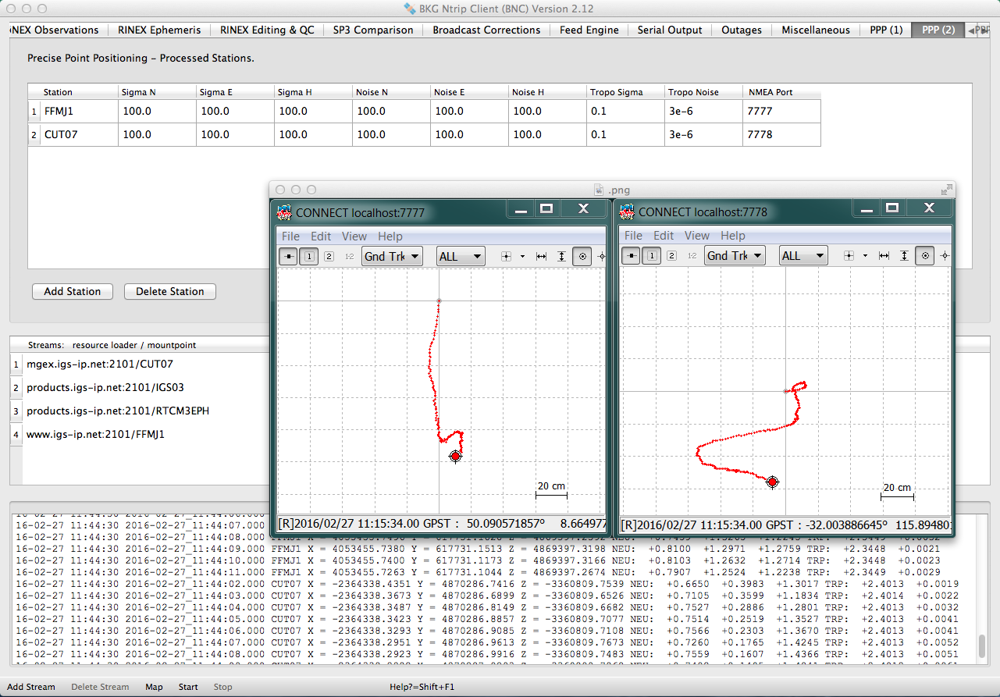

   Precise Point Positioning with BNC, PPP Panel 2, using RTKPLOT for visualization

Station - mandatory
^^^^^^^^^^^^^^^^^^^^

Hit the 'Add Station' button, double click on the 'Station' field, then specify an observation's mountpoint from the 'Streams' section or introduce the 4-character Station ID of your RINEX observation file and hit Enter. BNC will only produce PPP solutions for stations listed in this table.

Sigma North/East/Up - mandatory
^^^^^^^^^^^^^^^^^^^^^^^^^^^^^^^

Enter sigmas in meters for the initial coordinate components. A value of 100.0 (default) may be an appropriate choice. However, this value may be significantly smaller (e.g. 0.01) when starting for example from a station with a well-known position in so-called Quick-Start mode.

Noise North/East/Up - mandatory
^^^^^^^^^^^^^^^^^^^^^^^^^^^^^^^

Enter a white 'Noise' in meters for estimated coordinate components. A value of 100.0 (default) may be appropriate when considering possible sudden movements of a rover.

Tropo Sigma - mandatory
^^^^^^^^^^^^^^^^^^^^^^^

Enter a sigma in meters for the a priori model based tropospheric delay estimation. A value of 0.1 (default) may be an appropriate choice.

Tropo Noise - mandatory
^^^^^^^^^^^^^^^^^^^^^^^

Enter a white 'Noise' in meters per second to describe the expected variation of the tropospheric effect. Supposing 1Hz observation data, a value of 3e-6 (default) would mean that the tropospheric effect may vary for 3600 * 3e-6 = 0.01 meters per hour.

NMEA Port - optional
^^^^^^^^^^^^^^^^^^^^

Specify the IP port number of a local port where Point Positioning results become available as NMEA sentences. The default value for 'NMEA Port' is an empty option field, meaning that BNC does not provide NMEA sentences via IP port. Note that NMEA file output and NMEA IP port output are the same.

Note also that Tomoji Takasu has written a program named RTKPLOT for visualizing NMEA sentences from IP ports or files. It is available from http://www.rtklib.com and compatible with the NMEA file and port output of BNC's 'PPP' client option.

Furthermore, NASA's 'World Wind' software (see http://worldwindcentral.com/wiki/NASA_World_Wind_Download) can be used for real-time visualization of positions provided through BNC's NMEA IP output port. You need the 'GPS Tracker' plug-in available from http://worldwindcentral.com/wiki/GPS_Tracker for that. The 'Word Wind' map resolution is not meant for showing centimeter level details.

.. index:: PPP client processing options

PPP (3): Processing Options
---------------------------

BNC allows using various Point Positioning processing options depending on the capability of the involved receiver and the application in mind. You can introduce specific sigmas for code and phase observations as well as for a priori coordinates and troposphere estimates. You could also carry out your PPP solution in Quick-Start mode or enforce BNC to restart a solution if the length of an outage exceeds a certain threshold. The intention of this panel is to specify general processing options to be applied to all PPP threads in one BNC job, see :numref:`Fig. %s <fig_24>` for an example setup.

.. _fig_24:
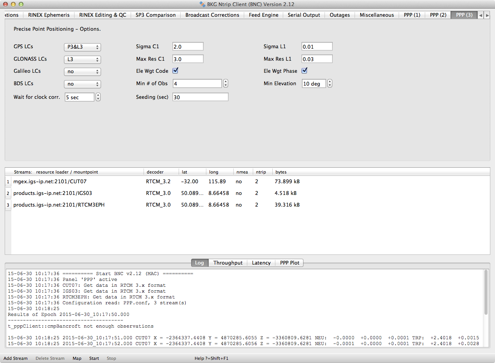

   Precise Point Positioning with BNC, PPP Panel 3

.. index:: PPP client linear combinations

Linear Combinations - mandatory
^^^^^^^^^^^^^^^^^^^^^^^^^^^^^^^

Specify on which ionosphere-free Linear Combinations (LCs) of observations you want to base ambiguity resolutions :cite:`mervart2008a`. This implicitly defines the kind of GNSS observations you want to use. The specification is to be done per GNSS system ('GPS LCs', 'GLONASS LCs', 'Galileo LCs', 'BDS LCs').

* Selecting 'P3' means that you request BNC to use code data and the so-called P3 ionosphere-free linear combinations of code observations.
* 'P3\&L3' means that you request BNC to use both, code and phase data and the so-called P3 and L3 ionosphere-free linear combinations of code and phase observations.

Note that most geodetic GPS receivers support the observation of both, code and phase data. Hence, specifying 'P3\&L3' would be a good choice for GPS when processing data from such a receiver. If multi-GNSS data processing is your intention, make sure your receiver supports GLONASS and/or Galileo and/or BDS observations besides GPS. Note also that the Broadcast Correction stream or file, which is required for PPP, also supports all the systems you have in mind.

Specifying 'no' means that you do not at all want BNC to use observations from the affected GNSS system.

.. index:: PPP client code observations

Code Observations - mandatory
^^^^^^^^^^^^^^^^^^^^^^^^^^^^^

Enter a 'Sigma C1' for C1 code observations in meters. The bigger the sigma you enter, the less the contribution of C1 code observations to a PPP solution based on a combination of code and phase data. '2.0' meters is likely to be an appropriate choice. Specify a maximum for residuals 'Max Res C1' for C1 code observations in a PPP solution. '3.0' meters may be an appropriate choice for that. If the maximum is exceeded, contributions from the corresponding observation will be ignored in the PPP solution.

.. index:: PPP client phase observations

Phase Observations - mandatory
^^^^^^^^^^^^^^^^^^^^^^^^^^^^^^

Enter a 'Sigma L1' for L1 phase observations in meters. The bigger the sigma you enter, the less the contribution of L1 phase observations to a PPP solutions based on a combination of code and phase data. '0.01' meters is likely to be an appropriate choice. Specify a maximum for residuals 'Max Res L1' for L1 phase observations in a PPP solution. '0.03' meters may be an appropriate choice for that. If the maximum is exceeded, contributions from the corresponding observation will be ignored in the PPP solution.

As the convergence characteristic of a PPP solution can be influenced by the ratio of sigmas for code and phase, you may like to introduce sigmas which differ from the default values:

* Introducing a smaller sigma (higher accuracy) for code observations or a bigger sigma for phase observations leads to better results shortly after program start. However, it may take more time until you finally get the best possible solution.
* Introducing a bigger sigma (lower accuracy) for code observations or a smaller sigma for phase observations may lead to less accurate results shortly after program start and thus a prolonged period of convergence but could provide better positions in the long run.

.. index:: PPP client elevation dependent weighting

Elevation Dependent Weighting - mandatory
^^^^^^^^^^^^^^^^^^^^^^^^^^^^^^^^^^^^^^^^^

BNC allows elevation dependent weighting when processing GNSS observations. A weight function

.. math::

     P = cos^2 * z

with :math:`z` being the zenith distance to the involved satellite can be applied instead of the simple weight function 'P = 1' independent from satellite elevation angles:

* Tick 'Ele Wgt Code' if you want Elevation Dependent Weighting for code observations.
* Tick 'Ele Wgt Phase' if you want Elevation Dependent Weighting for phase observations.

Default is using the plain weight function 'P = 1' for code and phase observations.

Minimum Number of Observations - mandatory
^^^^^^^^^^^^^^^^^^^^^^^^^^^^^^^^^^^^^^^^^^

Select the minimum number of observations you want to use per epoch. The minimum for parameter 'Min # of Obs' is 4. This is also the default.

Minimum Elevation - mandatory
^^^^^^^^^^^^^^^^^^^^^^^^^^^^^

Select a minimum for satellite elevation angles. Selecting '10 deg' for option 'Min Elevation' may be an appropriate choice. Default is '0 deg', meaning that any observation will be used regardless of the involved satellite elevation angle.

.. index:: PPP client wait for clock corrections

Wait for Clock Corrections - optional
^^^^^^^^^^^^^^^^^^^^^^^^^^^^^^^^^^^^^

Specifying 'no' for option 'Wait for clock corr.' means that BNC processes each epoch of data immediately after arrival using satellite clock corrections available at that time. A non-zero value means that epochs of data are buffered and the processing of each epoch is postponed until satellite clock corrections not older than 'Wait for clock corr.' seconds are available. Specifying a value of half the update rate of the clock corrections (e.g. 5 sec) may be appropriate. Note that this causes an additional delay of the PPP solutions in the amount of half of the update rate.

Using observations in sync with the corrections can avoid a possible high frequency noise of PPP solutions. Such noise could result from processing observations regardless of how late after a clock correction they were received. Note that applying the 'Wait for clock corr.' option significantly reduces the PPP computation effort for BNC.

Default is an empty option field, meaning that you want BNC to process observations immediately after their arrival through applying the latest received clock correction.

Seeding - optional if a priori coordinates specified in 'Coordinates file'
^^^^^^^^^^^^^^^^^^^^^^^^^^^^^^^^^^^^^^^^^^^^^^^^^^^^^^^^^^^^^^^^^^^^^^^^^^

Enter the length of a startup period in seconds for which you want to fix the PPP solution to a known position, see option 'Coordinates file'. Constraining a priori coordinates is done in BNC through setting their white 'Noise' temporarily to zero.

This so-called Quick-Start option allows the PPP solutions to rapidly converge after startup. It requires that the antenna remains unmoved on the known position throughout the defined period. A value of '60' seconds is likely to be an appropriate choice for 'Seeding'. Default is an empty option field, meaning that you do not want BNC to start in Quick-Start mode.

You may need to create your own reference coordinate beforehand through running BNC for an hour in normal mode before applying the 'Seeding' option. Do not forget to introduce realistic North/East/Up sigmas under panel 'PPP (2)' corresponding to the coordinate's precision.

'Seeding' has also a function for bridging gaps in PPP solutions from failures caused e.g. by longer lasting outages. Should the time span between two consecutive solutions exceed the limit of 60 seconds (maximum solution gap, hard-wired), the algorithm fixes the latest derived coordinate for a period of 'Seeding' seconds. This option avoids time-consuming reconvergences and makes especially sense for stationary operated receivers where convergence can be enforced because a good approximation for the receiver position is known.

:numref:`Fig. %s <fig_25>` provides the screenshot of an example PPP session with BNC showing the beginning of a time series plot when seeding is set to 30 seconds..

.. _fig_25:
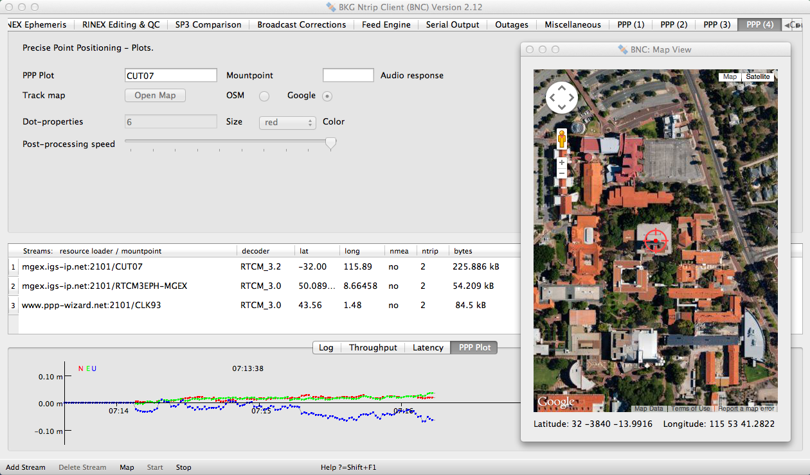

   Precise Point Positioning with BNC in 'Quick-Start' mode, PPP Panel 4

.. index:: PPP client plots

PPP (4): Plots
--------------

This panel presents options for visualizing PPP results as a time series plot or as a track map with PPP tracks on top of OSM or Google maps.

PPP Plot - optional
^^^^^^^^^^^^^^^^^^^

PPP time series of North (red), East (green) and Up (blue) displacements will be plotted under the 'PPP Plot' tab when a 'Mountpoint' is specified. Values will be referred to an XYZ reference coordinate (if specified, see 'Coordinates file'). The sliding PPP time series window will cover the period of the latest 5 minutes. Note that a PPP dicplacements time series makes only sense for a stationary operated receiver.

Audio Response - optional
^^^^^^^^^^^^^^^^^^^^^^^^^

For natural hazard prediction and monitoring landslides, it may be appropriate to generate audio alerts. For that you can specify an 'Audio response' threshold in meters. A beep is produced by BNC whenever a horizontal PPP coordinate component differs by more than the threshold value from the specified marker coordinate. Default is an empty option field, meaning that you do not want BNC to produce acoustic warnings.

Track Map - optional
^^^^^^^^^^^^^^^^^^^^

You may like to track your rover position using Google Maps or OpenStreetMap as a background map. Track maps (example :numref:`Fig. %s <fig_26>`) can be produced with BNC in 'Real-time Streams' mode or in 'RINEX Files' post processing mode with data coming from files.

.. _fig_26:
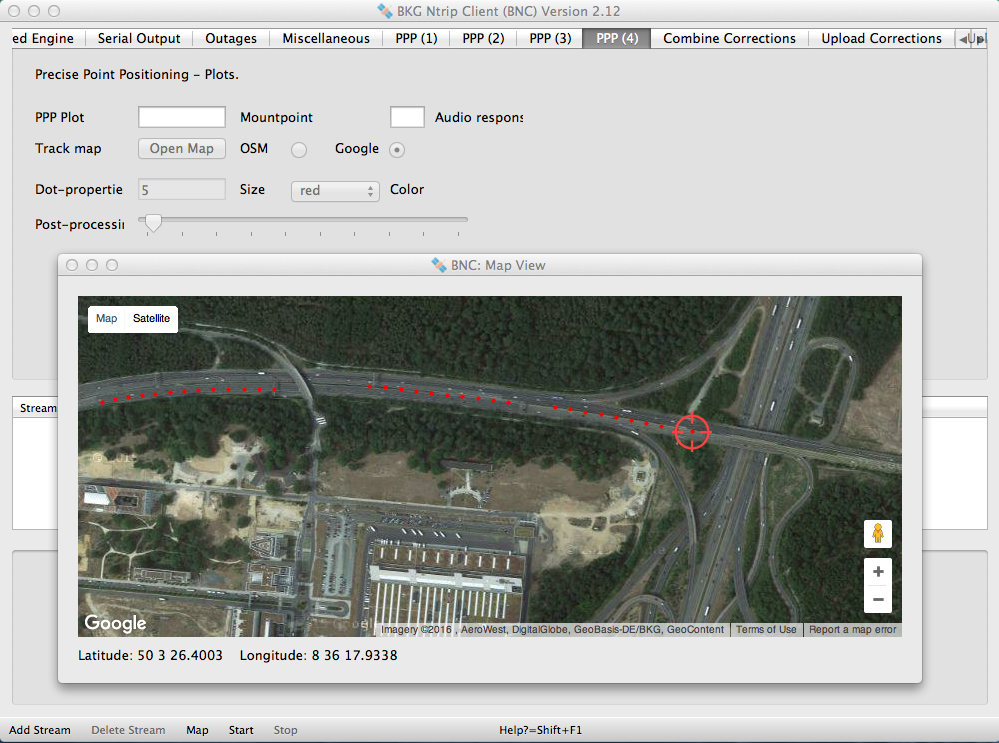

   Track of positions from BNC with Google Maps in background

Google/OSM - mandatory before pushing 'Open Map'
^^^^^^^^^^^^^^^^^^^^^^^^^^^^^^^^^^^^^^^^^^^^^^^^

Select either 'Google' or 'OSM' as the background map for your rover positions :numref:`(Fig. %s) <fig_27>`.

.. _fig_27:
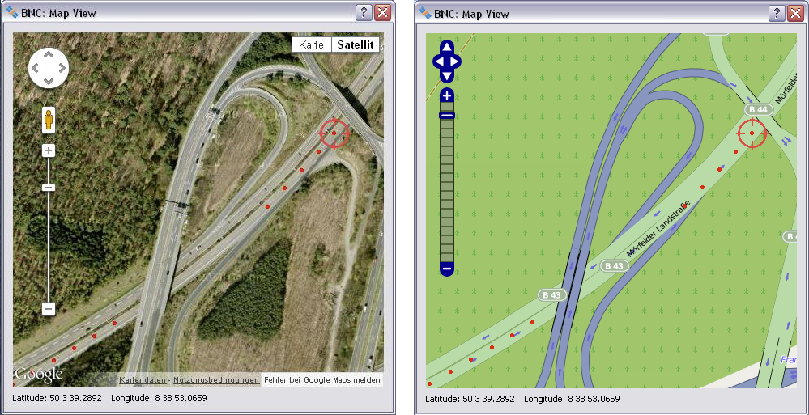

   Example for background map from Google Maps and OpenStreetMap (OSM)

Dot-properties - mandatory before pushing 'Open Map'
^^^^^^^^^^^^^^^^^^^^^^^^^^^^^^^^^^^^^^^^^^^^^^^^^^^^

PPP tracks are presented on maps through plotting one colored dot per observation epoch.

Size - mandatory before pushing 'Open Map'
^^^^^^^^^^^^^^^^^^^^^^^^^^^^^^^^^^^^^^^^^^

Specify the size of dots showing the rover position. A dot size of '3' may be appropriate. The maximum possible dot size is '10'. An empty option field or a size of '0' would mean that you do not want BNC to show the rover's track on the map.

Color - mandatory before pushing 'Open Map'
^^^^^^^^^^^^^^^^^^^^^^^^^^^^^^^^^^^^^^^^^^^

Select the color of dots showing the rover track.

Post Processing Speed - mandatory before pushing 'Open Map'
^^^^^^^^^^^^^^^^^^^^^^^^^^^^^^^^^^^^^^^^^^^^^^^^^^^^^^^^^^^

With BNC in PPP 'RINEX File' post processing mode, you can specify the speed of computations as appropriate for visualization. Note that you can adjust 'Post-processing speed' on-the-fly while BNC is already processing your observations.

.. index:: Correction combination

Combine Corrections
===================

BNC allows processing several orbit and clock correction streams in real-time to produce, encode, upload and save a combination of Broadcast Corrections from various providers. All corrections must refer to satellite Antenna Phase Centers (APC). It is so far only the satellite clock corrections which are combined by BNC while orbit corrections in the combination product as well as product update rates are just taken over from one of the incoming Broadcast Correction streams. Combining only clock corrections using a fixed orbit reference imposes the potential to introduce some analysis inconsistencies. We may therefore eventually consider improvements on this approach. The clock combination can be based either on a plain 'Single-Epoch' or on a Kalman 'Filter' approach.

In the Kalman Filter approach, satellite clocks estimated by individual Analyses Centers (ACs) are used as pseudo observations within the adjustment process. Each observation is modeled as a linear function (actually a simple sum) of three estimated parameters: AC specific offset, satellite specific offset common to all ACs, and the actual satellite clock correction, which represents the result of the combination. These three parameter types differ in their statistical properties. The satellite clock offsets are assumed to be static parameters while AC specific and satellite specific offsets are stochastic parameters affected by white noise.

The solution is regularized by a set of minimal constraints. In case of a change of the 'SSR Provider ID', 'SSR Solution ID', or 'IOD SSR' (see section 'Upload Corrections'), the satellite clock offsets belonging to the corresponding analysis center are reset in the adjustment.

Removing the AC-dependent biases as well as possible is a major issue with clock combinations. Since they vary in time, it can be tricky to do this. Otherwise, there will be artificial jumps in the combined clock stream if one or more AC contributions drop out for certain epochs. Here the Kalman Filter approach is expected to do better than the Single-Epoch approach.

In view of IGS real-time products, the 'Combine Corrections' functionality has been integrated in BNC :cite:`mervart2011a` because:

* The software with its Graphic User Interface and range of supported Operating Systems represents a perfect platform to process many Broadcast Correction streams in parallel;
* Outages of single AC product streams can be mitigated through merging several incoming streams into a combined product;
* Generating a combination product from several AC products allows detecting and rejecting outliers;
* A Combination Center (CC) can operate BNC to globally disseminate a combination product via Ntrip broadcast;
* An individual AC could prefer to disseminate a stream combined from primary and backup IT resources to reduce outages;
* It enables a BNC PPP user to follow his own preference in combining streams from individual ACs for Precise Point Positioning;
* It allows an instantaneous quality control of the combination process not only in the time domain but also in the space domain; this can be done by direct application of the combined stream in a PPP solution even without prior upload to an Ntrip Broadcaster;
* It provides the means to output SP3 and Clock RINEX files containing precise orbit and clock information for further processing using other tools than BNC.

Note that the combination process requires real-time access to Broadcast Ephemeris. Therefore, in addition to the orbit and clock correction streams BNC must pull a stream carrying Broadcast Ephemeris in the form of RTCM Version 3 messages. Stream 'RTCM3EPH' on caster products.igs-ip.net is an example for that. Note further that BNC will ignore incorrect or outdated Broadcast Ephemeris data when necessary, leaving a note 'WRONG EPHEMERIS' or 'OUTDATED EPHEMERIS' in the logfile.

A combination is carried out following a specified sampling interval. BNC waits for incoming Broadcast Corrections for the period of one such interval. Corrections received later than that will be ignored. If incoming streams have different rates, only epochs that correspond to the sampling interval are used.

With respect to IGS, it is important to understand that a major effect in the combination of GNSS orbit and clock correction streams is the selection of ACs to include. It is likely that a combination product could be improved in accuracy by using only the best two or three ACs. However, with only a few ACs to depend on, the reliability of the combination product could suffer and the risk of total failures increases. So there is an important tradeoff here that must be considered when selecting streams for a combination. The major strength of a combination product is its reliability and stable median performance which can be much better than that of any single AC product.

This comment applies in situations where we have a limited number of solutions to combine and their quality varies significantly. The situation may be different when the total number of ACs is larger and the range of AC variation is smaller. In that case, a standard full combination is probably the best.

The following recursive algorithm is used to detect orbit outliers in the Kalman Filter combination when Broadcast Corrections are provided by several ACs:

1. We do not produce a combination for a certain satellite if only one AC provides corrections for it.
2. A mean satellite position is calculated as the average of positions from all ACs.
3. For each AC and satellite, the 3D distance between individual and mean satellite position is calculated.
4. We find the greatest difference between AC specific and mean satellite positions.
5. If that is less than a threshold, the conclusion is that we do not have an outlier and can proceed to the next epoch.
6. If that is greater than a threshold, then corrections of the affiliated AC are ignored for the affected epoch and the outlier detection restarts with 1.

The screenshot in :numref:`Fig. %s <fig_28>` shows an example setup of BNC when combining Broadcast Correction streams CLK11, CLK21, CLK91, and CLK80.

.. _fig_28:
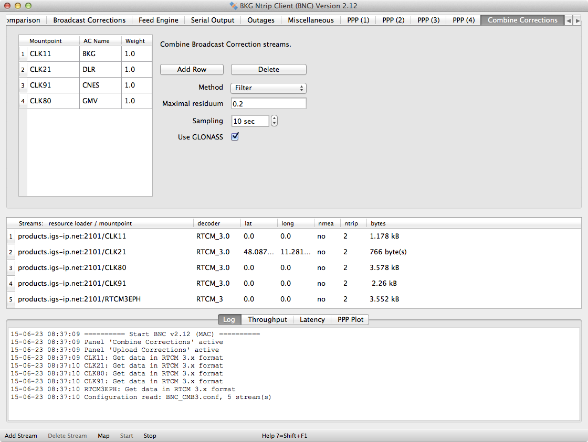

   BNC combining Broadcast Correction streams

Note that BNC can produce an internal PPP solution from combined Broadcast Corrections. For that you have to specify the keyword 'INTERNAL' as 'Corrections stream' in the PPP (1) panel. The example in :numref:`Fig. %s <fig_29>` combines correction streams IGS01 and IGS02 and simultaneously carries out a PPP solution with observations from stream FFMJ1 to allow monitoring the quality of the combination product in the space domain.

.. _fig_29:
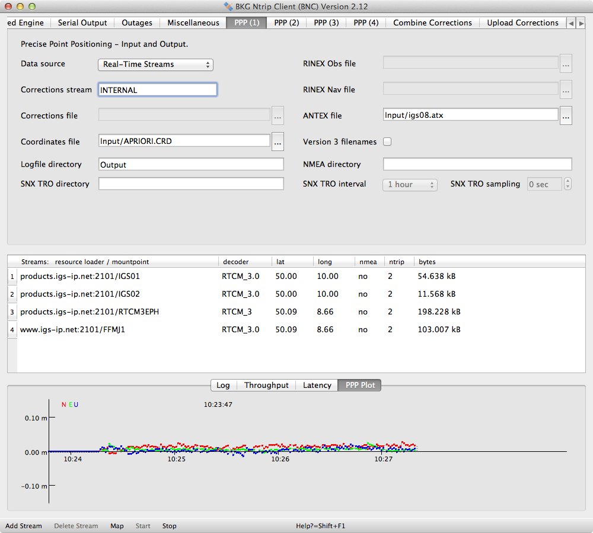

   'INTERNAL' PPP with BNC using a combination of Broadcast Corrections

Combine Corrections Table - optional
------------------------------------

Hit the 'Add Row' button, double click on the 'Mountpoint' field, enter a Broadcast Correction mountpoint from the 'Streams' section and hit Enter. Then double click on the 'AC Name' field to enter your choice of an abbreviation for the Analysis Center (AC) providing the Antenna Phase Center (APC) related correction stream. Finally, double click on the 'Weight' field to enter a weight to be applied to this stream in the combination.

The sequence of entries in the 'Combine Corrections' table is not of importance. Note that the orbit information in the final combination stream is just copied from one of the incoming streams. The stream used for providing the orbits may vary over time: if the orbit-providing stream has an outage then BNC switches to the next remaining stream for getting hold of the orbit information.

It is possible to specify only one Broadcast Ephemeris correction stream in the 'Combine Corrections' table. Instead of combining corrections from several sources, BNC will then merge the single corrections stream with Broadcast Ephemeris to allow saving results in SP3 and/or Clock RINEX format when specified accordingly under the 'Upload Corrections' panel. Note that in such a BNC application you must not pull more than one Broadcast Ephemeris correction stream even if a second stream would provide the same corrections from a backup caster.

Default is an empty 'Combine Corrections' table, meaning that you do not want BNC to combine orbit and clock correction streams.

Add Row, Delete - optional
--------------------------

Hit 'Add Row' button to add another row to the 'Combine Corrections' table or hit the 'Delete' button to delete the highlighted row(s).

Method - mandatory if 'Combine Corrections' table is populated
--------------------------------------------------------------

Select a clock combination method. Available options are Kalman 'Filter' and 'Single-Epoch. It is suggested to use the Kalman Filter approach in case the combined stream of Broadcast Corrections is intended for Precise Point Positioning.

Maximal Residuum - mandatory if 'Combine Corrections' table is populated
------------------------------------------------------------------------

BNC combines all incoming clocks according to specified weights. Individual clock estimates that differ by more than 'Maximal Residuum' meters from the average of all clocks will be ignored. It is suggested to specify a value of about 0.2 m for the Kalman Filter combination approach and a value of about 3.0 meters for the Single-Epoch combination approach. Default is a 'Maximal Residuum' of 999.0 meters.

Sampling - mandatory if 'Combine Corrections' table is populated
----------------------------------------------------------------

Specify a combination sampling interval. Orbit and clock corrections will be produced following that interval. A value of 10 sec may be an appropriate choice.

Use GLONASS - optional
----------------------

You may tick the 'Use GLONASS' option in case you want to produce a GPS plus GLONASS combination and both systems are supported by the Broadcast Correction streams participating in the combination.

.. index:: Corrections upload

Upload Corrections
==================

BNC can upload streams carrying orbit and clock corrections to Broadcast Ephemeris in radial, along-track and out-of-plane components if they are:

1. either generated by BNC as a combination of several individual Broadcast Correction streams coming from an number of real-time Analysis Centers (ACs), see section 'Combine Corrections',
2. or generated by BNC while the program receives an ASCII stream of precise satellite orbits and clocks via IP port from a connected real-time GNSS engine. Such a stream would be expected in a plain ASCII format and the associated 'decoder' string would have to be 'RTNET', see format description below.

The procedure taken by BNC to generate the orbit and clock corrections to Broadcast Ephemeris and upload them to an Ntrip Broadcaster is as follow:

* Continuously receive up-to-date Broadcast Ephemeris carrying approximate orbits and clocks for all satellites. Read new Broadcast Ephemeris immediately whenever they become available. This information may come via a stream of RTCM messages generated from another BNC instance.

Then, epoch by epoch:

* Continuously receive the best available orbit and clock estimates for all satellites in XYZ Earth-Centered-Earth-Fixed IGS08 reference system. Receive them every epoch in plain ASCII format as provided by a real-time GNSS engine such as RTNET or generate them following a combination approach.
* Calculate XYZ coordinates from Broadcast Ephemeris orbits.
* Calculate differences dX,dY,dZ between Broadcast Ephemeris and IGS08 orbits.
* Transform these differences into radial, along-track and out-of-plane corrections to Broadcast Ephemeris orbits.
* Calculate corrections to Broadcast Ephemeris clocks as differences between Broadcast Ephemeris clocks and IGS08 clocks.
* Encode Broadcast Ephemeris orbit and clock corrections in RTCM Version 3 format.
* Upload Broadcast Correction stream to Ntrip Broadcaster.

The orbit and clock corrections to Broadcast Ephemeris are usually referred to the latest set of broadcast messages, which are generally also received in real-time by a GNSS rover. However, the use of the latest broadcast message is delayed for a period of 60 seconds, measured from the time of complete reception of ephemeris and clock parameters, in order to accommodate rover applications to obtain the same set of broadcast orbital and clock parameters. This procedure is recommended in the RTCM SSR standard. Because the stream delivery process may put a significant load on the communication link between BNC and the real-time GNSS engine, it is recommended to run both programs on the same host. However, doing so is not compulsory.

The usual handling of BNC when uploading a stream with Broadcast Corrections is that you first specify Broadcast Ephemeris and Broadcast Correction streams. You then specify an Ntrip Broadcaster for stream upload before you start the program.

.. index:: RTNet stream format

**'RTNET' Stream Format**

When uploading an SSR stream generated according to 2. then BNC requires precise GNSS orbits and clocks in the IGS Earth-Centered-Earth-Fixed (ECEF) reference system and in a specific ASCII format named 'RTNET' because the data may come from a real-time engine such as RTNET. The sampling interval for data transmission should not exceed 15 sec. Note that otherwise tools involved in IP streaming such as Ntrip Broadcasters or Ntrip Clients may respond with a timeout.

Below you find an example for the 'RTNET' ASCII format coming from a real-time GNSS engine. Each epoch begins with an asterisk character followed by the time as year, month, day of month, hour, minute and second. Subsequent records can provide

.. code-block:: none

  * 2015 6 11 15 10 40.000000

Subsequent records can provide

* Satellite specific parameters

A set of parameters can be defined for each satellite as follows:

.. code-block:: console

  <SatelliteID> <key> <numValues> <value1 value2 ...>
                <key> <numValues> <value1 value2 ...> ...

The satellite specific keys and values currently specified for that in BNC are listed in :numref:`Table %s <tab_SAT_SPEC_PARAMETER_KEYS>`.

.. tabularcolumns:: |p{0.3\textwidth}|p{0.62\textwidth}|

.. _tab_SAT_SPEC_PARAMETER_KEYS:
.. table:: Keys for satellite specific parameters used in BNC.

  ============ ============================================================================
  **KeyName**  **Values**
  ============ ============================================================================
  APC          Satellite Antenna Phase Center coordinates in meters
  Clk          Satellite clock correction in meters, relativistic correction applied like in broadcast clocks
  Vel          Satellite velocity in meters per second
  CoM          Satellite Center of Mass coordinates in meters
  CodeBias     Satellite Code Biases in meters with two characters for frequency and tracking mode per bias as defined in RINEX 3 and preceded by total number of biases
  YawAngle     Satellite Yaw Angle in radian, restricted to be in [0, 2π] which shall be used for the computation of phase wind-up correction
  YawRate      Satellite Yaw Rate in radian per second which is the rate of Yaw Angle
  PhaseBias    Satellite Phase Biases in meters with two characters for frequency and tracking mode per bias as defined in RINEX 3, preceded by total number of biases and followed by Signal Integer Indicator, Signals Wilde-Lane Integer Indicator as well as Signal Discontinuity Counter
  ============ ============================================================================

* Non-satellite specific parameters

The following syntax will be used:

.. code-block:: console

  <key> <value1 value2 ...>

The non-satellite specific keys and values currently specified in BNC are listed in :numref:`Table %s <tab_NON_SAT_SPEC_PARAMETER_KEYS>`.

.. tabularcolumns:: |p{0.3\textwidth}|p{0.62\textwidth}|

.. _tab_NON_SAT_SPEC_PARAMETER_KEYS:
.. table:: Keys for non-satellite specific parameters used in BNC.

  ============ ============================================================================
  **KeyName**  **Values**
  ============ ============================================================================
  IND          Phase bias information followed by Dispersive Bias Consistency Indicator and MW Consistency Indicator
  VTEC         Vertical TEC information followed by Update Interval and Number of Ionospheric Layers
  ============ ============================================================================

If key VTEC is specified, a data set for each layer contains within its first line the Layers Number, followed by Maximum Degree, Maximum Order and Layer Height. After that, Cosine and Sinus Spherical Harmonic Coefficients will follow, one block each.

Because each keyword is associated to a certain number of values, an 'old' BNC could be operated with an incoming 'new' RTNET stream containing so far unknown keys - they would just be skipped in BNC.

Example for 'RTNET' stream content and format:

.. code-block:: console

  * 2015 6 11 15 10 40.000000
  VTEC 0 1 0 6 6 450000.0 20.4660 0.0000 0.0000 0.0000 0.0000 0.0000 0.0000 5.3590 9.6580 0.0000 0.0000 0.0000 0.0000 0.0000 -6.3610 -0.1210 1.1050 0.0000 0.0000 0.0000 0.0000 -2.7140 -1.8200 -0.9920 -0.6430 0.0000 0.0000 0.0000 1.9140 -0.5180 0.2530 0.0870 -0.0110 0.0000 0.0000 2.2950 1.0510 -0.9540 0.6220 -0.0720 -0.0810 0.0000 -0.9760 0.7570 0.2320 -0.2520 0.1970 -0.0680 -0.0280 0.0000 0.0000 0.0000 0.0000 0.0000 0.0000 0.0000 0.0000 0.2720 0.0000 0.0000 0.0000 0.0000 0.0000 0.0000 1.1100 -1.0170 0.0000 0.0000 0.0000 0.0000 0.0000 -1.1500 0.5440 0.9890 0.0000 0.0000 0.0000 0.0000 -0.3770 -0.1990 0.2670 -0.0470 0.0000 0.0000 0.0000 0.6550 -0.0130 -0.2310 -0.4810 -0.3510 0.0000 0.0000 0.2360 -0.0710 0.0280 0.1900 -0.0810 0.0710
  IND 0 1
  G01 APC 3   -14442611.532   -13311059.070   -18020998.395 Clk 1   -1426.920500 Vel 3  2274.647600   -28.980300 -1787.861900 CoM 3   -14442612.572   -13311059.518   -18020999.539 CodeBias 6 1W -3.760000 1C -3.320000 2W -6.200000 2X -5.780000 1H -3.350000 5I -5.430000 YawAngle 1 -0.315600 YawRate 1 0.0 PhaseBias 3 1C  3.9473 1 2 4 2W  6.3143 1 2 4 5I 6.7895 1 2 4
  G02 APC 3    -8859103.160    14801278.856    20456920.800 Clk 1  171219.083500 Vel 3 -2532.296700  -161.275800 -1042.884100 CoM 3    -8859103.418    14801279.287    20456921.395 CodeBias 6 1W  3.930000 1C  3.610000 2W  6.480000 2X  0.000000 1H  3.580000 5I  0.000000 YawAngle 1 -0.693500 YawRate 1 0.0 PhaseBias 2 1C -4.0902 1 2 4 2W -6.7045 1 2 4
  G03 APC 3   -13788295.679   -22525098.353     2644811.508 Clk 1  104212.074300 Vel 3   102.263400  -429.953400 -3150.231900 CoM 3   -13788296.829   -22525099.534     2644811.518 CodeBias 6 1W -2.650000 1C -2.160000 2W -4.360000 2X -4.480000 1H -2.070000 5I -5.340000 YawAngle 1 -0.428800 YawRate 1 0.0 PhaseBias 3 1C  2.9024 1 2 2 2W  4.6124 1 2 2 5I 5.3694 1 2 2
  ...
  R01 APC 3    -6783489.153   -23668850.753     6699094.457 Clk 1 - 45875.658100 Vel 3  -267.103000  -885.983700 -3403.253200 CoM 3    -6783489.307   -23668853.173     6699095.274 CodeBias 4 1P -2.496400 1C -2.490700 2P -4.126600 2C -3.156200
  R02 APC 3   -11292959.022   -10047039.425    20577343.288 Clk 1   41215.750900 Vel 3  -476.369400 -2768.936600 -1620.000600 CoM 3   -11292959.672   -10047040.710    20577345.344 CodeBias 4 1P  0.211200 1C  0.391300 2P  0.349100 2C  0.406300
  R03 APC 3    -9226469.614     9363128.850    21908853.313 Clk 1   13090.322800 Vel 3  -369.088600 -2964.934500  1111.041000 CoM 3    -9226470.226     9363129.442    21908855.791 CodeBias 4 1P  2.283800 1C  2.483800 2P  3.775300 2C  3.785500
  ...
  E11 APC 3     2965877.898    17754418.441    23503540.946 Clk 1   33955.329000 Vel 3 -1923.398100  1361.709200  -784.555800 CoM 3     2965878.082    17754418.669    23503541.507 CodeBias 3 1B  1.382100 5Q  2.478400 7Q  2.503300
  E12 APC 3   -14807433.144    21753389.581    13577231.476 Clk 1 -389652.211900 Vel 3 -1082.464300   825.868400 -2503.982200 CoM 3   -14807433.366    21753389.966    13577231.926 CodeBias 3 1B  0.386600 5Q  0.693300 7Q  0.534700
  E19 APC 3   -15922225.351     8097517.292    23611910.403 Clk 1   -2551.650800 Vel 3  -183.377800 -2359.143700   684.105100 CoM 3   -15922225.569     8097517.329    23611910.995 CodeBias 3 1B -1.777000 5Q -3.186600 7Q -3.069100
  ...
  EOE

Note that the end of an epoch in the incoming stream is indicated by an ASCII string 'EOE' (for End Of Epoch).

When using clocks from Broadcast Ephemeris (with or without applied corrections) or clocks from SP3 files, it may be important to understand that they are not corrected for the conventional periodic relativistic effect. Chapter 10 of the IERS Conventions 2003 mentions that the conventional periodic relativistic correction to the satellite clock (to be added to the broadcast clock) is computed as

.. math::

     dt =  -2 (R * V) / c^2

where :math:`R * V` is the scalar product of the satellite position and velocity and :math:`c` is the speed of light. This can also be found in the GPS Interface Specification, IS-GPS-200, Revision D, 7 March 2006.

Add, Delete Row - optional
--------------------------

Hit 'Add Row' button to add a row to the stream 'Upload Table' or hit the 'Delete' button to delete the highlighted row(s). Having an empty 'Upload Table' is default and means that you do not want BNC to upload orbit and clock correction streams to any Ntrip Broadcaster.

Host, Port, Mountpoint, Password - optional
-------------------------------------------

Specify the domain name or IP number of an Ntrip Broadcaster for uploading the stream. Furthermore, specify the caster's listening IP port, an upload mountpoint and an upload password. Note that Ntrip Broadcasters are often configured to provide access through more than one port, usually ports 80 and 2101. If you experience communication problems on port 80, you should try to use the alternative port(s).

BNC uploads a stream to the Ntrip Broadcaster by referring to a dedicated mountpoint that has been set by its operator. Specify the mountpoint based on the details you received for your stream from the operator. It is often a 4-character ID (capital letters) plus an integer number.

The stream upload may be protected through an upload 'Password'. Enter the password you received from the Ntrip Broadcaster operator along with the mountpoint(s).

If 'Host', 'Port', 'Mountpoint' and 'Password' are set, the stream will be encoded in RTCM's 'State Space Representation' (SSR) messages and uploaded to the specified broadcaster following the Ntrip Version 1 transport protocol.

.. index:: Reference system realizations

System - mandatory if 'Host' is set
-----------------------------------

BNC allows configuring several Broadcast Correction streams for upload so that they refer to different reference systems and different Ntrip Broadcasters. You may use this functionality for parallel support of a backup Ntrip Broadcaster or for simultaneous support of various regional reference systems. Available options for transforming orbit and clock corrections to specific target reference systems are:

* IGS08 which stands for the GNSS-based IGS realization of the International Terrestrial Reference Frame 2008 (ITRF2008), and
* ETRF2000 which stands for the European Terrestrial Reference Frame 2000 adopted by EUREF, and
* NAD83 which stands for the North American Datum 1983 as adopted for the U.S.A., and
* GDA94 which stands for the Geodetic Datum Australia 1994 as adopted for Australia, and
* SIRGAS2000 which stands for the Geodetic Datum adopted for Brazil, and
* SIRGAS95 which stands for the Geodetic Datum adopted e.g. for Venezuela, and
* DREF91 which stands for the Geodetic Datum adopted for Germany, and
* 'Custom' which allows a transformation of Broadcast Corrections from the IGS08 system to any other system through specifying up to 14 Helmert Transformation Parameters.

Because a mathematically strict transformation to a regional reference system is not possible on the BNC server side when a scale factor is involved, the program follows an approximate solution. While orbits are transformed in full accordance with given equations, a transformed clock is derived through applying correction term

.. math::

     dC = (s - 1) / s * \rho / c

where :math:`s` is the transformation scale, :math:`c` is the speed of light, and :math:`ρ` is the topocentric distance between an (approximate) center of the transformation's validity area and the satellite.

From a theoretical point of view, this kind of approximation leads to inconsistencies between orbits and clocks and is therefore not allowed :cite:`huisman2012a`. However, it has been proved that resulting errors in Precise Point Positioning are on millimeter level for horizontal components and below one centimeter for height components. The Australian GDA94 transformation with its comparatively large scale parameter is an exception in this as discrepancies may reach up there to two centimeters.

IGS08: As the orbits and clocks coming from real-time GNSS engine are expected to be in the IGS08 system, no transformation is carried out if this option is selected.

ETRF2000: The formulas for the transformation 'ITRF2008->ETRF2000' are taken from 'Claude Boucher and Zuheir Altamimi 2008: Specifications for reference frame fixing in the analysis of EUREF GPS campaign', see http://etrs89.ensg.ign.fr/memo-V8.pdf. The following 14 Helmert Transformation Parameters were introduced:

.. code-block:: console

  Translation in X at epoch To:  0.0521 m
  Translation in Y at epoch To:  0.0493 m
  Translation in Z at epoch To: -0.0585 m
  Translation rate in X:  0.0001 m/y
  Translation rate in Y:  0.0001 m/y
  Translation rate in Z: -0.0018 m/y
  Rotation in X at epoch To:  0.891 mas
  Rotation in Y at epoch To:  5.390 mas
  Rotation in Z at epoch To: -8.712 mas
  Rotation rate in X:  0.081 mas/y
  Rotation rate in Y:  0.490 mas/y
  Rotation rate in Z: -0.792 mas/y
  Scale at epoch To : 0.00000000134
  Scale rate: 0.00000000008 /y
  To: 2000.0

NAD83: Formulas for the transformation 'ITRF2008->NAD83' are taken from :cite:`pearson2013a`:

.. code-block:: console

  Translation in X at epoch To:  0.99343 m
  Translation in Y at epoch To: -1.90331 m
  Translation in Z at epoch To: -0.52655 m
  Translation rate in X:  0.00079 m/y
  Translation rate in Y: -0.00060 m/y
  Translation rate in Z: -0.00134 m/y
  Rotation in X at epoch To: -25.91467 mas
  Rotation in Y at epoch To:  -9.42645 mas
  Rotation in Z at epoch To: -11.59935 mas
  Rotation rate in X: -0.06667 mas/y
  Rotation rate in Y:  0.75744 mas/y
  Rotation rate in Z:  0.05133 mas/y
  Scale at epoch To : 0.00000000171504
  Scale rate: -0.00000000010201 /y
  To: 1997.0

GDA94: The formulas for the transformation 'ITRF2008->GDA94' are taken from :cite:`dawson2010a`:

.. code-block:: console

  Translation in X at epoch To: -0.08468 m
  Translation in Y at epoch To: -0.01942 m
  Translation in Z at epoch To:  0.03201 m
  Translation rate in X:  0.00142 m/y
  Translation rate in Y:  0.00134 m/y
  Translation rate in Z:  0.00090 m/y
  Rotation in X at epoch To:  0.4254 mas
  Rotation in Y at epoch To: -2.2578 mas
  Rotation in Z at epoch To: -2.4015 mas
  Rotation rate in X: -1.5461 mas/y
  Rotation rate in Y: -1.1820 mas/y
  Rotation rate in Z: -1.1551 mas/y
  Scale at epoch To : 0.000000009710
  Scale rate: 0.000000000109 /y
  To: 1994.0

SIRGAS2000: The formulas for the transformation 'ITRF2008->SIRGAS2000' were provided by :cite:`ibge_dgc2016a`:

.. code-block:: console

  Translation in X at epoch To:  0.0020 m
  Translation in Y at epoch To:  0.0041 m
  Translation in Z at epoch To:  0.0039 m
  Translation rate in X:  0.0000 m/y
  Translation rate in Y:  0.0000 m/y
  Translation rate in Z:  0.0000 m/y
  Rotation in X at epoch To:  0.170 mas
  Rotation in Y at epoch To: -0.030 mas
  Rotation in Z at epoch To:  0.070 mas
  Rotation rate in X:  0.000 mas/y
  Rotation rate in Y:  0.000 mas/y
  Rotation rate in Z:  0.000 mas/y
  Scale at epoch To : -0.000000001000
  Scale rate: 0.000000000000 /y
  To: 0000.0

SIRGAS95: The formulas for the transformation 'ITRF2005->SIRGAS95' were provided by :cite:`acuha2016a` , parameters based on values from :cite:`sirgas2009a`, Table 4.1:

.. code-block:: console

  Translation in X at epoch To:  0.0077 m
  Translation in Y at epoch To:  0.0058 m
  Translation in Z at epoch To: -0.0138 m
  Translation rate in X:  0.0000 m/y
  Translation rate in Y:  0.0000 m/y
  Translation rate in Z:  0.0000 m/y
  Rotation in X at epoch To:  0.000 mas
  Rotation in Y at epoch To:  0.000 mas
  Rotation in Z at epoch To: -0.003 mas
  Rotation rate in X:  0.000 mas/y
  Rotation rate in Y:  0.000 mas/y
  Rotation rate in Z:  0.000 mas/y
  Scale at epoch To : 0.00000000157
  Scale rate: -0.000000000000 /y
  To: 1995.4

DREF91 14 Helmert transformation parameters have been introduced :cite:`franke2008a`:

.. code-block:: console

  Translation in X at epoch To: -0.0118 m
  Translation in Y at epoch To:  0.1432 m
  Translation in Z at epoch To: -0.1117 m
  Translation rate in X:  0.0001 m/y
  Translation rate in Y:  0.0001 m/y
  Translation rate in Z: -0.0018 m/y
  Rotation in X at epoch To:   3.291 mas
  Rotation in Y at epoch To:   6.190 mas
  Rotation in Z at epoch To: -11.012 mas
  Rotation rate in X:  0.081 mas/y
  Rotation rate in Y:  0.490 mas/y
  Rotation rate in Z: -0.792 mas/y
  Scale at epoch To : 0.00000001224
  Scale rate: 0.00000000008 /y
  To: 2000.0

Custom: Feel free to specify your own 14 Helmert Transformation parameters for transformations from IGS08/ITRF2008 into your own target system (see :numref:`Fig. %s <fig_30>`).

.. _fig_30:
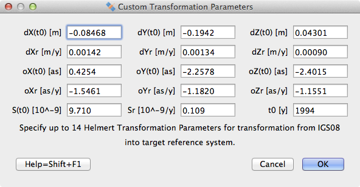

   Setting BNC's Custom Transformation Parameters window, example for 'ITRF2008->GDA94'

Center of Mass - optional
-------------------------

BNC allows to either refer Broadcast Corrections to the satellite's Center of Mass (CoM) or to the satellite's Antenna Phase Center (APC). By default, corrections refer to APC. Tick 'Center of Mass' to refer uploaded corrections to CoM.

SP3 File - optional
-------------------

Specify a path for saving the generated orbit corrections as SP3 orbit files. If the specified directory does not exist, BNC will not create SP3 orbit files. The following is a path example for a Linux system:

.. code-block:: console

  /home/user/BNC${GPSWD}.sp3

Note that '${GPSWD}' produces the GPS Week and Day number in the filename. Default is an empty option field, meaning that you do not want BNC to save the uploaded stream content in daily SP3 files.

As a SP3 file content should be referred to the satellites' Center of Mass (CoM) while Broadcast Corrections are referred to the satellites' APC, an offset has to be applied which is available from an IGS ANTEX file (see option 'ANTEX File' below). Hence, you should specify the 'ANTEX File' path there if you want to save the stream content in SP3 format. If you do not specify an 'ANTEX File' path, the SP3 file content will be referred to the satellites APCs.

The filenames for the daily SP3 files follow the convention for SP3 filenames. The first three characters of each filename are set to 'BNC'. Note that clocks in the SP3 orbit files are not corrected for the conventional periodic relativistic effect.

In case the 'Combine Corrections' table contains only one Broadcast Correction stream, BNC will merge that stream with Broadcast Ephemeris to save results in files specified here through SP3 and/or Clock RINEX file path. In such a case you have to define only the SP3 and Clock RINEX file path and no further option in the 'Upload Corrections' table.

Note that BNC outputs a complete list of SP3 'Epoch Header Records', even if no 'Position and Clock Records' are available for certain epochs because of stream outages. Note further that the 'Number of Epochs' in the first SP3 header record may not be correct because that number is not available when the file is created. Depending on your processing software (e.g. Bernese GNSS Software, BSW) it could therefore be necessary to correct an incorrect 'Number of Epochs' in the file before you use it in post processing.

RNX File - optional
-------------------

The clock corrections generated by BNC for upload can be logged in Clock RINEX format. The file naming follows the RINEX convention.

Specify a path for saving the generated clock corrections as Clock RINEX files. If the specified directory does not exist, BNC will not create Clock RINEX files. The following is a path example for a Linux system:

.. code-block:: console

  /home/user/BNC${GPSWD}.clk

Note that '${GPSWD}' produces the GPS Week and Day number in the filename. Note further that clocks in the Clock RINEX files are not corrected for the conventional periodic relativistic effect.

PID, SID, IOD - optional
------------------------

When applying Broadcast Ephemeris corrections in a PPP algorithm or in a combination of several correction streams, it is important for the client software to receive information on the continuity of discontinuity of the stream contents. Here you can specify three ID's to describe the contents of your Broadcast Ephemeris correction stream when it is uploaded.

* A 'SSR Provider ID' is issued by RTCM SC-104 on request to identify a SSR service (see e.g. \url{http://software.rtcm-ntrip.org/wiki/SSRProvider}). This ID is globally unique. Values vary in the range of 0-65535. Values in the range of 0-255 are reserved for experimental services.
* A provider may generate several Broadcast Ephemeris correction streams with different contents. The 'SSR Solution ID' indicates different SSR services of one SSR provider. Values vary in the range of 0-15.
* A change of the 'IOD SSR' is used to indicate a change in the SSR generating configuration which may be relevant for the rover. Values vary in the range of 0-15.

Interval - mandatory if 'Upload Table' entries specified
--------------------------------------------------------

Select the length of Clock RINEX files and SP3 Orbit files. The default value is 1 day.

Sampling
--------

BNC requires an orbit corrections sampling interval for the stream to be uploaded and sampling intervals for SP3 and Clock RINEX files. The outgoing stream's clock correction sampling interval follows that of incoming corrections and is therefore nothing to be specified here.

Orbits (Orb) - mandatory if 'Upload Table' entries specified
^^^^^^^^^^^^^^^^^^^^^^^^^^^^^^^^^^^^^^^^^^^^^^^^^^^^^^^^^^^^

Select the stream's orbit correction sampling interval in seconds. A value of 60 sec may be appropriate. A value of zero '0' tells BNC to upload all orbit correction samples coming in from the real-time GNSS engine along with the clock correction samples to produce combined orbit and clock corrections to Broadcast Ephemeris (1060 for GPS, 1066 for GLONASS).

Configuration examples:

Let us suppose a real-time network engine supporting BNC every 5 sec with GPS Broadcast Corrections for orbits, clocks and code biases in 'RTNET' stream format:

With 'Sampling Orb' set to '0' BNC will produce

* Every 5 sec a 1059 message for GPS code biases,
* Every 5 sec a 1060 message for combined orbit and clock corrections to GPS Broadcast Ephemeris.

With 'Sampling Orb' set to '5' BNC will produce

* Every 5 sec a 1057 message for GPS orbit corrections to Broadcast Ephemeris,
* Every 5 sec a 1058 message for GPS clock corrections to Broadcast Ephemeris,
* Every 5 sec a 1059 message for GPS code biases.

With 'Sampling Orb' set to '10' BNC will produce

* Every 10 sec a 1057 message for GPS orbit corrections to Broadcast Ephemeris,
* Every 5 sec a 1058 message for GPS clock corrections to Broadcast Ephemeris,
* Every 5 sec a 1059 message for GPS code biases.

Note that only when specifying a value of zero '0' (default) for 'Sampling Orb', BNC produces combined orbit and clock correction messages.

SP3 - mandatory if 'SP3 File' is specified
^^^^^^^^^^^^^^^^^^^^^^^^^^^^^^^^^^^^^^^^^^

Select the SP3 orbit file sampling interval in minutes. A value of 15 min may be appropriate. A value of zero '0' tells BNC to store all available samples into SP3 orbit files.

RINEX (RNX) - mandatory if 'RNX File' is specified
^^^^^^^^^^^^^^^^^^^^^^^^^^^^^^^^^^^^^^^^^^^^^^^^^^

Select the Clock RINEX file sampling interval in seconds. A value of 10 sec may be appropriate. A value of zero '0' tells BNC to store all available samples into Clock RINEX files.

Custom Trafo - optional if 'Upload Table' entries specified
-----------------------------------------------------------

Hit 'Custom Trafo' to specify your own 14 parameter Helmert Transformation instead of selecting a predefined transformation through 'System' button.

ANTEX File - mandatory if 'SP3 File' is specified
-------------------------------------------------

IGS provides a file containing absolute phase center variations for GNSS satellite and receiver antennas in ANTEX format. Entering the full path to such an ANTEX file is required here for referring the SP3 file content to the satellite's Center of Mass (CoM). If you do not specify an ANTEX file, the SP3 file will contain orbit information which is referred to Antenna Phase Center (APC) instead of CoM.

The screenshot in :numref:`Fig. %s <fig_31>` shows the encoding and uploading of a stream of precise orbits and clocks coming from a real-time network engine in 'RTNET' ASCII format. The stream is uploaded to Ntrip Broadcaster 'products.igs-ip.net'. It is referred to APC and IGS08. Uploaded data are locally saved in SP3 and Clock RINEX format. The SSR Provider ID is set to 3. The SSR Solution ID and the Issue of Data SSR are set to 1. Required Broadcast Ephemeris are received via stream 'RTCM3EPH'.

.. _fig_31:
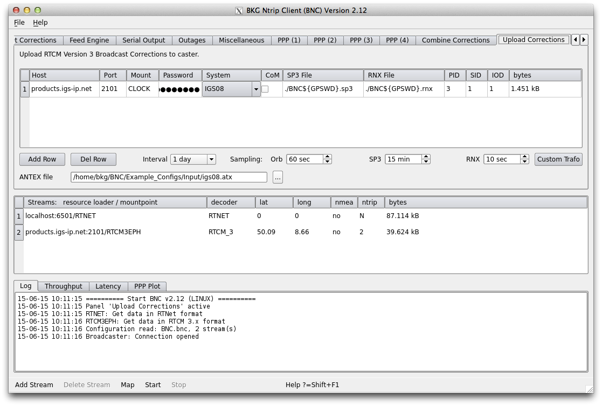

   BNC producing Broadcast Corrections from incoming precise orbits and clocks and uploading them to an Ntrip Broadcaster

The screenshot in :numref:`Fig. %s <fig_32>` shows the encoding and uploading of several Broadcast Ephemeris correction streams combined from streams CLK11, CLK21, CLK80, and CLK91. Combined streams are uploaded to different Ntrip Broadcasters and referred to different reference systems. One of the uploaded streams is locally saved in SP3 and Clock RINEX format. Different SSR Provider IDs, SSR Solution IDs and Issue of Data IDs are specified. Required Broadcast Ephemeris are received via stream 'RTCM3EPH'.

.. _fig_32:
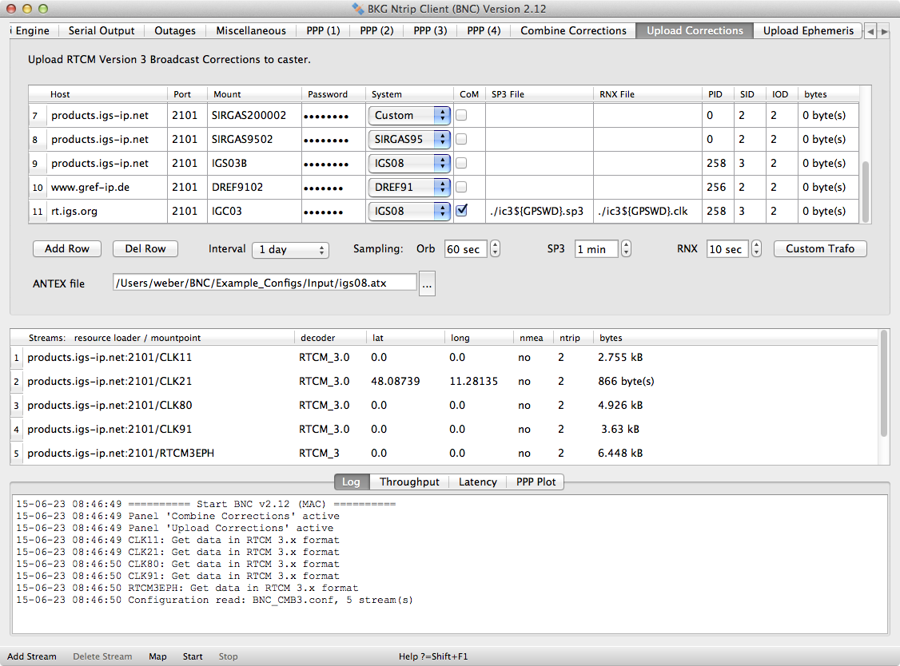

   BNC uploading a combined Broadcast Correction stream

.. index:: Upload ephemeris

Upload Ephemeris
================

BNC can generate streams carrying only Broadcast Ephemeris in RTCM Version 3 format and upload them to an Ntrip Broadcaster (Fig. 35). This can be done for individual satellite systems or for all satellite systems,  specifying the parameter ‘System’ for each stream. Note that Broadcast Ephemeris received in real-time have a system specific period of validity in BNC which is defined in accordance with the update rates of the navigation messages.

* GPS ephemeris will be interpreted as outdated and ignored when older than 4 hours.
* GLONASS ephemeris will be interpreted as outdated and ignored when older than 1 hour.
* Galileo ephemeris will be interpreted as outdated and ignored when older than 4 hours.
* BDS ephemeris will be interpreted as outdated and ignored when older than 6 hours.
* SBAS ephemeris will be interpreted as outdated and ignored when older than 10 minutes.
* QZSS ephemeris will be interpreted as outdated and ignored when older than 4 hours.

A note 'OUTDATED EPHEMERIS' will be given in the logfile and the data will be disregarded when necessary. Furthermore, received Broadcast Ephemeris parameters pass through a plausibility check in BNC which allows to ignore incorrect ephemeris data when necessary, leaving a note 'WRONG EPHEMERIS' in the logfile.

Host & Port - optional
----------------------

Specify the 'Host' IP number or URL of an Ntrip Broadcaster to upload the stream. An empty option field means that you do not want to upload Broadcast Ephemeris. Enter the Ntrip Broadcaster's IP 'Port' number for stream upload. Note that Ntrip Broadcasters are often configured to provide access through more than one port, usually ports 80 and 2101. If you experience communication problems on port 80, you should try to use the alternative port(s).

Mountpoint & Password - mandatory if 'Host' is set
--------------------------------------------------

BNC uploads a stream to the Ntrip Broadcaster by referring it to a dedicated mountpoint that has been set by its operator. Specify the mountpoint based on the details you received for your stream from the operator. It is often a 4-character ID (capital letters) plus an integer number. The stream upload follows Ntrip Version 1 and may be protected through an upload 'Password'. Enter the password you received from the Ntrip Broadcaster operator along with the mountpoint.

Sampling - mandatory if 'Host' is set
-------------------------------------

Select the Broadcast Ephemeris repetition interval in seconds. Default is '5', meaning that a complete set of Broadcast Ephemeris is uploaded every 5 seconds.

.. _fig_33:
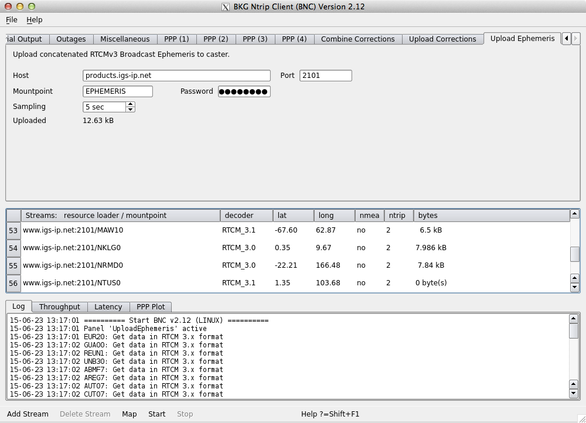

   BNC producing a Broadcast Ephemeris stream from navigation messages of globally distributed RTCM streams and uploading them in RTCM Version 3 format to an Ntrip Broadcaster

.. index:: Streams canvas

Streams Canvas
==============

Each stream on an Ntrip Broadcaster (and consequently on BNC) is defined using a unique source ID called mountpoint. An Ntrip Client like BNC accesses the desired stream by referring to its mountpoint. Information about streams and their mountpoints is available through the source-table maintained by the Ntrip Broadcaster. Streams selected for retrieval are listed under the 'Streams' canvas on BNC's main window. The list provides the following information either extracted from source-table(s) produced by the Ntrip Broadcasters or introduced by BNC's user (:numref:`Table %s <tab_STREAM_CANVAS_KEYS>`).

.. tabularcolumns:: |p{0.3\textwidth}|p{0.62\textwidth}|

.. index:: Stream canvas information
.. _tab_STREAM_CANVAS_KEYS:
.. table:: Source table information listed in BNCs Stream Canvas.

  ================== ======================================================================
  **Keyword**        **Meaning**
  ================== ======================================================================
  resource loader    Ntrip Broadcaster URL and port, or
                     TCP/IP host and port, or
                     UDP port, or
                     Serial input port specification.
  mountpoint         Mountpoint introduced by Ntrip Broadcaster, or
                     Mountpoint introduced by BNC's user.
  decoder            Name of decoder used to handle the incoming stream content according to its format; editable.
  lat                Approximate latitude of reference station, in degrees, north; editable if 'nmea' = 'yes'.
  long               Approximate longitude of reference station, in degrees, east; editable if 'nmea' = 'yes'.
  nmea               Indicates whether or not streaming needs to be initiated by BNC through sending NMEA-GGA message carrying position coordinates in 'lat' and 'long'.
  ntrip              Selected Ntrip transport protocol version (1, 2, 2s, R, or U), or
                     'N' for TCP/IP streams without Ntrip, or
                     'UN' for UDP streams without Ntrip, or
                     'S' for serial input streams without Ntrip.
  bytes              Number of bytes received.
  ================== ======================================================================

Edit Streams
------------

BNC automatically allocates one of its internal decoders to a stream based on the stream's 'format' and 'format-details' as given in the source-table. However, there might be cases where you need to override the automatic selection due to an incorrect source-table for example. BNC allows users to manually select the required decoder by editing the decoder string. Double click on the 'decoder' field, enter your preferred decoder and then hit Enter. Accepted decoder strings are 'RTCM_2.x', 'RTCM_3.x' and 'RTNET'.

In case you need to log the raw data as it is, BNC allows users to by-pass its decoders and directly save the input in daily logfiles. To do this, specify the decoder string as 'ZERO'. The generated filenames are created from the characters of the streams mountpoints plus two-digit numbers each for year, month, and day. Example: Setting the 'decoder' string for mountpoint WTZZ0 to 'ZERO' and running BNC on March 29, 2007 would save raw data in a file named WTZZ0_070329.

BNC can also retrieve streams from virtual reference stations (VRS). To initiate these streams, an approximate rover position needs to be sent in NMEA format to the Ntrip Broadcaster. In return, a user-specific data stream is generated, typically by Network RTK software. VRS streams are indicated by a 'yes' in the source-table as well as in the 'nmea' column on the 'Streams' canvas in BNC's main window. They are customized exactly to the latitude and longitude transmitted to the Ntrip Broadcaster via NMEA GGA sentences.

If NMEA GGA sentences are not coming from a serially connected GNSS rover, BNC simulates them from the default latitude and longitude of the source-table as shown in the 'lat' and 'long' columns on the 'Streams' canvas. However, in many cases you would probably want to change these defaults according to your requirement. Double-click on 'lat' and 'long' fields, enter the values you wish to send and then hit Enter. The format is in positive north latitude degrees (e.g. for northern hemisphere: 52.436, for southern hemisphere: -24.567) and eastern longitude degrees (example: 358.872 or -1.128). Only streams with a 'yes' in their 'nmea' column can be edited. The position should preferably be a point within the VRS service area of the network. RINEX files generated from these streams will contain an additional COMMENT line in the header beginning with 'NMEA' showing the 'lat' and 'long' used.

Note that when running BNC in a Local Area Network (LAN), NMEA strings may be blocked by a proxy server, firewall or virus scanner when not using the Ntrip Version 2 transport protocol.

Delete Streams
--------------

To remove a stream from the 'Streams' canvas in the main window, highlight it by clicking on it and hit the 'Delete Stream' button. You can also remove multiple streams simultaneously by highlighting them using +Shift or +Ctrl.

Reconfigure Stream Selection On-the-fly
---------------------------------------

The streams selection can be changed on-the-fly without interrupting uninvolved threads in the running BNC process.

Window mode: Hit 'Reread & Save Configuration' while BNC is in window mode and already processing data to let changes of your stream selection immediately become effective.

No window mode: When operating BNC online in 'no window' mode (command line option -nw), you force BNC to reread its 'mountPoints' configuration option from disk at pre-defined intervals. Select '1 min', '1 hour', or '1 day' as 'Reread configuration' option to reread the 'mountPoints' option every full minute, hour, or day. This lets a 'mountPoints' option edited in between in the configuration file become effective without terminating uninvolved threads. See section 'Configuration Examples' for configuration file examples and section 'Reread Configuration' for a list of other on-the-fly changeable options.

.. index:: Logging canvas

Logging Canvas
==============

The 'Logging Canvas' above the bottom menu bar on the main window labeled 'Log', 'Throughput', 'Latency', and 'PPP Plot' provides control of BNC's activities. Tabs are available for continuously showing logfile content, for a plot controlling the bandwidth consumption, a plot showing stream latencies, and for time series plots of PPP results.

Log
---

Records of BNC's activities are shown in the 'Log' tab. They can be saved into a file when a valid path is specified in the 'Logfile (full path)' field.

Throughput
----------

The bandwidth consumption per stream is shown in the 'Throughput' tab in bits per second (bps) or kilobits per second (kbps). :numref:`Fig. %s <fig_34>` shows an example for the bandwidth consumption of incoming streams.

.. _fig_34:
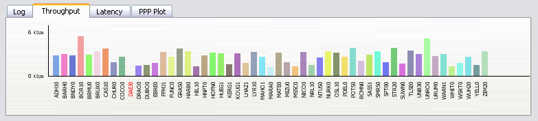

   Bandwidth consumption of RTCM streams received by BNC

Latency
-------

The latency of observations in each incoming stream is shown in the 'Latency' tab in milliseconds or seconds. Streams not carrying observations (e.g. those providing only Broadcast Ephemeris messages) or having an outage are not considered here and shown in red color. Note that the calculation of correct latencies requires the clock of the host computer to be properly synchronized. :numref:`Fig. %s <fig_35>` shows an example for the latency of incoming streams.

.. _fig_35:
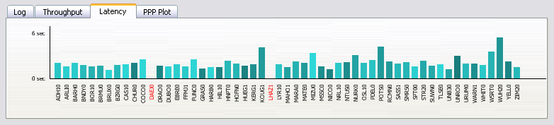

   Latency of RTCM streams received by BNC

PPP Plot
--------

Precise Point Positioning time series of North (red), East (green) and Up (blue) coordinate components are shown in the 'PPP Plot' tab when a 'Mountpoint' option is defined under PPP (4). Values are referred to a priori reference coordinates. The time as given in format [hh:mm] refers to GPS Time. The sliding PPP time series window covers a period of 5 minutes. Note that it may take up to 30 seconds or more until the first PPP solutions becomes available. :numref:`Fig. %s <fig_36>` shows the screenshot of a PPP time series plot of North, East and Up coordinate displacements.

.. _fig_36:
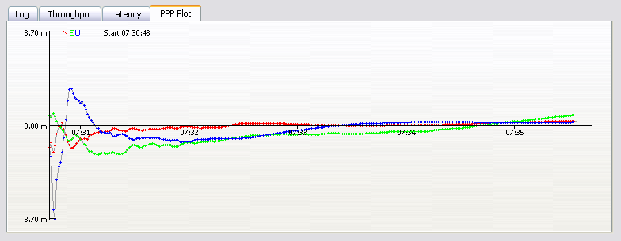

   Example for time series plot of displacements produced by BNC

Bottom Menu Bar
===============

The bottom menu bar allows to add or delete streams to or from BNC's configuration and to start or stop it. It also provides access to BNC's online help function. The 'Add Stream' button opens a window that allows users to select one of several input communication links, see :numref:`Fig. %s <fig_37>`.

.. _fig_37:
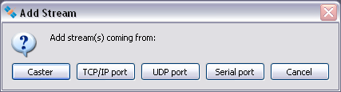

   Steam input communication links accepted by BNC

Add Stream
----------

Button 'Add Stream' allows you to pull streams either from an Ntrip Broadcaster or from a TCP/IP port, UPD port, or serial port.

Add/Delete Stream - Coming from Caster
--------------------------------------

Button 'Add Stream' > 'Coming from Caster' opens a window that allows users to select data streams from an Ntrip Broadcaster according to their mountpoints and show a distribution map of offered streams.

Button ‘Delete Stream’ allows you to delete streams previously selected for retrieval as listed under the ‘Streams’ canvas on BNC’s main window.

Caster Host and Port - mandatory
^^^^^^^^^^^^^^^^^^^^^^^^^^^^^^^^

Enter the Ntrip Broadcaster host IP and port number. Note that EUREF and IGS operate Ntrip Broadcasters at http://www.euref-ip.net/home, http://www.igs-ip.net/home, http://products.igs-ip.net/home and http://mgex.igs-ip.net/home.

Casters Table - optional
^^^^^^^^^^^^^^^^^^^^^^^^

It may be that you are not sure about your Ntrip Broadcaster's host and port number or you are interested in other broadcaster installations operated elsewhere. Hit 'Show' for a table of known broadcasters maintained at www.rtcm-ntrip.org/home. A window opens which allows selecting a broadcaster for stream retrieval, see :numref:`Fig. %s <fig_38>`.

.. _fig_38:
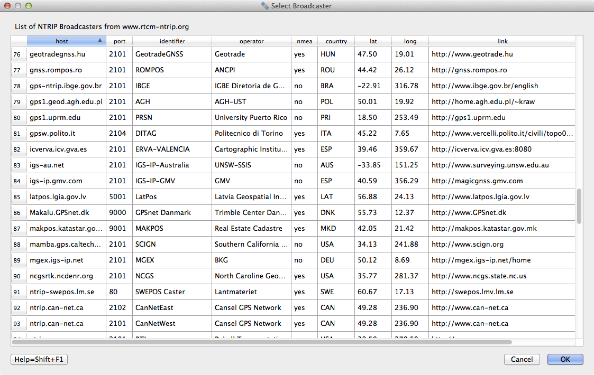

   BNC's 'Select Broadcaster' table

User and Password - mandatory for protected streams
^^^^^^^^^^^^^^^^^^^^^^^^^^^^^^^^^^^^^^^^^^^^^^^^^^^

Streams on Ntrip Broadcasters may be protected. Enter a valid 'User' ID and 'Password' for access to protected streams. Accounts are usually provided per Ntrip Broadcaster through a registration procedure. Register through http://register.rtcm-ntrip.org for access to protected streams from EUREF and IGS.

Get Table
^^^^^^^^^

Use the 'Get Table' button to download the source-table from the Ntrip Broadcaster. Pay attention to data fields 'format' and 'format-details'. Keep in mind that BNC can only decode and convert streams that come in RTCM Version 2, RTCM Version 3, or RTNET format. For access to observations, Broadcast Ephemeris and Broadcast Corrections in RTCM format, streams must contain a selection of appropriate message types as listed in the Annex, cf. data field 'format-details' for available message types and their repetition rates in brackets. Note that in order to produce RINEX Navigation files, RTCM Version 3 streams containing message types 1019 (GPS) and 1020 (GLONASS) and 1043 (SBAS) and 1044 (QZSS) and 1045, 1046 (Galileo) and 63 (BDS/BeiDou, tentative message number) are required. Select your streams line by line, use +Shift and +Ctrl when necessary. :numref:`Fig. %s <fig_39>` provides an example source-table.

The content of data field 'nmea' tells you whether a stream retrieval needs to be initiated by BNC through sending an NMEA-GGA message carrying approximate position coordinates (Virtual Reference Station, VRS).

Hit 'OK' to return to the main window. If you wish, you can click on 'Add Stream' and repeat the process of retrieving streams from different casters.

.. _fig_39:
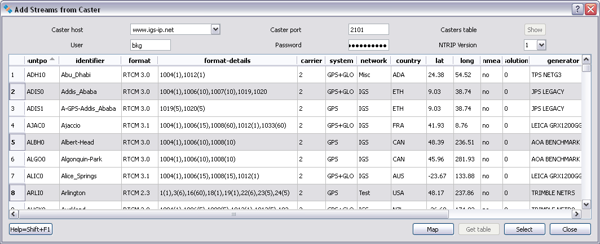

   Broadcaster source-table shown by BNC

Ntrip Version - mandatory
^^^^^^^^^^^^^^^^^^^^^^^^^

Some limitations and deficiencies of the Ntrip Version 1 stream transport protocol are solved in Ntrip Version 2. Improvements mainly concern a full HTTP compatibility in view of requirements coming from proxy servers. Version 2 is backwards compatible to Version 1. Options implemented in BNC are summarized in :numref:`Table %s <tab_NTRIP_OPTIONS>`.

.. tabularcolumns:: |p{0.3\textwidth}|p{0.62\textwidth}|

.. index:: Ntrip versions
.. _tab_NTRIP_OPTIONS:
.. table:: Ntrip options implemented in BNC.

  ================ ======================================
  **Option**       **Meaning**
  ================ ======================================
  1                Ntrip Version 1, TCP/IP
  2                Ntrip Version 2 in TCP/IP mode
  2s               Ntrip Version 2 in TCP/IP mode via SSL
  R                Ntrip Version 2 in RTSP/RTP mode
  U                Ntrip Version 2 in UDP mode
  ================ ======================================

If Ntrip Version 2 is supported by the broadcaster:

* Try using option '2' if your streams are otherwise blocked by a proxy server operated in front of BNC.
* When using Ntrip Version 2 via SSL (option '2s') you need to specify the appropriate 'Caster port' for that. It is usually port number 443. Clarify 'SSL' options offered in panel 'Network'.
* Option 'R' or 'U' may be selected if latency is more important than completeness for your application. Note that the latency reduction is likely to be in the order of 0.5 sec or less. Note further that options 'R' (RTSP/RTP mode) and 'U' (UDP mode) are not accepted by proxy servers and a mobile Internet Service Provider may not support it.

Select option '1' if you are not sure whether the broadcaster supports Ntrip Version 2.

Map - optional
^^^^^^^^^^^^^^

Button 'Map' opens a window to show a distribution map of the caster's streams :numref:`(Fig. %s) <fig_40>`. You may like to zoom in or out using the mouse. Left button: draw a rectangle to zoom, right button: zoom out, middle button: zoom back.

.. _fig_40:
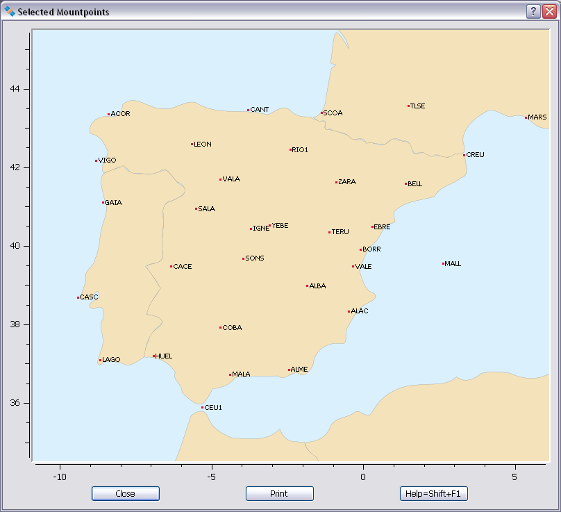

   Stream distribution map shown by BNC as derived from Ntrip Broadcaster source-table

Add Stream - Coming from TCP/IP Port
------------------------------------

Button 'Add Stream' > 'Coming from TCP/IP Port' allows to retrieve streams via TCP directly from an IP address without using the Ntrip transport protocol. For that you:

* Enter the IP address of the stream providing host.
* Enter the IP port number of the stream providing host.
* Specify a mountpoint. Recommended is a 4-character station ID. Example: FFMJ
* Specify the stream format. Available options are 'RTCM_2', 'RTCM_3', 'RTNET', and 'ZERO'.
* Enter the approximate latitude of the stream providing rover in degrees. Example: 45.32.
* Enter the approximate longitude of the stream providing rover in degrees. Example: -15.20.

Streams directly received from a TCP/IP port show up with an 'N' for 'No Ntrip' in the 'Streams' canvas on BNC's main window. Latitude and longitude are to be entered just for informal reasons. Note that this option works only if no proxy server is involved in the communication link.

Add Stream - Coming from UDP Port
---------------------------------

Button 'Add Stream' > 'Coming from UDP Port' allows to pick up streams arriving directly at one of the local host's UDP ports without using the Ntrip transport protocol. For that you:

* Enter the local port number where the UDP stream arrives.
* Specify a mountpoint. Recommended is a 4-character station ID. Example: FFMJ
* Specify the stream format. Available options are 'RTCM_2', 'RTCM_3', 'RTNET', and 'ZERO'.
* Enter the approximate latitude of the stream providing rover in degrees. Example: 45.32.
* Enter the approximate longitude of the stream providing rover in degrees. Example: -15.20.

Streams directly received at a UDP port show up with a 'UN' for 'UDP, No Ntrip' in the 'Streams' canvas section on BNC's main window. Latitude and longitude are to be entered just for informal reasons.

Add Stream - Coming from Serial Port
------------------------------------

Button 'Add Stream' > 'Coming from Serial Port' allows to retrieve streams from a GNSS receiver via serial port without using the Ntrip transport protocol. For that you:

* Specify a mountpoint. Recommended is a 4-character station ID. Example: FFMJ
* Specify the stream format. Available options are 'RTCM\_2', 'RTCM\_3', 'RTNET', and 'ZERO'.
* Enter the approximate latitude of the stream providing receiver in degrees. Example: 45.32.
* Enter the approximate longitude of the stream providing receiver in degrees. Example: -15.20.
* Enter the serial 'Port name' selected on your host for communication with the receiver. Valid port names are listed in :numref:`Table %s <tab_SERIAL_PORT_NAMES>`.
* Select a 'Baud rate' for the serial input. Note that using a high baud rate is recommended.
* Select the number of 'Data bits' for the serial input. Note that often '8' data bits are used.
* Select the 'Parity' for the serial input. Note that parity is often set to 'NONE'.
* Select the number of 'Stop bits' for the serial input. Note that often '1' stop bit is used.
* Select a 'Flow control' for the serial link. Select 'OFF' if you do not know better.

When selecting one of the serial communication options listed above, make sure that you pick those configured to the serially connected GNSS receiver. Streams received from a serially connected GNSS receiver show up with an 'S' (for Serial Port, no Ntrip) in the 'Streams' canvas section on BNC's main window. Latitude and longitude are to be entered just for informal reasons.

.. tabularcolumns:: |p{0.3\textwidth}|p{0.62\textwidth}|

.. index: Serial port names
.. _tab_SERIAL_PORT_NAMES:
.. table:: Valid port names in BNC.

  =============== ==========================
  **OS**          **Valid port names**
  =============== ==========================
  Windows         COM1, COM2
  Linux           /dev/ttyS0, /dev/ttyS1
  FreeBSD         /dev/ttyd0, /dev/ttyd1
  Digital Unix    /dev/tty01, /dev/tty02
  HP-UX           /dev/tty1p0, /dev/tty2p0
  SGI/IRIX        /dev/ttyf1, /dev/ttyf2
  SunOS/Solaris   /dev/ttya, /dev/ttyb
  =============== ==========================

:numref:`Fig. %s <fig_41>` shows a BNC example setup for pulling a stream via serial port on a Windows operating system.

.. _fig_41:
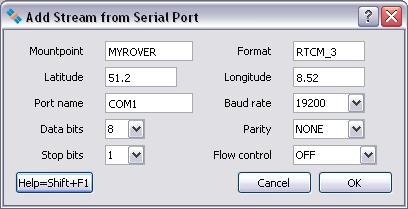

   BNC configuration for pulling a stream via serial port

Map
---

Button 'Map' opens a window to show a distribution map of the streams selected for retrieval as listed under the 'Streams' canvas. You may like to zoom in or out using the mouse. Left button: draw a rectangle to zoom, right button: zoom out, middle button: zoom back.

Start/Stop
----------

Hit 'Start' to start retrieving, decoding or converting GNSS data streams in real-time. Note that 'Start' generally forces BNC to begin with fresh RINEX files which might overwrite existing files when necessary unless option 'Append files' is ticked.

Hit the 'Stop' button in order to stop BNC.

Help? = Shift+F1
----------------

BNC comes with a 'What's This' help system providing information about its functionality and usage. Short descriptions are available for any widget and program option. Focus to the relevant object and press Shift+F1 to request help information. A help text appears immediately; it disappears as soon as the user does something else. The dialogs on some operating systems may provide a '?' button that users can click; click the relevant widget to pop up the help text.

.. index:: Command Line Options

Command Line Options
====================

Command line options are available to run BNC in 'no window' mode or let it read previously recorded input offline from one or several files for debugging or post processing purposes. It is also possible to introduce a specific configuration filename instead of using the default filename 'BNC.bnc'. The self-explaining content of the configuration file can easily be edited. In addition to reading processing options from the involved configuration file, BNC can optionally read any configuration option from command line. Running BNC with command line option 'help'

.. code-block:: console

  bnc --help (MS Windows: bnc.exe --help | more)

provides a list of all available command line options.

Version - optional
------------------

Command line option ``--version`` lets BNC print its version number.

.. code-block:: console

  bnc --version (MS Windows: bnc.exe --version | more)

Display - optional
------------------

On systems which support graphics, command line option ``--display`` forces BNC to present the BNC window on the specified display.

.. code-block:: console

  bnc.exe --display localhost:10.0

No Window Mode - optional
-------------------------

Apart from its regular windows mode, BNC can be started on all systems as a batch job with command line option '-nw'. BNC will then run in 'no window' mode, using processing options from its configuration file on disk. Terminate BNC using Windows Task Manager when running it in 'no window' mode on Windows systems.

.. code-block:: console

  bnc.exe --nw

It is obvious that BNC requires graphics support when started in interactive mode. However, note that graphics support is also required when producing plots in batch mode (option ``-nw``). Windows and Mac OS X systems always support graphics. For producing plots in batch mode on Linux systems you must make sure that at least a virtual X-Server such as 'Xvfb' is installed and the ``-display`` option is used. The following is an example shell script to execute BNC in batch mode for producing QC plots from RINEX files. It could be used via ``crontab``:

.. code-block:: none

  #!/bin/bash
  # Save string localhost
  echo "localhost" > /home/user/hosts

  # Start virtual X-Server, save process ID
  /usr/bin/Xvfb :29 -auth /home/user/hosts -screen 0 1280x1024x8 &
  psID=`echo $!`

  # Run BNC application with defined display variable
  /home/user/BNC/bnc --conf /dev/null --key reqcAction Analyze --key reqcObsFile ons12090.12o --key reqcNavFile brdc2090.12p --key reqcOutLogFile multi.txt --key reqcPlotDir /home/user --display localhost:29 --nw

  # BNC done, kill X-server process
  kill $psID

File Mode - optional
--------------------

Although BNC is primarily a real-time online tool, for debugging purposes it can be run offline to read data from a file previously saved through option 'Raw output file' (Record & Replay functionality). Enter the following command line option for that

.. code-block:: console

  --file <inputFileName>

and specify the full path to an input file containing previously saved data, e.g.

.. code-block:: console

  ./bnc --file /home/user/raw.output_110301

Note that when running BNC offline, it will use options for file saving, interval, sampling, PPP etc. from its configuration file. Note further that option ``--file`` forces BNC to apply the '-nw' option for running in 'no window' mode.

Configuration File - optional
-----------------------------

The default configuration filename is ``BNC.bnc``. You may change this name at startup time using command line option ``--conf <confFileName>``. This allows running several BNC jobs in parallel on the same host using different sets of configuration options. 'confFileName' stands either for the full path to a configuration file or just for a filename. If you introduce only a filename, the corresponding file will be saved in the current working directory from where BNC is started, e.g.

.. code-block:: console

  ./bnc --conf MyConfig.bnc

This leads to a BNC job using configuration file 'MyConfig.bnc'. The configuration file will be saved in the current working directory.

Configuration Options - optional
--------------------------------

BNC applies options from the configuration file but allows updating every one of them on the command line while the content of the configuration file remains unchanged. Note the following syntax for Command Line Interface (CLI) options:

.. code-block:: console

  --key <keyName> <keyValue>

Parameter <keyName> stands for the key name of an option contained in the configuration file and <keyValue> stands for the value you want to assign to it. The following is a syntax example for a complete command line:

.. code-block:: console

  bnc --nw --conf <confFileName> --key <keyName1> <keyValue1> --key <keyName2> <keyValue2> ...

Configuration options which are part of the configuration files PPP section must be prefixed by 'PPP/'. As an example, option 'minObs' from the PPP section of the BNC configuration file would be specified as 'PPP/minObs' on a command line.

Values for configuration options can be introduced via command line exactly as they show up in the configuration file. However, any value containing one or more blank characters must be enclosed by quotation marks when specified on command line.

.. bibliography:: references.bib
   :style: unsrt
   :all:
