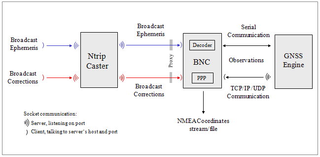
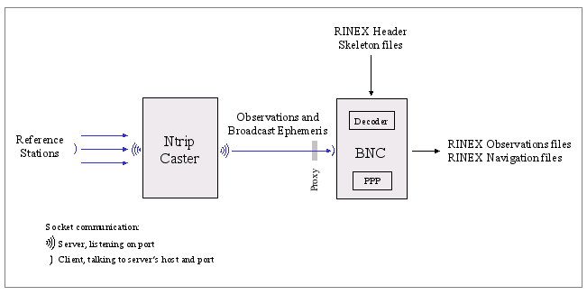
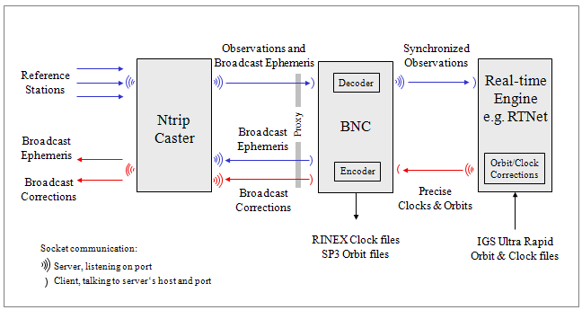
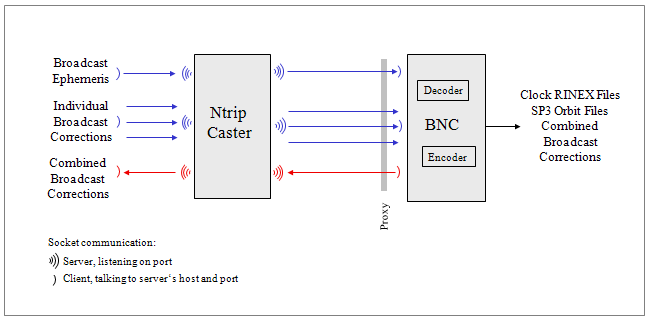
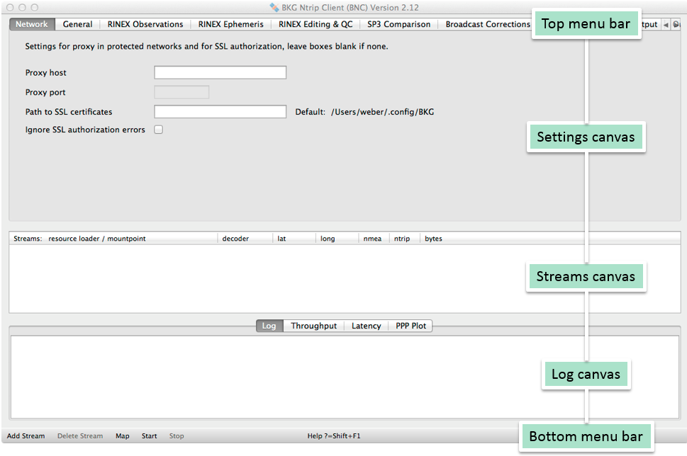

.. index:: BNC overview

BNC Overview
************

.. index:: GNSS supported

Supported GNSS and applications
===============================

.. only:: latex
   
   .. raw:: latex

    BNC is permanently completed to finally support all existing GNSS systems throughout all features of the program. Table~\ref{tab:rtcm3_status_bnc} shows in detail which GNSS systems are supported so far by particular applications when using the latest BNC version. Application areas named here are: 

.. only:: html
   
  BNC is permanently completed to finally support all existing GNSS systems throughout all features of the program. :numref:`Table %s <tab_BNC_RTCM>` shows in detail which GNSS systems are supported so far by particular applications when using the latest BNC version. Application areas named here are: 
	
* Decoding of RTCM or RTNET [#f_rtnet]_ streams
* RINEX and SP3 file input and output
* Encoding of SSR and ephemeris messages
* Upload of SSR and ephemeris messages
* PPP (Precise Point Positioning)
* Combining/merging SSR or ephemeris messages from various real-time sources

It is indicated when a message implementation in BNC could so far only be based on a 'RTCM Proposal'. 

.. index:: RTCM Version 3 message implementation

.. only:: latex
  
   .. raw:: latex

      \begin{landscape}
      \begin{small}
      \begin{longtabu} to \linewidth
      {p{2.5cm}p{4cm}p{2.5cm}>{\centering}X>{\centering}X>{\centering}X>{\centering}X>{\centering}X>{\centering}X>{\centering\arraybackslash}X}
      \caption{Status of RTCM Version 3 message implementations in BNC supporting various GNSS systems.}\\
      \label{tab:rtcm3_status_bnc}
      \textbf{Message} &\textbf{Description}&\textbf{GNSS}&\textbf{RTCM}&\textbf{Decoding}&\textbf{RINEX}&\textbf{Encoding}&\textbf{Upload}&\textbf{PPP} &\textbf{Combin.}\\
      \textbf{Type \#}     & & & \textbf{Proposal} & & \textbf{SP3} & & & & \\
      \endfirsthead
      \textbf{Message} &\textbf{Description}  &\textbf{GNSS}&\textbf{RTCM}&\textbf{Decoding}&\textbf{RINEX}&\textbf{Encoding}&\textbf{Upload}&\textbf{PPP} &\textbf{Combin.}\\
      \textbf{Type \#}     & & & \textbf{Proposal} & & \textbf{SP3} & & & & \\
      \hline
      \endhead
      \hline
      \multicolumn{10}{r}{Continued at next page}\\
      \endfoot
      \endlastfoot
      \hline 
      \multicolumn{10}{l}{\textbf{General}}\\
       \hline 
      1005,1006 &Station & & &x & & & & & \\
      1007,1008 &Antenna & & &x & & & & & \\
      1033 &Receiver, Antenna & & &x & & & & & \\
      1013 &System Parameters & & &x & & & & & \\
      \hline
      \multicolumn{10}{l}{\textbf{Navigation}}\\
      \hline 
      1019 &Ephemeris &GPS & &x &x &x &x &x &x \\
      1020 &Ephemeris &GLONASS & &x &x &x &x &x &x \\
      1045 &Ephemeris &Galileo F/Nav & &x &x &x &x & & \\
      1046 &Ephemeris &Galileo I/Nav &x &x &x &x &x &x & \\
      1043 &Ephemeris &SBAS &x &x &x &x &x & & \\
      1044 &Ephemeris &QZSS & &x &x &x &x & & \\
      63 &Ephemeris &BDS &x &x &x &x &x &x & \\
      \hline
      \multicolumn{10}{l}{\textbf{Observation}}\\
       \hline 
      1001-4 &Conventional Messages &GPS & &x &x & & &x & \\
      1009-12 &Conventional Messages &GLONASS & &x &x & & &x & \\
      \hline
      \multicolumn{10}{l}{\textbf{Observation}}\\
       \hline 
      1071-77 &Multiple Signal Message &GPS & &x &x & & &x & \\
      1081-87 &Multiple Signal Message &GLONASS & &x &x & & &x & \\
      1091-97 &Multiple Signal Message &Galileo & &x &x & & &x & \\
      1101-07 &Multiple Signal Message &SBAS &x &x &x & & & & \\
      1111-17 &Multiple Signal Message &QZSS & &x &x & & & & \\
      1121-27 &Multiple Signal Message &BDS &  &x &x & & &x & \\
      \hline 
      \multicolumn{10}{l}{\textbf{SSR I}}\\
      \hline 
      1057 &Orbit Corrections &GPS & &x &x &x &x &x &x \\
      1063 &Orbit Corrections &GLONASS & &x &x &x &x &x &x \\
      1240 &Orbit Corrections &Galileo &x &x &x &x &x &x & \\
      1246 &Orbit Corrections &SBAS &x &x &x &x &x & & \\
      1252 &Orbit Corrections &QZSS &x &x &x &x &x & & \\
      1258 &Orbit Corrections &BDS &x &x &x &x &x &x & \\
      1058 &Clock Corrections &GPS & &x &x &x &x &x &x \\
      1064 &Clock Corrections &GLONASS & &x &x &x &x &x &x \\
      1241 &Clock Corrections &Galileo &x &x &x &x &x &x & \\
      1247 &Clock Corrections &SBAS &x &x &x &x &x & & \\
      1253 &Clock Corrections &QZSS &x &x &x &x &x & & \\
      1259 &Clock Corrections &BDS &x &x &x &x &x &x & \\
      1059 &Code Biases &GPS & &x &x &x &x &x & \\
      1065 &Code Biases &GLONASS & &x &x &x &x &x & \\
      1242 &Code Biases &Galileo &x &x &x &x &x &x & \\
      1248 &Code Biases &SBAS &x &x &x &x &x & & \\
      1254 &Code Biases &QZSS &x &x &x &x &x & & \\
      1260 &Code Biases &BDS &x &x &x &x &x &x & \\
      1061, 1062 &User Range Accuracy, HR  &GPS & &x & & & & & \\
      1067, 1068 &User Range Accuracy, HR  &GLONASS & &x & & & & & \\
      1244, 1245 &User Range Accuracy, HR  &Galileo &x &x & & & & & \\
      1250, 1251 &User Range Accuracy, HR  &SBAS &x &x & & & & & \\
      1256, 1257 &User Range Accuracy, HR  &QZSS &x &x & & & & & \\
      1262, 1263 &User Range Accuracy, HR  &BDS &x &x & & & & & \\
      1060 &Comb. Orbits \& Clocks &GPS & &x &x &x &x &x &x \\
      1066 &Comb. Orbits \& Clocks &GLONASS & &x &x &x &x &x &x \\
      1243 &Comb. Orbits \& Clocks &Galileo &x &x &x &x &x &x & \\
      1249 &Comb. Orbits \& Clocks &SBAS &x &x &x &x &x & & \\
      1255 &Comb. Orbits \& Clocks &QZSS &x &x &x &x &x & & \\
      1261 &Comb. Orbits \& Clocks &BDS &x &x &x &x &x &x & \\
      \hline
      \multicolumn{10}{l}{\textbf{SSR II}}\\
      \hline 
      1264 &VTEC &GNSS  &x &x &x &x &x & & \\
      1265 &Phase Biases &GPS &x &x &x &x &x & & \\
      1266 &Phase Biases &GLONASS &x &x &x &x &x & & \\
      1267 &Phase Biases &Galileo &x &x &x &x &x & & \\
      1268 &Phase Biases &SBAS &x &x &x &x &x & & \\
      1269 &Phase Biases &QZSS &x &x &x &x &x & & \\
      1270 &Phase Biases &BDS &x &x &x &x &x & & \\
       \hline 
      \end{longtabu}
      \end{small}
      \end{landscape}
   
.. index:: RTCM Version 3 message implementation

.. only:: html

  .. _tab_BNC_RTCM:
  .. table:: Status of RTCM Version 3 message implementations in BNC supporting various GNSS systems.

    =============== ======================= ============= ============ ============ ============= ============ ============ ============ ============
    **Message #**   **Description**         **GNSS**      **RTCM**     **Decoding** **RINEX/SP3** **Encoding** **Upload**   **PPP**      **Combin.**
                                                          **Proposal**                  
    =============== ======================= ============= ============ ============ ============= ============ ============ ============ ============
    **General**
    -------------------------------------------------------------------------------------------------------------------------------------------------
    1005,1006       Station                                            x
    1007,1008       Antenna                                            x
    1033            Receiver, Antenna                                  x
    1013            System Parameters                                  x
    **Navigation**
    -------------------------------------------------------------------------------------------------------------------------------------------------
    1019            Ephemeris               GPS                        x            x             x            x            x            x
    1020            Ephemeris               GLONASS                    x            x             x            x            x            x
    1045            Ephemeris               Galileo F/Nav              x            x             x            x 
    1046            Ephemeris               Galileo I/Nav              x            x             x            x            x 
    1043            Ephemeris               SBAS          x            x            x             x            x 
    1044            Ephemeris               QZSS                       x            x             x            x
    63              Ephemeris               BDS           x            x            x             x            x            x
    **Observation**
    -------------------------------------------------------------------------------------------------------------------------------------------------
    1001-4          Conventional Messages   GPS                        x            x                                       x
    1009-12         Conventional Messages   GLONASS                    x            x                                       x
    **Observation**
    -------------------------------------------------------------------------------------------------------------------------------------------------
    1071-77         Multiple Signal Message GPS                        x            x                                       x
    1081-87         Multiple Signal Message GLONASS                    x            x                                       x
    1091-97         Multiple Signal Message Galileo                    x            x                                       x
    1101-07         Multiple Signal Message SBAS          x            x            x
    1111-17         Multiple Signal Message QZSS                       x            x
    1121-27         Multiple Signal Message BDS                        x            x                                       x
    **SSR I**
    -------------------------------------------------------------------------------------------------------------------------------------------------
    1057            Orbit Corrections       GPS                        x            x             x            x            x            x
    1063            Orbit Corrections       GLONASS                    x            x             x            x            x            x
    1240            Orbit Corrections       Galileo       x            x            x             x            x            x
    1246            Orbit Corrections       SBAS          x            x            x             x            x 
    1252            Orbit Corrections       QZSS          x            x            x             x            x
    1258            Orbit Corrections       BDS           x            x            x             x            x            x
    1058            Clock Corrections       GPS                        x            x             x            x            x            x
    1064            Clock Corrections       GLONASS                    x            x             x            x            x            x
    1241            Clock Corrections       Galileo       x            x            x             x            x            x
    1247            Clock Corrections       SBAS          x            x            x             x            x
    1253            Clock Corrections       QZSS          x            x            x             x            x
    1259            Clock Corrections       BDS           x            x            x             x            x            x
    1059            Code Biases             GPS                        x            x             x            x            x
    1065            Code Biases             GLONASS                    x            x             x            x            x
    1242            Code Biases             Galileo       x            x            x             x            x            x
    1248            Code Biases             SBAS          x            x            x             x            x
    1254            Code Biases             QZSS          x            x            x             x            x 
    1260            Code Biases             BDS           x            x            x             x            x            x
    1061, 1062      User Range Accuracy, HR GPS                        x
    1067, 1068      User Range Accuracy, HR GLONASS                    x
    1244, 1245      User Range Accuracy, HR Galileo       x            x
    1250, 1251      User Range Accuracy, HR SBAS          x            x
    1256, 1257      User Range Accuracy, HR QZSS          x            x
    1262, 1263      User Range Accuracy, HR BDS           x            x
    1060            Comb. Orbits & Clocks   GPS                        x            x             x            x            x            x
    1066            Comb. Orbits & Clocks   GLONASS                    x            x             x            x            x            x
    1243            Comb. Orbits & Clocks   Galileo       x            x            x             x            x            x
    1249            Comb. Orbits & Clocks   SBAS          x            x            x             x            x 
    1255            Comb. Orbits & Clocks   QZSS          x            x            x             x            x
    1261            Comb. Orbits & Clocks   BDS           x            x            x             x            x            x
    **SSR II**
    -------------------------------------------------------------------------------------------------------------------------------------------------
    1264            VTEC                    GNSS          x            x            x             x            x 
    1265            Phase Biases            GPS           x            x            x             x            x
    1266            Phase Biases            GLONASS       x            x            x             x            x
    1267            Phase Biases            Galileo       x            x            x             x            x
    1268            Phase Biases            SBAS          x            x            x             x            x
    1269            Phase Biases            QZSS          x            x            x             x            x
    1270            Phase Biases            BDS           x            x            x             x            x
    =============== ======================= ============= ============ ============ ============= ============ ============ ============ ============

.. index:: BNC data flow
  
Data Flow
=========

BNC can be used in different contexts with varying data flows. Typical real-time communication follows the Ntrip protocol over TCP/IP (probably via SSL), RTSP/RTP or UDP, plain TCP/IP protocol, or serial communication links. Stream content could be observations, ephemeris, satellite orbit/clock products or NMEA sentences. 

:numref:`Fig. %s <fig_1>` shows a flow chart of BNC connected to a GNSS receiver providing observations via serial or TCP communication link for the purpose of Precise Point Positioning. :numref:`Fig. %s <fig_2>` shows the conversion of RTCM streams to RINEX files. :numref:`Fig. %s <fig_3>` shows a flow chart of BNC feeding a real-time GNSS engine which estimates precise orbits and clocks. BNC is used in this scenario to encode correctors to RTCM Version 3 and upload them to an Ntrip Broadcaster. :numref:`Fig. %s <fig_4>` shows BNC combining several Broadcast Correction streams to disseminate the combination product while saving results in SP3 and Clock RINEX files. 

.. _fig_1:

   Flowchart, BNC connected to a GNSS rover for Precise Point Positioning.

.. _fig_2:

   Flowchart, BNC converting RTCM streams to RINEX batches.

.. _fig_3:

   Flowchart, BNC feeding a real-time GNSS engine and uploading encoded Broadcast Corrections

.. _fig_4:

   Flowchart, BNC combining Broadcast Correction streams.

.. index:: BNC handling   
   
Handling
========

Although BNC is mainly a real-time tool to be operated online, it can be run offline 

* To simulate real-time observation situations for debugging purposes;
* For post processing purposes.

Furthermore, apart from its regular window mode, BNC can be run as a batch/background job in a 'no window' mode, using processing options from a previously saved configuration or from command line. 

Unless it runs offline, BNC 

* Requires access to the Internet with a minimum of about 2 to 6 kbits/sec per stream depending on the stream format and the number of visible satellites. You need to make sure that the connection can sustain the required bandwidth;
* Requires the clock of the host computer to be properly synchronized;
* Has the capacity to retrieve hundreds of GNSS data streams simultaneously. Please be aware that such usage may incur a heavy load on the Ntrip Broadcaster side depending on the number of streams requested. We recommend limiting the number of streams where possible to avoid unnecessary workload.

The main window of BNC shows a 'Top menu bar' section, a 'Settings' sections with panels to set processing options, a 'Streams' section, a section for 'Log' tabs, and a 'Bottom menu bar' section :numref:`(Fig. %s) <fig_5>`. 

.. _fig_5:

   Sections on BNC's main window.

Running BNC in interactive mode requires graphics support. This is also required in batch mode when producing plots. Windows and Mac OS X systems always support graphics. However, when using BNC in batch mode on Linux systems for producing plots, you need to make sure that at least a virtual X-Server like 'Xvfb' is installed and the '-display' command line option is used. 

The usual handling of BNC is that you first select a number of streams ('Add Stream'). Any stream configured to BNC shows up on the 'Streams' canvas in the middle of BNC's main window. You then go through BNC's various configuration panels to set a combination of input, processing and output options before you start the program ('Start'). Most configuration panels are dedicated to a certain function of BNC. If the first option field on such a configuration panel is empty, the affected functionality is deactivated. 

Records of BNC's activities are shown in the 'Log' tab which is part of the 'Log' canvas. The bandwidth consumption per stream, the latency of incoming observations, and a PPP time series for coordinate displacements are also part of that canvas and shown in the 'Throughput', 'Latency' and 'PPP Plot' tabs. 

Configuration options are usually first set using BNC's Graphical User Interface (GUI), then saved in a configuration file. For routine operations in batch mode all of BNC's configuration options can be extracted from the configuration file and applied using the program's Command Line Interface (CLI). 

.. index:: BNC limitations

Limitations
===========

* In Qt-based desktop environments (like KDE) on Unix/Linux platforms it may happen that you experience a crash of BNC at startup even when running the program in the background using the '-nw' option. This is a known bug most likely resulting from an incompatibility of Qt libraries in the environment and in BNC. Entering the command ``unset SESSION\MANAGER`` before running BNC may help as a work-around. 
* Using RTCM Version 3 to produce RINEX files, BNC will properly handle most message types. However, when handling message types 1001, 1003, 1009 and 1011 where the ambiguity field is not set, the output will be no valid RINEX. All values will be stored modulo 299792.458 (speed of light). 
* Using RTCM Version 2, BNC will only handle message types 18 and 19 or 20 and 21 together with position and the antenna offset information carried in types 3 and 22. Note that processing carrier phase corrections and pseudo-range corrections contained in message types 20 and 21 needs access to Broadcast Ephemeris. Hence, whenever dealing with message types 20 and 21, make sure that Broadcast Ephemeris become available for BNC through also retrieving at least one RTCM Version 3 stream carrying message types 1019 (GPS ephemeris) and 1020 (GLONASS ephemeris). 
* BNC's 'Get Table' function only shows the STR records of a source-table. You can use an Internet browser to download the full source-table content of any Ntrip Broadcaster by simply entering its URL in the form of http://host:port. Data field number 8 in the NET records may provide information about where to register for an Ntrip Broadcaster account. 
* EUREF as well as IGS adhere to an Open Data policy. Streams are made available through Ntrip Broadcasters at www.euref-ip.net, www.igs-ip.net, products.igs-ip.net, and mgex.igs-ip.net free of charge to anyone for any purpose. There is no indication up until now how many users will need to be supported simultaneously. The given situation may develop in such a way that it might become difficult to serve all registered users at the same times. In cases where limited resources on the Ntrip Broadcaster side (software restrictions, bandwidth limitation etc.) dictates, first priority in stream provision will be given to stream providers followed by re-broadcasting activities and real-time analysis centers while access to others might be temporarily denied. 
* Once BNC has been started, many of its configuration options cannot be changed as long as it is stopped. See chapter 'Reread Configuration' for on-the-fly configuration exceptions. 
* Drag and drop of configuration files is currently not supported on Mac OS X. On such system you have to start BNC via command line. 

.. rubric:: Footnotes

.. [#f_rtnet] RTNet, GPS Solutions Inc., http://gps-solutions.com
